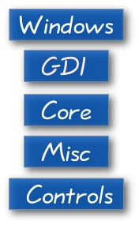
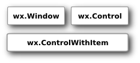
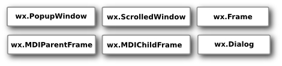
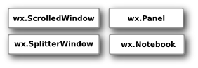
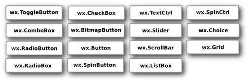
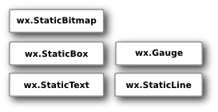
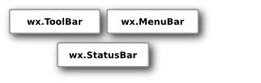
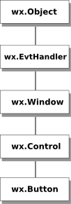

## wxPython 简介

wxPython 是一个用于创建桌面 GUI 应用程序的跨平台工具包。 wxPython 的主要作者是 *Robin Dunn*。 借助wxPython，开发人员可以在 Windows，Mac 和各种 Unix 系统上创建应用程序。 wxPython 封装了 wxWidgets，而 wxWidgets 是一个成熟的跨平台 C ++ 库。 

## wxPython 模块

wxPython 由五个基本模块组成。

Controls 模块：提供了图形应用程序中常见的 widgets。例如 Button、Toolbar 或 Notebook。Widgets 在 Windows 上叫做 controls。

Core 模块：由开发的基本中用到的基本类组成。这些类包括 Object 类，它是所有类的基类；Sizers，用于 widget 布局；Events；像 Point 和 Rectangle 这样的基本几何类。 

GDI 模块：The Graphics Device Interface，图形设备接口。是用于绘制 widgets 的一组类。

Misc 模块：包含各种其他类和模块功能。 这些类用于记录日志，应用程序配置，系统设置，显示或操纵杆。

Windows 模块：由形成应用程序的各种窗口组成，例如 面板 Panel，对话框 Dialog，框架 Frame 或滚动窗口 Scrolled Window。

## wxPython API

wxPython API 是一组方法和对象。 组件 Widgets 是 GUI 应用程序的重要组成部分。组件 Widgets 在 Windows 下被称作控件 controls。 我们大致可以将程序员分成两组：编写应用程序或库。 在我们的例子中，wxPython 是应用程序员用来编写应用程序的库。 从技术上讲，wxPython 是一个名为 wxWidgets 的 C ++ GUI API 的封装。 所以它不是一个本地 API; 即它不是直接用 Python 编写的。

在 wxPython 中，我们有很多组件。 这些可以分成一些逻辑组。

### 基本 Widgets

这些组件为派生组件提供基本功能。 他们被称为祖先 ancestors。 他们通常不直接使用。 

 

### 顶层 Widgets

这些组件彼此独立存在。 

  

### Containers

容器 Containers 包含其他组件 Widgets。 

 

### 动态 Widgets

这些组件可以由用户编辑。 

 

### 静态 Static Widgets

这些组件显示信息。 它们不能由用户编辑。 

 

### 其他 Widgets

这些组件在应用程序中实现状态栏，工具栏和菜单栏。

 

### 继承关系

wxPython 中的组件 widgets 之间有特定的关系。 这种关系是通过继承来发展的。 继承是面向对象编程的关键部分。 组件形成一个层次结构。 组件可以继承其他组件的功能。现有的类被称为基类，父母或祖先。 继承我们的组件称为派生组件，子组件或后代。 

 

假设我们在应用程序中使用了一个按钮组件按钮构件继承自四个不同的基类。 最接近的类是 `wx.Control` 类。 按钮组件是一种小窗口。所有出现在屏幕上的组件都是窗口。 因此它们从 `wx.Window` 类继承而来。 有些 objects 是不可见的。 比如 sizers，设备上下文 device context  或 locale 对象。 也有可见的类，但它们不是窗口。 例如，颜色对象 a colour object，插入符号对象 caret object 或游标对象 cursor object。 并非所有的组件都是控件。 例如 `wx.Dialog` 不是一种控件。控件是放置在其他称为容器 Containers 的组件上的组件。 这就是为什么我们有一个单独的 `wx.Control` 基类。

每个窗口都能对事件做出反应。 按钮组件也是如此。 通过点击按钮，我们启动 `wx.EVT_COMMAND_BUTTON_CLICKED` 事件。 按钮组件通过 `wx.Window` 类继承 `wx.EvtHandler`。 每个对事件作出反应的组件都必须从 `wx.EvtHandler` 类继承。 最后，所有对象都从 `wx.Object` 类继承。

