# wxPython graphics

GDI（图形设备接口 Graphics Device Interface）是用于处理图形的接口。它用于与图形设备（如显示器，打印机或文件）进行交互。GDI 允许程序员在屏幕或打印机上显示数据，而不必关心特定设备的细节。GDI 将程序员与硬件隔离开来。

从程序员的角度来看，GDI 是一组处理图形的类和方法。 GDI 由 2D 矢量图形、字体和图像组成。

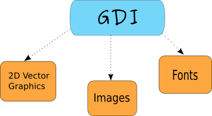

要开始绘制图形，我们必须创建一个设备上下文 device context（DC）对象。在 wxPython 中，设备上下文称为 `wx.DC`。文档中将 `wx.DC` 定义为可以绘制图形和文本的设备上下文。它以一个通用的方式表示设备的数量。同一段代码可以写入不同种类的设备，无论是屏幕还是打印机。 `wx.DC` 不应该直接使用。相反，程序员应该选择一个派生类。每个派生类都应该在特定条件下使用。

## paint 和 draw 区别

paint 指用颜色画，如油画颜料、水彩或者水墨画。wxpython 中指的是涂颜色，比如用笔刷。

draw 通常指用铅笔、钢笔或者粉笔画，一般并不涂上颜料。wxpython 中指的是钢笔画边、线、轮廓，用于描边，和 ps 的钢笔工具类似。

## Derived wx.DC classes

- wxBufferedDC
- wxBufferedPaintDC
- wxPostScriptDC
- wxMemoryDC
- wxPrinterDC
- wxScreenDC
- wxClientDC
- wxPaintDC
- wxWindowDC

`wx.ScreenDC`  用于在屏幕上的任何位置绘制。

`wx.WindowDC`  如果我们想在整个窗口上 paint（仅限 Windows），则使用 `wx.WindowDC`，这包括窗口装饰。

`wx.ClientDC`  用于绘制窗口的客户区  client area 。客户区域是没有装饰的窗口区域（标题和边框）。

`wx.PaintDC`  也用于绘制客户区。但是 `wx.PaintDC` 和 `wx.ClientDC` 有一个区别。`wx.PaintDC` 只能从 `wx.PaintEvent` 中使用。`wx.ClientDC` 不应该从 `wx.PaintEvent` 中使用。

`wx.MemoryDC`  用于在位图上绘制图形。

`wx.PostScriptDC`  用于在任何平台上写入 `PostScript` 文件。

`wx.PrinterDC`  用于访问打印机（仅限Windows）。

## Drawing a simple line

我们的第一个例子将在窗口的客户区绘制一条简单的线。

```python
DrawLine(self, x1, y1, x2, y2)
```

该方法从第一点到第二点绘制一条线；不包括第二点。

**draw_line.py**

```python
#!/usr/bin/env python3
# -*- coding: utf-8 -*-

"""
ZetCode wxPython tutorial

This program draws a line on the
frame window after a while.

author: Jan Bodnar
website: zetcode.com
last edited: May 2018
"""

import wx

class Example(wx.Frame):

    def __init__(self, *args, **kw):
        super(Example, self).__init__(*args, **kw)

        self.InitUI()

    def InitUI(self):

        wx.CallLater(2000, self.DrawLine)

        self.SetTitle("Line")
        self.Centre()

    def DrawLine(self):

        dc = wx.ClientDC(self)
        dc.DrawLine(50, 60, 190, 60)

def main():

    app = wx.App()
    ex = Example(None)
    ex.Show()
    app.MainLoop()


if __name__ == '__main__':
    main()
```

我们在两秒钟后在框架窗口上绘制一条线。

```python
wx.FutureCall(2000, self.DrawLine)
```

在创建窗口后我们调用 `DrawLine()` 方法。我们这样做是因为当窗口被创建时，窗口也会绘制，我们所有的绘画都会因此丢失。我们可以在创建窗口后开始绘制。这就是为什么我们调用 `wx.FutureCall()` 方法的原因。

```python
def DrawLine(self):

    dc = wx.ClientDC(self)
    dc.DrawLine(50, 60, 190, 60)
```

我们创建一个 `wx.ClientDC` 设备上下文。唯一的参数是我们想要绘制的窗口。在我们的例子中，它是 `self`，它是对我们的 `wx.Frame` 小部件的引用。我们调用设备上下文的 `DrawLine()` 方法。这个调用实际上在我们的窗口上画了一条线。

了解以下行为非常重要。如果我们调整窗口的大小，这条线就会消失。为什么会出现这种情况？如果调整大小，每个窗口都会重新绘制。如果它被最大化，它也被重新绘制。如果我们用另一个窗口覆盖窗口并在之后移开另一个窗口，原来的窗口也会重新绘制。该窗口又被绘到默认状态，我们的绘的线丢失。我们必须在每次调整窗口大小时画出线条。解决方案是 `wx.PaintEvent`。每次触发此事件时，窗口都会重新绘制。我们将在一个方法中绘画我们的线条，然后绑定到绘图事件 paint event。

以下示例展示了它是如何完成的。

**draw_line2.py**

```python
#!/usr/bin/env python3
# -*- coding: utf-8 -*-

"""
ZetCode wxPython tutorial

This program draws a line in
a paint event.

author: Jan Bodnar
website: zetcode.com
last edited: May 2018
"""

import wx

class Example(wx.Frame):

    def __init__(self, *args, **kw):
        super(Example, self).__init__(*args, **kw)

        self.InitUI()

    def InitUI(self):

        self.Bind(wx.EVT_PAINT, self.OnPaint)

        self.SetTitle("Line")
        self.Centre()

    def OnPaint(self, e):

        dc = wx.PaintDC(self)
        dc.DrawLine(50, 60, 190, 60)


def main():

    app = wx.App()
    ex = Example(None)
    ex.Show()
    app.MainLoop()


if __name__ == '__main__':
    main()
```

我们画同一条线。 这次是对绘图事件作出反应。

```python
self.Bind(wx.EVT_PAINT, self.OnPaint)
```

在这里，我们将 `OnPaint` 方法绑定到 `wx.PaintEvent` 事件。 这意味着每次我们的窗口被重新绘制时，我们都会调用 `OnPaint()` 方法。 现在，如果我们调整窗口大小（覆盖它，最大化它），线条都不会消失。

```python
dc = wx.PaintDC(self)
```

请注意，这次我们使用了 `wx.PaintDC` 设备上下文。

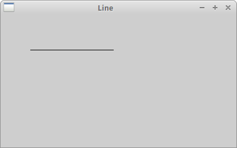

## Computer graphics

有两种不同的计算机图形：矢量 vector 和光栅 raster 图像。光栅图像将图像表示为像素集合。矢量图形是使用几何图元，如点、直线、曲线或多边形来表示图像。这些原语是使用数学方程创建的。

这两种计算机图形都有优点和缺点。矢量图像相对于栅格图像的优点是：

- 更小的尺寸
- 无限缩放的能力
- 移动，缩放，填充或旋转不会降低图像的质量

## Types of primitives

以下是图形基元的部分列表。

- points  点
- lines  直线
- polylines  折线
- polygons  多边形
- circles  圆形
- ellipses  椭圆形
- splines  样条曲线

### Device context attributes

设备上下文包含许多属性，例如画笔、钢笔或字体。 `wx.Brush` 是用于填充区域的绘图工具。它用于绘制形状的背景。它有颜色和样式属性。`wx.Pen` 用于绘制形状的轮廓。它有颜色、宽度和样式属性。`wx.Font` 是一个决定文本外观的对象。

## Basic elements

在以下几行中，我们介绍几个基本对象：颜色 colours，画笔 brushes，钢笔 pens，连接线 joins，顶盖 caps和渐变 gradients。

### Colours

颜色是表示红色、绿色和蓝色（RGB）强度值组合的对象。有效的 RGB 值在 0 到 255 范围内。有三种设置颜色的方法。我们可以创建一个 `wx.Colour` 对象，使用预定义的颜色名称或使用十六进制值字符串。  `wx.Colour(0,0,255)`、`'BLUE'`、`'＃0000FF'`。这三种符号产生相同的颜色。

在 [colorjack.com](http://www.colorjack.com/) 网站上可以找到使用颜色的完美工具。或者我们可以使用 Gimp 这样的工具。

我们还有一个预定义的颜色名称列表，可以在我们的程序中使用。

| AQUAMARINE       | BLACK             | BLUE              | BLUE VIOLET       | BROWN               |
| ---------------- | ----------------- | ----------------- | ----------------- | ------------------- |
| CADET BLUE       | CORAL             | CORNFLOWER BLUE   | CYAN              | DARK GREY           |
| DARK GREEN       | DARK OLIVE GREEN  | DARK ORCHID       | DARK SLATE BLUE   | DARK SLATE GREY     |
| DARK TURQUOISE   | DIM GREY          | FIREBRICK         | FOREST GREEN      | GOLD                |
| GOLDENROD        | GREY              | GREEN             | GREEN YELLOW      | INDIAN RED          |
| KHAKI            | LIGHT BLUE        | LIGHT GREY        | LIGHT STEEL BLUE  | LIME GREEN          |
| MAGENTA          | MAROON            | MEDIUM AQUAMARINE | MEDIUM BLUE       | MEDIUM FOREST GREEN |
| MEDIUM GOLDENROD | MEDIUM ORCHID     | MEDIUM SEA GREEN  | MEDIUM SLATE BLUE | MEDIUM SPRING GREEN |
| MEDIUM TURQUOISE | MEDIUM VIOLET RED | MIDNIGHT BLUE     | NAVY              | ORANGE              |
| ORANGE RED       | ORCHID            | PALE GREEN        | PINK              | PLUM                |
| PURPLE           | RED               | SALMON            | SEA GREEN         | SIENNA              |
| SKY BLUE         | SLATE BLUE        | SPRING GREEN      | STEEL BLUE        | TAN                 |
| THISTLE          | TURQUOISE         | VIOLET            | VIOLET RED        | WHEAT               |
| WHITE            | YELLOW            | YELLOW GREEN      |                   |                     |

以下示例使用几个颜色值。

**colours.py**

```python
#!/usr/bin/env python3
# -*- coding: utf-8 -*-

"""
ZetCode wxPython tutorial

This program draws nine coloured rectangles
on the window.

author: Jan Bodnar
website: zetcode.com
last edited: May 2018
"""

import wx

class Example(wx.Frame):

    def __init__(self, *args, **kw):
        super(Example, self).__init__(*args, **kw)

        self.InitUI()

    def InitUI(self):

        self.Bind(wx.EVT_PAINT, self.OnPaint)

        self.SetTitle("Colours")
        self.Centre()


    def OnPaint(self, e):

        dc = wx.PaintDC(self)
        dc.SetPen(wx.Pen('#d4d4d4'))

        dc.SetBrush(wx.Brush('#c56c00'))
        dc.DrawRectangle(10, 15, 90, 60)

        dc.SetBrush(wx.Brush('#1ac500'))
        dc.DrawRectangle(130, 15, 90, 60)

        dc.SetBrush(wx.Brush('#539e47'))
        dc.DrawRectangle(250, 15, 90, 60)

        dc.SetBrush(wx.Brush('#004fc5'))
        dc.DrawRectangle(10, 105, 90, 60)

        dc.SetBrush(wx.Brush('#c50024'))
        dc.DrawRectangle(130, 105, 90, 60)

        dc.SetBrush(wx.Brush('#9e4757'))
        dc.DrawRectangle(250, 105, 90, 60)

        dc.SetBrush(wx.Brush('#5f3b00'))
        dc.DrawRectangle(10, 195, 90, 60)

        dc.SetBrush(wx.Brush('#4c4c4c'))
        dc.DrawRectangle(130, 195, 90, 60)

        dc.SetBrush(wx.Brush('#785f36'))
        dc.DrawRectangle(250, 195, 90, 60)


def main():

    app = wx.App()
    ex = Example(None)
    ex.Show()
    app.MainLoop()


if __name__ == '__main__':
    main()
```

我们绘制九个矩形，并填充不同的颜色。

```python
dc.SetBrush(wx.Brush('#c56c00'))
dc.DrawRectangle(10, 15, 90, 60)
```

我们用十六进制表示法指定画笔的颜色。画笔是形状的背景填充。 然后我们用 `DrawRectangle()` 方法绘制矩形。

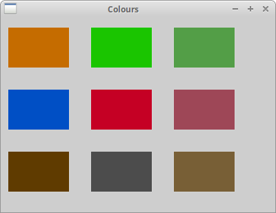 

### wx.Pen

笔是基本的图形对象。 它用于绘制直线、圆形，或矩形、椭圆、多边形或其他形状的轮廓。

```python
wx.Pen(wx.Colour colour, width=1, style=wx.SOLID)
```

`wx.Pen` 构造函数有三个参数：颜色 colour，宽度 width 和样式 style。 以下是可能的钢笔样式列表：

- wx.SOLID
- wx.DOT
- wx.LONG_DASH
- wx.SHORT_DASH
- wx.DOT_DASH
- wx.TRANSPARENT

**pens.py**

```python
#!/usr/bin/env python3
# -*- coding: utf-8 -*-

"""
ZetCode wxPython tutorial

This program draws six rectangles with different pens.

author: Jan Bodnar
website: zetcode.com
last edited: May 2018
"""

import wx

class Example(wx.Frame):

    def __init__(self, *args, **kw):
        super(Example, self).__init__(*args, **kw)

        self.InitUI()

    def InitUI(self):

        self.Bind(wx.EVT_PAINT, self.OnPaint)

        self.SetTitle("Pens")
        self.Centre()

    def OnPaint(self, event):
        dc = wx.PaintDC(self)

        dc.SetPen(wx.Pen('#4c4c4c', 1, wx.SOLID))
        dc.DrawRectangle(10, 15, 90, 60)

        dc.SetPen(wx.Pen('#4c4c4c', 1, wx.DOT))
        dc.DrawRectangle(130, 15, 90, 60)

        dc.SetPen(wx.Pen('#4c4c4c', 1, wx.LONG_DASH))
        dc.DrawRectangle(250, 15, 90, 60)

        dc.SetPen(wx.Pen('#4c4c4c', 1, wx.SHORT_DASH))
        dc.DrawRectangle(10, 105, 90, 60)

        dc.SetPen(wx.Pen('#4c4c4c', 1, wx.DOT_DASH))
        dc.DrawRectangle(130, 105, 90, 60)

        dc.SetPen(wx.Pen('#4c4c4c', 1, wx.TRANSPARENT))
        dc.DrawRectangle(250, 105, 90, 60)


def main():

    app = wx.App()
    ex = Example(None)
    ex.Show()
    app.MainLoop()


if __name__ == '__main__':
    main()
```

如果我们不指定自定义画笔，则使用默认画笔。 默认画笔是 `wx.WHITE_BRUSH`。 矩形的周长由钢笔画出。 最后一个没有边界。 它是透明的，即不可见。

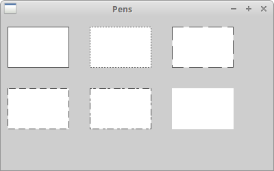 

### Joins and Caps

笔对象有另外两个参数：join 和 cap。join 定义了如何绘制线之间的连接。

join 样式有以下选项：

- wx.JOIN_MITER
- wx.JOIN_BEVEL
- wx.JOIN_ROUND

当使用 `wx.JOIN_MITER` 时，线的外边缘被延伸。 他们以一定角度相遇，这个区域被填满。


在 `wx.JOIN_BEVEL` 中，两条线之间的三角形缺口被填充。


在 `wx.JOIN_ROUND` 中，两条线之间的圆弧被填满。 


默认值是 `wx.JOIN_ROUND`。

cap 定义了线条将如何由钢笔画出。 选项是：

- wx.CAP_ROUND
- wx.CAP_PROJECTING
- wx.CAP_BUTT

`wx.CAP_ROUND` 绘制圆角端。 

`wx.CAP_PROJECTING` 和 `wx.CAP_BUTT` 绘制方形端。它们之间的区别在于 `wx.CAP_PROJECTING` 将延伸超出终点，直线尺寸的一半。`wx.CAP_ROUND` 也会延伸到终点之外。

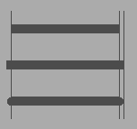

**joins_caps.py**

```python
#!/usr/bin/env python3
# -*- coding: utf-8 -*-

"""
ZetCode wxPython tutorial

This program draws uses different joins
and caps in drawing.

author: Jan Bodnar
website: zetcode.com
last edited: May 2018
"""

import wx

class Example(wx.Frame):

    def __init__(self, *args, **kw):
        super(Example, self).__init__(*args, **kw)

        self.InitUI()

    def InitUI(self):

        self.Bind(wx.EVT_PAINT, self.OnPaint)

        self.SetTitle("Joins and caps")
        self.Centre()

    def OnPaint(self, e):

        dc = wx.PaintDC(self)

        pen = wx.Pen('#4c4c4c', 10, wx.SOLID)

        pen.SetJoin(wx.JOIN_MITER)
        dc.SetPen(pen)
        dc.DrawRectangle(15, 15, 80, 50)

        pen.SetJoin(wx.JOIN_BEVEL)
        dc.SetPen(pen)
        dc.DrawRectangle(125, 15, 80, 50)

        pen.SetJoin(wx.JOIN_ROUND)
        dc.SetPen(pen)
        dc.DrawRectangle(235, 15, 80, 50)

        pen.SetCap(wx.CAP_BUTT)
        dc.SetPen(pen)
        dc.DrawLine(30, 150,  150, 150)

        pen.SetCap(wx.CAP_PROJECTING)
        dc.SetPen(pen)
        dc.DrawLine(30, 190,  150, 190)

        pen.SetCap(wx.CAP_ROUND)
        dc.SetPen(pen)
        dc.DrawLine(30, 230,  150, 230)

        pen2 = wx.Pen('#4c4c4c', 1, wx.SOLID)
        dc.SetPen(pen2)
        dc.DrawLine(30, 130, 30, 250)
        dc.DrawLine(150, 130, 150, 250)
        dc.DrawLine(155, 130, 155, 250)


def main():

    app = wx.App()
    ex = Example(None)
    ex.Show()
    app.MainLoop()


if __name__ == '__main__':
    main()
```

```python
pen = wx.Pen('#4c4c4c', 10, wx.SOLID)
```

为了看到各种 join 和 cap 样式，我们需要将钢笔宽度设置为大于1。

```python
dc.DrawLine(150, 130, 150, 250)
dc.DrawLine(155, 130, 155, 250)
```

注意下面的图右边两条包围的垂直线。 它们之间的距离是 5px。 它恰好是当前笔宽的一半。

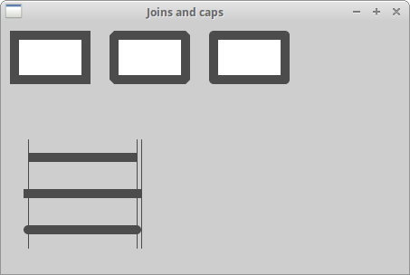

### Gradients

在计算机图形学中，渐变是从浅色到深色或从一种颜色到另一种颜色的平滑混合。 在 2D drawing 程序和 paint 程序中，渐变用于创建丰富多彩的背景和特殊效果，以及模拟灯光和阴影。

```python
GradientFillLinear(self, rect, initialColour, destColour, nDirection=RIGHT)
```

此方法使用线性渐变填充由 `rect` 指定的区域，从 `initialColour` 开始并最终消失为 `destColour`。`nDirection` 参数指定颜色更改的方向; 默认值是 `wx.EAST`。

**gradients.py**

```python
#!/usr/bin/env python3
# -*- coding: utf-8 -*-

"""
ZetCode wxPython tutorial

This program draws four rectangles filled
with gradients.

author: Jan Bodnar
website: zetcode.com
last edited: May 2018
"""

import wx

class Example(wx.Frame):

    def __init__(self, *args, **kw):
        super(Example, self).__init__(*args, **kw)

        self.InitUI()

    def InitUI(self):

        self.Bind(wx.EVT_PAINT, self.OnPaint)

        self.SetTitle("Gradients")
        self.Centre()

    def OnPaint(self, event):

        dc = wx.PaintDC(self)

        dc.GradientFillLinear((20, 20, 180, 40), '#ffec00', '#000000', wx.NORTH)
        dc.GradientFillLinear((20, 80, 180, 40), '#ffec00', '#000000', wx.SOUTH)
        dc.GradientFillLinear((20, 140, 180, 40), '#ffec00', '#000000', wx.EAST)
        dc.GradientFillLinear((20, 200, 180, 40), '#ffec00', '#000000', wx.WEST)


def main():

    app = wx.App()
    ex = Example(None)
    ex.Show()
    app.MainLoop()


if __name__ == '__main__':
    main()
```

在这个例子中，四个矩形用渐变填充。

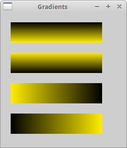

### wx.Brush

画笔是一个基本的图形对象。 它用于绘制图形形状的背景，例如矩形，椭圆或多边形。

wxPython 有以下内置的笔刷类型：

- wx.SOLID
- wx.STIPPLE
- wx.BDIAGONAL_HATCH
- wx.CROSSDIAG_HATCH
- wx.FDIAGONAL_HATCH
- wx.CROSS_HATCH
- wx.HORIZONTAL_HATCH
- wx.VERTICAL_HATCH
- wx.TRANSPARENT

**brushes.py**

```python
#!/usr/bin/env python3
# -*- coding: utf-8 -*-

"""
ZetCode wxPython tutorial

This program draws eight rectangles filled
with different brushes.

author: Jan Bodnar
website: zetcode.com
last edited: May 2018
"""

import wx

class Example(wx.Frame):

    def __init__(self, *args, **kw):
        super(Example, self).__init__(*args, **kw)

        self.InitUI()

    def InitUI(self):

        self.Bind(wx.EVT_PAINT, self.OnPaint)

        self.SetTitle("Brushes")
        self.Centre()

    def OnPaint(self, e):

        dc = wx.PaintDC(self)

        dc.SetBrush(wx.Brush('#4c4c4c', wx.CROSS_HATCH))
        dc.DrawRectangle(10, 15, 90, 60)

        dc.SetBrush(wx.Brush('#4c4c4c', wx.SOLID))
        dc.DrawRectangle(130, 15, 90, 60)

        dc.SetBrush(wx.Brush('#4c4c4c', wx.BDIAGONAL_HATCH))
        dc.DrawRectangle(250, 15, 90, 60)

        dc.SetBrush(wx.Brush('#4c4c4c', wx.CROSSDIAG_HATCH))
        dc.DrawRectangle(10, 105, 90, 60)

        dc.SetBrush(wx.Brush('#4c4c4c', wx.FDIAGONAL_HATCH))
        dc.DrawRectangle(130, 105, 90, 60)

        dc.SetBrush(wx.Brush('#4c4c4c', wx.HORIZONTAL_HATCH))
        dc.DrawRectangle(250, 105, 90, 60)

        dc.SetBrush(wx.Brush('#4c4c4c', wx.VERTICAL_HATCH))
        dc.DrawRectangle(10, 195, 90, 60)

        dc.SetBrush(wx.Brush('#4c4c4c', wx.TRANSPARENT))
        dc.DrawRectangle(130, 195, 90, 60)


def main():

    app = wx.App()
    ex = Example(None)
    ex.Show()
    app.MainLoop()


if __name__ == '__main__':
    main()
```

示例中使用了八种不同的内置画笔类型。

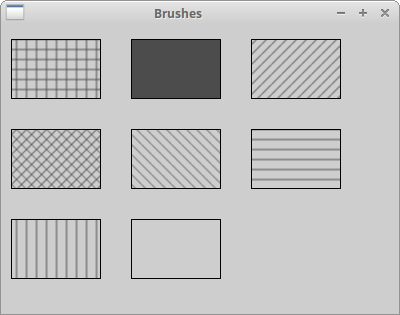

### Custom Patterns

我们不限制使用预定义的模式。 我们可以轻松创建自己的自定义模式。

**custom_patterns.py**

```python
#!/usr/bin/env python3
# -*- coding: utf-8 -*-

"""
ZetCode wxPython tutorial

This program draws three rectangles with custom
brush patterns.

author: Jan Bodnar
website: zetcode.com
last edited: May 2018
"""

import wx

class Example(wx.Frame):

    def __init__(self, *args, **kw):
        super(Example, self).__init__(*args, **kw)

        self.InitUI()

    def InitUI(self):

        self.Bind(wx.EVT_PAINT, self.OnPaint)

        self.SetTitle("Custom patterns")
        self.Centre()

    def OnPaint(self, e):

        dc = wx.PaintDC(self)

        dc.SetPen(wx.Pen('#C7C3C3'))

        brush1 = wx.Brush(wx.Bitmap('pattern1.png'))
        dc.SetBrush(brush1)
        dc.DrawRectangle(10, 15, 90, 60)

        brush2 = wx.Brush(wx.Bitmap('pattern2.png'))
        dc.SetBrush(brush2)
        dc.DrawRectangle(130, 15, 90, 60)

        brush3 = wx.Brush(wx.Bitmap('pattern3.png'))
        dc.SetBrush(brush3)
        dc.DrawRectangle(250, 15, 90, 60)


def main():

    app = wx.App()
    ex = Example(None)
    ex.Show()
    app.MainLoop()


if __name__ == '__main__':
    main()
```

我们创建了一些小的位图。这些位图是在 Gimp 中创建的。

```python
brush1 = wx.Brush(wx.Bitmap('pattern1.png'))
dc.SetBrush(brush1)
dc.DrawRectangle(10, 15, 90, 60)
```

从位图创建画笔并将其设置为设备上下文。它用于填充矩形的内部。

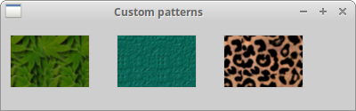

### Points

最简单的几何对象是一个点，是窗口上的一个普通点。

```python
DrawPoint(self, x, y)
```

此方法在 x,y 坐标处绘制一个点。

**points.py**

```python
#!/usr/bin/env python3
# -*- coding: utf-8 -*-

"""
ZetCode wxPython tutorial

This program draws one thousand points
randomly on the window.

author: Jan Bodnar
website: zetcode.com
last edited: May 2018
"""

import wx
import random

class Example(wx.Frame):

    def __init__(self, *args, **kw):
        super(Example, self).__init__(*args, **kw)

        self.InitUI()

    def InitUI(self):

        self.Bind(wx.EVT_PAINT, self.OnPaint)

        self.SetTitle("Points")
        self.Centre()

    def OnPaint(self, e):

        dc = wx.PaintDC(self)

        dc.SetPen(wx.Pen('RED'))

        for i in range(1000):

            w, h = self.GetSize()
            x = random.randint(1, w-1)
            y = random.randint(1, h-1)
            dc.DrawPoint(x, y)


def main():

    app = wx.App()
    ex = Example(None)
    ex.Show()
    app.MainLoop()


if __name__ == '__main__':
    main()
```

单点可能很难看到，所以我们创建了1000 个点。

```python
dc.SetPen(wx.Pen('RED'))
```

在这里，我们将笔的颜色设置为红色。

```python
w, h = self.GetSize()
x = random.randint(1, w-1)
```

点随机分布在窗口的客户区域周围。 它们也是动态分布的。如果我们调整窗口的大小，这些点将随着一个新的客户端大小随机绘制。`randint(a, b)` 方法返回范围 [a，b] 中的随机整数，包括 a, b。

 

## Shapes

形状 Shapes 是更复杂的几何对象。 我们在下面的例子中绘制各种几何形状。

**shapes.py**

```python
#!/usr/bin/env python3
# -*- coding: utf-8 -*-

"""
ZetCode wxPython tutorial

This program draws various shapes on
the window.

author: Jan Bodnar
website: zetcode.com
last edited: May 2018
"""

import wx

class Example(wx.Frame):

    def __init__(self, *args, **kw):
        super(Example, self).__init__(*args, **kw)

        self.InitUI()

    def InitUI(self):

        self.Bind(wx.EVT_PAINT, self.OnPaint)

        self.SetTitle("Shapes")
        self.Centre()


    def OnPaint(self, e):

        dc = wx.PaintDC(self)
        dc.SetBrush(wx.Brush('#777'))
        dc.SetPen(wx.Pen("#777"))

        dc.DrawEllipse(20, 20, 90, 60)
        dc.DrawRoundedRectangle(130, 20, 90, 60, 10)
        dc.DrawArc(240, 40, 340, 40, 290, 20)

        dc.DrawPolygon(((130, 140), (180, 170), (180, 140), (220, 110), (140, 100)))
        dc.DrawRectangle(20, 120, 80, 50)
        dc.DrawSpline(((240, 170), (280, 170), (285, 110), (325, 110)))

        dc.DrawLines(((20, 260), (100, 260), (20, 210), (100, 210)))
        dc.DrawCircle(170, 230, 35)
        dc.DrawRectangle(250, 200, 60, 60)


def main():

    app = wx.App()
    ex = Example(None)
    ex.Show()
    app.MainLoop()


if __name__ == '__main__':
    main()
```

在我们的例子中，我们绘制了椭圆、圆角矩形、弧形、矩形、多边形，样条线，直线、圆和正方形（从右到左，从上到下）。圆是一种特殊的椭圆形，方形是一种特殊的矩形。

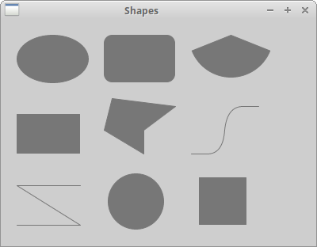

## Regions

设备上下文可以分成几个部分，称为区域 regions。 区域可以是任何形状，例如矩形或圆形。 通过 `Union`、`Intersect`、`Substract` 和 `Xor` 操作，我们可以创建复杂区域。 区域用于轮廓 outlining，填充 filling 和裁剪 clipping。

我们可以通过三种方式创建区域。 最简单的方法是创建一个矩形区域  rectangular region。 可以从位图的点列表中创建更复杂的区域。

在我们创建这些区域之前，我们会先创建一个小例子。 我们将这个主题分成几个部分，以便更容易理解。 你可能会发现复习一下你在学校学的数学是个好主意。 在[这里](http://en.wikipedia.org/wiki/Circle)我们可以找到一篇好文章。

**lines.py**

```python
#!/usr/bin/env python3
# -*- coding: utf-8 -*-

"""
ZetCode wxPython tutorial

This program draws various shapes on
the window.

author: Jan Bodnar
website: zetcode.com
last edited: May 2018
"""

import wx
from math import hypot, sin, cos, pi

class Example(wx.Frame):

    def __init__(self, *args, **kw):
        super(Example, self).__init__(*args, **kw)

        self.InitUI()

    def InitUI(self):

        self.Bind(wx.EVT_PAINT, self.OnPaint)

        self.SetTitle('Lines')
        self.Centre()

    def OnPaint(self, e):

        dc = wx.PaintDC(self)
        size_x, size_y = self.GetClientSize()
        dc.SetDeviceOrigin(size_x/2, size_y/2)

        radius = hypot(size_x/2, size_y/2)
        angle = 0

        while (angle < 2*pi):
            x = radius*cos(angle)
            y = radius*sin(angle)
            dc.DrawLine((0, 0), (x, y))
            angle = angle + 2*pi/360


def main():

    app = wx.App()
    ex = Example(None)
    ex.Show()
    app.MainLoop()


if __name__ == '__main__':
    main()
```

在这个例子中，我们从客户区中间画出 360 条线。 两条线之间的距离是 1 度。 我们创造一个有趣的图像。

```python
import wx
from math import hypot, sin, cos, pi
```

我们需要数学模块中的三个数学函数和一个常量。

```python
dc.SetDeviceOrigin(size_x/2, size_y/2)
```

方法 `SetDeviceOrigin()` 创建坐标系新的起点。我们把它放在客户区的中间。通过重新定位坐标系，我们使得绘图更简单。

```python
radius = hypot(size_x/2, size_y/2)
```

我们调用 `hypot()` 方法得到了直角三角形的斜边。这是最长的一条线，我们可以从客户区中间开始绘制。这是从起点到窗口角落的线的长度。 这样，大部分线条都没有完全绘制。 重叠部分不可见。

```python
x = radius*cos(angle)
y = radius*sin(angle)
```

这些是参数化功能。它们用于在曲线上找到  [x, y] 点。所有的 360 条线都是从坐标系的起点到圆上的点的连成的线条。

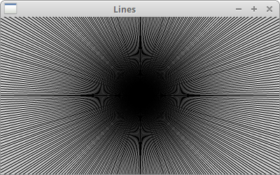

## Clipping

`Clipping` 限制绘制到某个区域。裁剪 Clipping 通常用于创建效果并提高应用程序的性能。我们使用 `SetClippingRegionAsRegion()` 方法限制绘图到某个区域。

在下面的例子中，我们将修改和改进我们之前的程序。

**star.py**

```python
#!/usr/bin/env python3
# -*- coding: utf-8 -*-

"""
ZetCode wxPython tutorial

This program demonstrates a clipping operation
when drawing a star object.

author: Jan Bodnar
website: zetcode.com
last edited: May 2018
"""

import wx
from math import hypot, sin, cos, pi

class Example(wx.Frame):

    def __init__(self, *args, **kw):
        super(Example, self).__init__(*args, **kw)

        self.InitUI()

    def InitUI(self):

        self.Bind(wx.EVT_PAINT, self.OnPaint)

        self.SetTitle("Star")
        self.Centre()

    def OnPaint(self, e):

        dc = wx.PaintDC(self)

        dc.SetPen(wx.Pen('#424242'))
        size_x, size_y = self.GetClientSize()
        dc.SetDeviceOrigin(size_x/2, size_y/2)

        points = (((0, 85), (75, 75), (100, 10), (125, 75), (200, 85),
            (150, 125), (160, 190), (100, 150), (40, 190), (50, 125)))

        region = wx.Region(points)
        dc.SetDeviceClippingRegion(region)

        radius = hypot(size_x/2, size_y/2)
        angle = 0

        while (angle < 2*pi):

            x = radius*cos(angle)
            y = radius*sin(angle)
            dc.DrawLine((0, 0), (x, y))
            angle = angle + 2*pi/360

        dc.DestroyClippingRegion()


def main():

    app = wx.App()
    ex = Example(None)
    ex.Show()
    app.MainLoop()


if __name__ == '__main__':
    main()
```

我们再次绘制所有的 360 个线条。 但是这一次，只有客户区的一部分被绘制。 我们限制绘图的区域是一个星形对象。

```python
region = wx.Region(points)
dc.SetDeviceClippingRegion(region)
```

我们从点列表中创建一个区域。 `SetDeviceClippingRegion()` 方法将绘图限制在指定的区域。 在我们的例子中，它是一个星形对象。

```python
dc.DestroyClippingRegion()
```

我们必须销毁裁剪区域 clipping region。

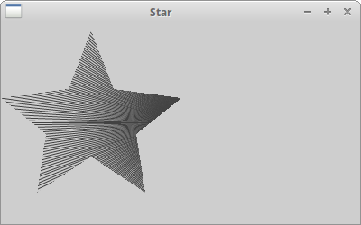

## Region operations

区域 Regions 可以组合起来创建更复杂的形状。 我们可以使用四个集合操作：union，intersect，substract，xor。

以下示例显示了所有四个操作中的操作。

**region_operations.py**

```python
#!/usr/bin/env python3
# -*- coding: utf-8 -*-

"""
ZetCode wxPython tutorial

This program performs set operations on regions.

author: Jan Bodnar
website: zetcode.com
last edited: May 2018
"""

import wx

class Example(wx.Frame):

    def __init__(self, *args, **kw):
        super(Example, self).__init__(*args, **kw)

        self.InitUI()

    def InitUI(self):

         self.Bind(wx.EVT_PAINT, self.OnPaint)

         self.SetTitle("Regions")
         self.Centre()

    def OnPaint(self, e):

         dc = wx.PaintDC(self)
         dc.SetPen(wx.Pen('#d4d4d4'))

         dc.DrawRectangle(20, 20, 50, 50)
         dc.DrawRectangle(30, 40, 50, 50)

         dc.SetBrush(wx.Brush('#ffffff'))
         dc.DrawRectangle(100, 20, 50, 50)
         dc.DrawRectangle(110, 40, 50, 50)

         region1 = wx.Region(100, 20, 50, 50)
         region2 = wx.Region(110, 40, 50, 50)
         region1.Intersect(region2)

         rect = region1.GetBox()
         dc.SetDeviceClippingRegion(region1)
         dc.SetBrush(wx.Brush('#ff0000'))
         dc.DrawRectangle(rect)
         dc.DestroyClippingRegion()

         dc.SetBrush(wx.Brush('#ffffff'))
         dc.DrawRectangle(180, 20, 50, 50)
         dc.DrawRectangle(190, 40, 50, 50)

         region1 = wx.Region(180, 20, 50, 50)
         region2 = wx.Region(190, 40, 50, 50)
         region1.Union(region2)
         dc.SetDeviceClippingRegion(region1)

         rect = region1.GetBox()
         dc.SetBrush(wx.Brush('#fa8e00'))
         dc.DrawRectangle(rect)
         dc.DestroyClippingRegion()

         dc.SetBrush(wx.Brush('#ffffff'))
         dc.DrawRectangle(20, 120, 50, 50)
         dc.DrawRectangle(30, 140, 50, 50)
         region1 = wx.Region(20, 120, 50, 50)
         region2 = wx.Region(30, 140, 50, 50)
         region1.Xor(region2)

         rect = region1.GetBox()
         dc.SetDeviceClippingRegion(region1)
         dc.SetBrush(wx.Brush('#619e1b'))
         dc.DrawRectangle(rect)
         dc.DestroyClippingRegion()

         dc.SetBrush(wx.Brush('#ffffff'))
         dc.DrawRectangle(100, 120, 50, 50)
         dc.DrawRectangle(110, 140, 50, 50)
         region1 = wx.Region(100, 120, 50, 50)
         region2 = wx.Region(110, 140, 50, 50)
         region1.Subtract(region2)

         rect = region1.GetBox()
         dc.SetDeviceClippingRegion(region1)
         dc.SetBrush(wx.Brush('#715b33'))
         dc.DrawRectangle(rect)
         dc.DestroyClippingRegion()

         dc.SetBrush(wx.Brush('#ffffff'))
         dc.DrawRectangle(180, 120, 50, 50)
         dc.DrawRectangle(190, 140, 50, 50)
         region1 = wx.Region(180, 120, 50, 50)
         region2 = wx.Region(190, 140, 50, 50)
         region2.Subtract(region1)

         rect = region2.GetBox()
         dc.SetDeviceClippingRegion(region2)
         dc.SetBrush(wx.Brush('#0d0060'))
         dc.DrawRectangle(rect)
         dc.DestroyClippingRegion()


def main():

    app = wx.App()
    ex = Example(None)
    ex.Show()
    app.MainLoop()


if __name__ == '__main__':
    main()
```

在这个例子中，我们展示了六个区域集 region set 操作。

```python
 region1 = wx.Region(100, 20, 50, 50)
 region2 = wx.Region(110, 40, 50, 50)
 region1.Intersect(region2)
```

该代码执行两个区域的交集 intersection 操作。

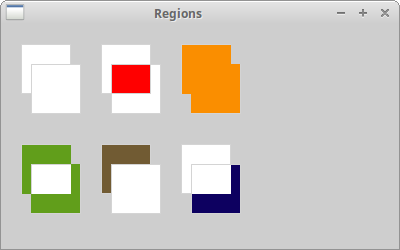

## Mapping modes

映射模式 mapping mode 定义了用于将页面空间 page-space 单元转换为设备空间 device-space 单元的度量单位，还定义了设备 x 和 y 轴的方向。

### Speak in English, measure in metric

英语成为全球沟通语言。公制体系也成为了全球的测量体系。 根据这个维基百科[文章](http://en.wikipedia.org/wiki/Metric_system)，只有三个例外。 美国，利比里亚和缅甸。 例如，美国人使用华氏温度来测量温度、用加仑来给汽车加油或磅来称重。

尽管我们在欧洲使用公制系统，但仍然有例外。美国主导IT，我们正在进口他们的标准。所以我们也说我们有一个 17 英寸的显示器。图形可以放入文件中，显示在显示器或其他设备（相机、摄像机、手机）的屏幕上或用打印机打印。纸张大小可以毫米，点或英寸为单位设置，屏幕的分辨率以像素为单位，文本的质量由每英寸的点数决定。 我们也有点，比特或样本。 这是我们拥有逻辑和设备单位的原因之一。

## Logical and device units

如果我们在客户区域绘制文本或几何图元，我们使用逻辑单位来定位它们。

如果我们想绘制一些文本，我们提供 text 参数和  x, y 位置。x，y 是逻辑单位。设备然后以设备单位绘制文本。 逻辑和设备单位可能相同，也可能不同。 人们使用逻辑单位（毫米），设备单位对于特定设备来说是本地的。例如，屏幕的本机设备单位是像素。 HEWLETT PACKARD LaserJet 1022 的本机设备单位是1200 dpi（每英寸点数）。

到目前为止，我们已经谈到了各种测量单位。设备的映射模式 mapping mode 是一种如何将逻辑单元转换为设备单元的方式。 wxPython 有以下映射模式：

| Mapping Mode   | Logical Unit                         |
| -------------- | ------------------------------------ |
| wx.MM_TEXT     | 1 pixel                              |
| wx.MM_METRIC   | 1 millimeter                         |
| wx.MM_LOMETRIC | 1/10 of a millimeter                 |
| wx.MM_POINTS   | 1 point, 1/72 of an inch             |
| wx.MM_TWIPS    | 1/20 of a point or 1/1440 of an inch |

默认的映射模式是 `wx.MM_TEXT`。 在这种模式下，逻辑单元与设备单元相同。当人们在屏幕上定位对象或设计网页时，他们通常以像素为单位进行思考。 网页设计师创建三个列页面，这些列以像素为单位设置。页面的最低公分母通常是800像素等。这种想法是很自然的，因为我们知道我们的监视器具有例如 1024x768 像素我们不打算做转换，而是习惯用像素来思考。如果我们想以毫米为单位绘制结构，我们可以使用两种公制映射模式。 直接以毫米为单位绘制屏幕太大，这就是为什么我们有 `wx.MM_LOMETRIC` 映射模式。

要设置不同的映射模式，我们使用 `SetMapMode()` 方法。

## Ruler example

标尺以像素为单位测量屏幕对象。

**ruler.py**

```python
#!/usr/bin/env python3
# -*- coding: utf-8 -*-

"""
ZetCode wxPython tutorial

This program creates a ruler.

author: Jan Bodnar
website: zetcode.com
last edited: May 2018
"""

import wx


RW = 701 # ruler width
RM = 10  # ruler margin
RH = 80  # ruler height


class Example(wx.Frame):

    def __init__(self, parent):
        wx.Frame.__init__(self, parent, size=(RW + 2*RM, RH),
            style=wx.FRAME_NO_TASKBAR | wx.NO_BORDER | wx.STAY_ON_TOP)
        self.font = wx.Font(7, wx.FONTFAMILY_DEFAULT, wx.FONTSTYLE_NORMAL,
            wx.FONTWEIGHT_BOLD, False, 'Courier 10 Pitch')

        self.InitUI()

    def InitUI(self):

        self.Bind(wx.EVT_PAINT, self.OnPaint)
        self.Bind(wx.EVT_LEFT_DOWN, self.OnLeftDown)
        self.Bind(wx.EVT_LEFT_UP, self.OnLeftUp)
        self.Bind(wx.EVT_RIGHT_DOWN, self.OnRightDown)
        self.Bind(wx.EVT_MOTION, self.OnMouseMove)

        self.Centre()
        self.Show(True)

    def OnPaint(self, e):

        dc = wx.PaintDC(self)

        brush = wx.Brush(wx.Bitmap('granite.png'))
        dc.SetBrush(brush)
        dc.DrawRectangle(0, 0, RW+2*RM, RH)
        dc.SetFont(self.font)

        dc.SetPen(wx.Pen('#F8FF25'))
        dc.SetTextForeground('#F8FF25')

        for i in range(RW):

            if not (i % 100):

                dc.DrawLine(i+RM, 0, i+RM, 10)
                w, h = dc.GetTextExtent(str(i))
                dc.DrawText(str(i), i+RM-w/2, 11)

            elif not (i % 20):

                dc.DrawLine(i+RM, 0, i+RM, 8)

            elif not (i % 2):

                dc.DrawLine(i+RM, 0, i+RM, 4)

    def OnLeftDown(self, e):

        x, y = self.ClientToScreen(e.GetPosition())
        ox, oy = self.GetPosition()

        dx = x - ox
        dy = y - oy

        self.delta = ((dx, dy))

    def OnMouseMove(self, e):

        if e.Dragging() and e.LeftIsDown():

            self.SetCursor(wx.Cursor(wx.CURSOR_HAND))

            x, y = self.ClientToScreen(e.GetPosition())
            fp = (x - self.delta[0], y - self.delta[1])
            self.Move(fp)

    def OnLeftUp(self, e):

        self.SetCursor(wx.Cursor(wx.CURSOR_ARROW))

    def OnRightDown(self, e):

        self.Close()


def main():

    app = wx.App()
    ex = Example(None)
    ex.Show()
    app.MainLoop()


if __name__ == '__main__':
    main()
```

在这个例子中，我们创建了一个标尺。 此标尺以像素为单位测量屏幕对象。我们保留默认的映射模式，即 `wx.MM_TEXT`。 正如我们之前已经提到的，这种模式具有相同的逻辑和设备单位。 在我们的例子中，这些是像素。

```python
def __init__(self, parent):
    wx.Frame.__init__(self, parent, size=(RW + 2*RM, RH),
        style=wx.FRAME_NO_TASKBAR | wx.NO_BORDER | wx.STAY_ON_TOP)
```

我们创建了一个无边框窗口。 标尺是 721 px 宽：RW + 2RM = 701 + 20 = 721。标尺显示 700 个数字; 0 ... 700 是 701 个像素。标尺在两边都有边距，210 是 20像素。它们一同创建了 721 个像素。

```python
brush = wx.Brush(wx.Bitmap('granite.png'))
dc.SetBrush(brush)
dc.DrawRectangle(0, 0, RW+2*RM, RH)
```

在这里，我们在窗口上绘制一个自定义图案。 我们已经在 Gimp 中使用了预定义的模式。 它被称为花岗岩。

```python
w, h = dc.GetTextExtent(str(i))
dc.DrawText(str(i), i+RM-w/2, 11)
```

这些直线确保我们正确地对齐文本。 `GetTextExtent()` 方法返回文本的宽度和高度。

我们的窗口周围没有边框。所以我们必须手动处理移动。`OnLeftDown()` 和 `OnMouseMove()` 方法使我们能够移动标尺。

```python
def OnLeftDown(self, e):

    x, y = self.ClientToScreen(e.GetPosition())
    ox, oy = self.GetPosition()

    dx = x - ox
    dy = y - oy

    self.delta = ((dx, dy))
```

在 `OnLeftDown()` 方法中，我们确定窗口和鼠标的光标坐标; delta 值是鼠标指针距窗口左上角的距离。 我们需要 delta 值来移动窗口。

```python
def OnMouseMove(self, e):

    if e.Dragging() and e.LeftIsDown():

        self.SetCursor(wx.Cursor(wx.CURSOR_HAND))

        x, y = self.ClientToScreen(e.GetPosition())
        fp = (x - self.delta[0], y - self.delta[1])
        self.Move(fp)
```

当我们同时拖动窗口并按下鼠标左键时，代码被执行。在代码块中，我们使用 `SetCursor()` 更改鼠标光标并使用  `Move()` 方法移动窗口。 delta 值用于获取距离。

```python
def OnLeftUp(self, e):

    self.SetCursor(wx.Cursor(wx.CURSOR_ARROW))
```

当我们释放鼠标左键时，我们将光标变回箭头。

```python
def OnRightDown(self, e):

    self.Close()
```

右击窗口区域关闭窗口。

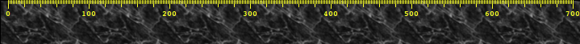

在本章中，我们在 wxPython中 使用了图形。