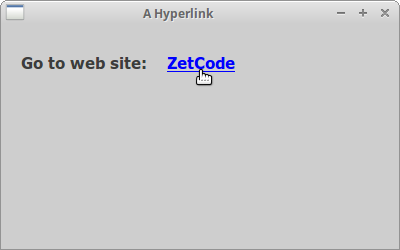
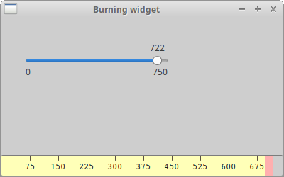
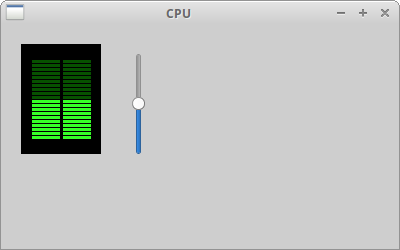

# Creating custom widgets

工具包 Toolkits 通常只提供最常用的组件，如按钮 buttons、文本组件 text widgets、滚动条 scrollbars、滑块 sliders 等。没有工具包可以提供所有可能的组件。 wxPython 有很多组件；更多专用的组件需要客户端程序员自己创建。

自定义组件有两种创建方式：我们修改或增强现有的组件，或者我们从头创建一个自定义组件。

## A hyperlink widget

第一个例子将创建一个超链接。 超链接组件将基于现有的 `wx.lib.stattext.GenStaticText` 组件。

**hyperlink.py**

```python
#!/usr/bin/env python3
# -*- coding: utf-8 -*-

"""
ZetCode wxPython tutorial

This program creates a Hyperlink widget.

author: Jan Bodnar
website: zetcode.com
last edited: May 2018
"""

import wx
from wx.lib.stattext import GenStaticText
import webbrowser


class Link(GenStaticText):

    def __init__(self, *args, **kw):
        super(Link, self).__init__(*args, **kw)

        self.font1 = wx.Font(11, wx.SWISS, wx.NORMAL, wx.BOLD, True, 'Verdana')
        self.font2 = wx.Font(11, wx.SWISS, wx.NORMAL, wx.BOLD, False, 'Verdana')

        self.SetFont(self.font2)
        self.SetForegroundColour('#0000ff')

        self.Bind(wx.EVT_MOUSE_EVENTS, self.OnMouseEvent)
        self.Bind(wx.EVT_MOTION, self.OnMouseEvent)

    def SetUrl(self, url):

        self.url = url


    def OnMouseEvent(self, e):

        if e.Moving():

            self.SetCursor(wx.Cursor(wx.CURSOR_HAND))
            self.SetFont(self.font1)

        elif e.LeftUp():

            webbrowser.open_new(self.url)

        else:
            self.SetCursor(wx.NullCursor)
            self.SetFont(self.font2)

        e.Skip()


class Example(wx.Frame):

    def __init__(self, *args, **kw):
        super(Example, self).__init__(*args, **kw)

        self.InitUI()

    def InitUI(self):

        panel = wx.Panel(self)

        vbox = wx.BoxSizer(wx.VERTICAL)
        hbox = wx.BoxSizer(wx.HORIZONTAL)

        st = GenStaticText(panel, label='Go to web site:')
        st.SetFont(wx.Font(11, wx.SWISS, wx.NORMAL, wx.BOLD, False, 'Verdana'))
        hbox.Add(st, flag=wx.LEFT, border=20)

        link_wid = Link(panel, label='ZetCode')
        link_wid.SetUrl('http://www.zetcode.com')
        hbox.Add(link_wid, flag=wx.LEFT, border=20)
        
        vbox.Add(hbox, flag=wx.TOP, border=30)
        panel.SetSizer(vbox)

        self.SetTitle('A Hyperlink')
        self.Centre()


def main():

    app = wx.App()
    ex = Example(None)
    ex.Show()
    app.MainLoop()


if __name__ == '__main__':
    main()
```

此超链接组件基于现有的组件。在这个例子中，我们不绘制任何东西，我们只是使用一个现有的组件，我们稍微修改一下。

```python
from wx.lib.stattext import GenStaticText
import webbrowser
```

在这里我们导入了我们从中派生出的超链接组件和 webbrowser 模块的基础组件。webbrowser模块是 Python 的标准模块。 我们将使用它在默认浏览器中打开链接。

```python
self.SetFont(self.font2)
self.SetForegroundColour('#0000ff')
```

创建超链接组件的想法很简单。 我们从基础 `wx.lib.stattext.GenStaticText` 组件类继承。 所以我们有一个文本组件。然后我们修改一下。 我们改变文字的字体和颜色。

```python
if e.Moving():
    
    self.SetCursor(wx.Cursor(wx.CURSOR_HAND))
    self.SetFont(self.font1)
```

如果我们将鼠标指针悬停在链接上，我们给字体带下划线，并将鼠标指针更改为手形光标。

```python
elif e.LeftUp():
    
    webbrowser.open_new(self.url)
```

如果我们点击链接，我们会在默认浏览器中打开链接。



## Burning widget

这是我们从头开始创建的组件示例。我们在窗口的底部放置一个 `wx.Panel` 并手动绘制整个组件。如果您曾烧制过 CD 或 DVD，您已经看到了这种组件。

**burning.py**

```python
#!/usr/bin/env python3
# -*- coding: utf-8 -*-

"""
ZetCode wxPython tutorial

This program creates a Burning widget.

author: Jan Bodnar
website: zetcode.com
last edited: May 2018
"""

import wx

class Burning(wx.Panel):
    def __init__(self, parent):
        wx.Panel.__init__(self, parent, size=(-1, 30), style=wx.SUNKEN_BORDER)

        self.parent = parent
        self.font = wx.Font(9, wx.FONTFAMILY_DEFAULT, wx.FONTSTYLE_NORMAL,
            wx.FONTWEIGHT_NORMAL, False, 'Courier 10 Pitch')

        self.Bind(wx.EVT_PAINT, self.OnPaint)
        self.Bind(wx.EVT_SIZE, self.OnSize)


    def OnPaint(self, e):

        num = range(75, 700, 75)
        dc = wx.PaintDC(self)
        dc.SetFont(self.font)
        w, h = self.GetSize()

        self.cw = self.parent.GetParent().cw

        step = int(round(w / 10.0))

        j = 0

        till = (w / 750.0) * self.cw
        full = (w / 750.0) * 700

        if self.cw >= 700:

            dc.SetPen(wx.Pen('#FFFFB8'))
            dc.SetBrush(wx.Brush('#FFFFB8'))
            dc.DrawRectangle(0, 0, full, 30)
            dc.SetPen(wx.Pen('#ffafaf'))
            dc.SetBrush(wx.Brush('#ffafaf'))
            dc.DrawRectangle(full, 0, till-full, 30)
        else:

            dc.SetPen(wx.Pen('#FFFFB8'))
            dc.SetBrush(wx.Brush('#FFFFB8'))
            dc.DrawRectangle(0, 0, till, 30)


        dc.SetPen(wx.Pen('#5C5142'))

        for i in range(step, 10*step, step):

            dc.DrawLine(i, 0, i, 6)
            width, height = dc.GetTextExtent(str(num[j]))
            dc.DrawText(str(num[j]), i-width/2, 8)
            j = j + 1

    def OnSize(self, e):

        self.Refresh()


class Example(wx.Frame):

    def __init__(self, *args, **kwargs):
        super(Example, self).__init__(*args, **kwargs)

        self.InitUI()

    def InitUI(self):

        self.cw = 75

        panel = wx.Panel(self)
        CenterPanel = wx.Panel(panel)

        self.sld = wx.Slider(CenterPanel, value=75, maxValue=750, size=(200, -1),
            style=wx.SL_LABELS)

        vbox = wx.BoxSizer(wx.VERTICAL)
        hbox = wx.BoxSizer(wx.HORIZONTAL)
        hbox2 = wx.BoxSizer(wx.HORIZONTAL)
        hbox3 = wx.BoxSizer(wx.HORIZONTAL)

        self.wid = Burning(panel)
        hbox.Add(self.wid, 1, wx.EXPAND)

        hbox2.Add(CenterPanel, 1, wx.EXPAND)
        hbox3.Add(self.sld, 0, wx.LEFT|wx.TOP, 35)

        CenterPanel.SetSizer(hbox3)

        vbox.Add(hbox2, 1, wx.EXPAND)
        vbox.Add(hbox, 0, wx.EXPAND)

        self.Bind(wx.EVT_SCROLL, self.OnScroll)

        panel.SetSizer(vbox)

        self.sld.SetFocus()

        self.SetTitle("Burning widget")
        self.Centre()

    def OnScroll(self, e):

        self.cw = self.sld.GetValue()
        self.wid.Refresh()


def main():

    app = wx.App()
    ex = Example(None)
    ex.Show()
    app.MainLoop()


if __name__ == '__main__':
    main()
```

此组件以图形方式显示介质的总容量和可用空间。组件由滑块 slider 控制。 我们的自定义组件的最小值为0，最大值为 750。如果值达到 700，我们开始绘制红色。 这通常表示烧制过量。

```python
w, h = self.GetSize()
self.cw = self.parent.GetParent().cw
...
till = (w / 750.0) * self.cw
full = (w / 750.0) * 700
```

我们动态地绘制组件。窗口越大，烧制的组件就越大。 反之亦然。 这就是为什么我们必须计算我们绘制自定义组件的 `wx.Panel` 的尺寸。 `till` 参数确定要绘制的总尺寸。 该值来自滑块组件。这是整个区域 area 的一部分。 `full` 参数决定了我们开始用红色绘制的点。 注意使用浮点数算术。这是为了达到更高的精度。

实际绘图由三个步骤组成。我们绘制黄色或红色和黄色的矩形。然后我们绘制垂直线，它将组件分成几个部分。 最后，我们画出数字，指示介质的使用量。

```python
def OnSize(self, e):
   
    self.Refresh()
```

每次调整窗口大小时，我们都会刷新窗口组件。 这会导致组件重新绘制自己。

```python
def OnScroll(self, e):
   
    self.cw = self.sld.GetValue()
    self.wid.Refresh()
```

如果我们滚动滑块，我们会得到当前实际值并将其保存到 `self.cw` 参数中。当烧制组件被绘制时，这个值被使用。 然后我们让该组件被重绘。



## The CPU widget

有系统应用程序可以测量系统资源，如温度、内存或 CPU 消耗。专用组件的创建使应用程序更具吸引力。

以下组件经常用于系统应用程序。

**cpu.py**

```python
#!/usr/bin/env python3
# -*- coding: utf-8 -*-

"""
ZetCode wxPython tutorial

This program creates a CPU widget.

author: Jan Bodnar
website: zetcode.com
last edited: May 2018
"""

import wx


class CPU(wx.Panel):

    def __init__(self, parent):
        wx.Panel.__init__(self, parent, size=(80, 110))

        self.parent = parent
        self.SetBackgroundColour('#000000')
        self.Bind(wx.EVT_PAINT, self.OnPaint)


    def OnPaint(self, e):

        dc = wx.PaintDC(self)

        dc.SetDeviceOrigin(0, 100)
        dc.SetAxisOrientation(True, True)

        pos = self.parent.GetParent().GetParent().sel
        rect = pos / 5

        for i in range(1, 21):

            if i > rect:

                dc.SetBrush(wx.Brush('#075100'))
                dc.DrawRectangle(10, i*4, 30, 5)
                dc.DrawRectangle(41, i*4, 30, 5)

            else:
                dc.SetBrush(wx.Brush('#36ff27'))
                dc.DrawRectangle(10, i*4, 30, 5)
                dc.DrawRectangle(41, i*4, 30, 5)


class Example(wx.Frame):

    def __init__(self, *args, **kwargs):
        super(Example, self).__init__(*args, **kwargs)

        self.InitUI()

    def InitUI(self):

        self.sel = 0

        panel = wx.Panel(self)
        centerPanel = wx.Panel(panel)

        self.cpu = CPU(centerPanel)

        hbox = wx.BoxSizer(wx.HORIZONTAL)

        self.slider = wx.Slider(panel, value=self.sel, maxValue=100, size=(-1, 100),
		      style=wx.VERTICAL | wx.SL_INVERSE)
        self.slider.SetFocus()

        hbox.Add(centerPanel, 0,  wx.LEFT | wx.TOP, 20)
        hbox.Add(self.slider, 0, wx.LEFT | wx.TOP, 30)

        self.Bind(wx.EVT_SCROLL, self.OnScroll)

        panel.SetSizer(hbox)

        self.SetTitle("CPU")
        self.Centre()


    def OnScroll(self, e):

        self.sel = e.GetInt()
        self.cpu.Refresh()


def main():

    app = wx.App()
    ex = Example(None)
    ex.Show()
    app.MainLoop()


if __name__ == '__main__':
    main()
```

我们创建一个黑色面板。然后我们在这个面板上绘制小矩形。矩形的颜色取决于滑块的值。颜色可以是深绿色 dark green 或亮绿色 bright green。

```python
dc.SetDeviceOrigin(0, 100)
dc.SetAxisOrientation(True, True)
```

在这里，我们将默认坐标系更改为笛卡尔坐标系。 这是为了使绘图直观。

```python
pos = self.parent.GetParent().GetParent().sel
rect = pos / 5
```

这里我们得到了 sizer 的值。 我们每列有 20 个矩形。 滑块有 100 个数字。 rect 参数将滑块值转换为将以亮绿色绘制的矩形。

```python
for i in range(1, 21):
   
    if i > rect:
        dc.SetBrush(wx.Brush('#075100'))
        dc.DrawRectangle(10, i*4, 30, 5)
        dc.DrawRectangle(41, i*4, 30, 5)
        
    else:
        dc.SetBrush(wx.Brush('#36ff27'))
        dc.DrawRectangle(10, i*4, 30, 5)
        dc.DrawRectangle(41, i*4, 30, 5)
```

在这里，我们绘制了 40 个矩形，每列 20 个。如果正在绘制的矩形的数量大于转换后的 rect 值，我们将它绘制成深绿色；否则以亮绿色。



在本章中，我们在 wxPython 中创建了自定义组件。