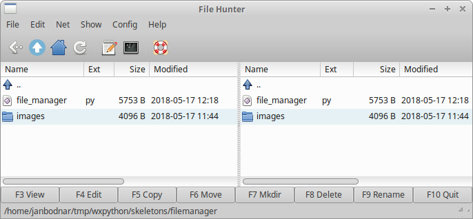
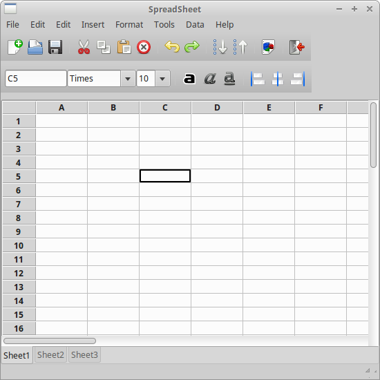
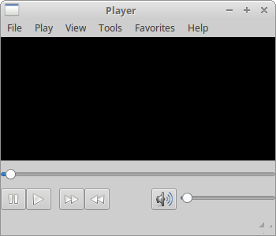
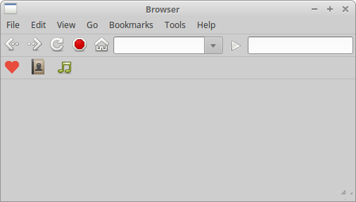

# Application skeletons in wxPython

在本节中，我们将创建一些应用程序框架。 我们的脚本将解决界面，但不会实现功能。 目标是展示如何在 wxPython 中完成几个众所周知的 GUI 界面。

## File Manager

File Hunter 是文件管理器的骨架。 它复制了 Unix 系统上的文件管理器 Krusader。 如果我们双击分离器组件，它会将 File Hunter 分成两部分，宽度相同。如果我们调整主窗口的大小，会发生同样的情况。

**file_hunter.py**

```python
#!/usr/bin/env python3
# -*- coding: utf-8 -*-

"""
ZetCode wxPython tutorial

This program creates a skeleton
of a file manager UI.

author: Jan Bodnar
website: zetcode.com
last edited: May 2018
"""

import wx
import os
import time

ID_BUTTON=100
ID_EXIT=200
ID_SPLITTER=300


class MyListCtrl(wx.ListCtrl):

    def __init__(self, parent):
        wx.ListCtrl.__init__(self, parent, style=wx.LC_REPORT)

        images = ['images/empty.png', 'images/folder.png', 'images/source-py.png',
		      'images/image.png', 'images/pdf.png', 'images/up16.png']

        self.InsertColumn(0, 'Name')
        self.InsertColumn(1, 'Ext')
        self.InsertColumn(2, 'Size', wx.LIST_FORMAT_RIGHT)
        self.InsertColumn(3, 'Modified')

        self.SetColumnWidth(0, 220)
        self.SetColumnWidth(1, 70)
        self.SetColumnWidth(2, 100)
        self.SetColumnWidth(3, 420)

        self.il = wx.ImageList(16, 16)

        for i in images:

            self.il.Add(wx.Bitmap(i))

        self.SetImageList(self.il, wx.IMAGE_LIST_SMALL)

        j = 1

        self.InsertItem(0, '..')
        self.SetItemImage(0, 5)

        files = os.listdir('.')

        for i in files:

            (name, ext) = os.path.splitext(i)
            ex = ext[1:]
            size = os.path.getsize(i)
            sec = os.path.getmtime(i)

            self.InsertItem(j, name)
            self.SetItem(j, 1, ex)
            self.SetItem(j, 2, str(size) + ' B')
            self.SetItem(j, 3, time.strftime('%Y-%m-%d %H:%M', time.localtime(sec)))

            if os.path.isdir(i):
                self.SetItemImage(j, 1)
            elif ex == 'py':
                self.SetItemImage(j, 2)
            elif ex == 'jpg':
                self.SetItemImage(j, 3)
            elif ex == 'pdf':
                self.SetItemImage(j, 4)
            else:
                self.SetItemImage(j, 0)

            if (j % 2) == 0:

                self.SetItemBackgroundColour(j, '#e6f1f5')

            j = j + 1


class Example(wx.Frame):

    def __init__(self, *args, **kw):
        super(Example, self).__init__(*args, **kw)

        self.InitUI()

    def InitUI(self):

        self.splitter = wx.SplitterWindow(self, ID_SPLITTER, style=wx.SP_BORDER)
        self.splitter.SetMinimumPaneSize(50)

        p1 = MyListCtrl(self.splitter)
        p2 = MyListCtrl(self.splitter)
        self.splitter.SplitVertically(p1, p2)

        self.Bind(wx.EVT_SIZE, self.OnSize)
        self.Bind(wx.EVT_SPLITTER_DCLICK, self.OnDoubleClick, id=ID_SPLITTER)

        filemenu= wx.Menu()
        filemenu.Append(ID_EXIT, "E&xit"," Terminate the program")
        editmenu = wx.Menu()
        netmenu = wx.Menu()
        showmenu = wx.Menu()
        configmenu = wx.Menu()
        helpmenu = wx.Menu()

        menuBar = wx.MenuBar()
        menuBar.Append(filemenu, "&File")
        menuBar.Append(editmenu, "&Edit")
        menuBar.Append(netmenu, "&Net")
        menuBar.Append(showmenu, "&Show")
        menuBar.Append(configmenu, "&Config")
        menuBar.Append(helpmenu, "&Help")
        self.SetMenuBar(menuBar)
        self.Bind(wx.EVT_MENU, self.OnExit, id=ID_EXIT)

        tb = self.CreateToolBar( wx.TB_HORIZONTAL | wx.NO_BORDER |
		      wx.TB_FLAT)

        tb.AddTool(10, 'Previous', wx.Bitmap('images/previous.png'), shortHelp='Previous')
        tb.AddTool(20, 'Up', wx.Bitmap('images/up.png'), shortHelp='Up one directory')
        tb.AddTool(30, 'Home', wx.Bitmap('images/home.png'), shortHelp='Home')
        tb.AddTool(40, 'Refresh', wx.Bitmap('images/refresh.png'), shortHelp='Refresh')
        tb.AddSeparator()
        tb.AddTool(50, 'Edit text', wx.Bitmap('images/textedit.png'), shortHelp='Edit text')
        tb.AddTool(60, 'Terminal', wx.Bitmap('images/terminal.png'), shortHelp='Terminal')
        tb.AddSeparator()
        tb.AddTool(70, 'Help', wx.Bitmap('images/help.png'), shortHelp='Show help')
        tb.Realize()

        self.sizer2 = wx.BoxSizer(wx.HORIZONTAL)

        button1 = wx.Button(self, ID_BUTTON + 1, "F3 View")
        button2 = wx.Button(self, ID_BUTTON + 2, "F4 Edit")
        button3 = wx.Button(self, ID_BUTTON + 3, "F5 Copy")
        button4 = wx.Button(self, ID_BUTTON + 4, "F6 Move")
        button5 = wx.Button(self, ID_BUTTON + 5, "F7 Mkdir")
        button6 = wx.Button(self, ID_BUTTON + 6, "F8 Delete")
        button7 = wx.Button(self, ID_BUTTON + 7, "F9 Rename")
        button8 = wx.Button(self, ID_EXIT, "F10 Quit")

        self.sizer2.Add(button1, 1, wx.EXPAND)
        self.sizer2.Add(button2, 1, wx.EXPAND)
        self.sizer2.Add(button3, 1, wx.EXPAND)
        self.sizer2.Add(button4, 1, wx.EXPAND)
        self.sizer2.Add(button5, 1, wx.EXPAND)
        self.sizer2.Add(button6, 1, wx.EXPAND)
        self.sizer2.Add(button7, 1, wx.EXPAND)
        self.sizer2.Add(button8, 1, wx.EXPAND)

        self.Bind(wx.EVT_BUTTON, self.OnExit, id=ID_EXIT)

        self.sizer = wx.BoxSizer(wx.VERTICAL)
        self.sizer.Add(self.splitter,1,wx.EXPAND)
        self.sizer.Add(self.sizer2,0,wx.EXPAND)
        self.SetSizer(self.sizer)

        # size = wx.DisplaySize()
        # self.SetSize(size)

        sb = self.CreateStatusBar()
        sb.SetStatusText(os.getcwd())

        self.SetTitle("File Hunter")
        self.Center()


    def OnExit(self, e):

        self.Close(True)

    def OnSize(self, e):

        size = self.GetSize()
        self.splitter.SetSashPosition(size.x / 2)

        e.Skip()

    def OnDoubleClick(self, e):

        size =  self.GetSize()
        self.splitter.SetSashPosition(size.x / 2)


def main():

    app = wx.App()
    ex = Example(None)
    ex.Show()
    app.MainLoop()


if __name__ == '__main__':
    main()
```

该示例创建一个双面板文件管理器 UI。

```python
class MyListCtrl(wx.ListCtrl):

    def __init__(self, parent):
        wx.ListCtrl.__init__(self, parent, style=wx.LC_REPORT)
```

该应用程序的主要区域被 `wx.ListCtrl` 组件占用。

```python
self.il = wx.ImageList(16, 16)

for i in images:

    self.il.Add(wx.Bitmap(i))

self.SetImageList(self.il, wx.IMAGE_LIST_SMALL)
```

列表控件包含一个列表图像，用于指示文件类型。

```python
files = os.listdir('.')

for i in files:

    (name, ext) = os.path.splitext(i)
    ex = ext[1:]
    size = os.path.getsize(i)
    sec = os.path.getmtime(i)
    ...
```

我们得到当前工作目录的内容，并确定文件扩展名、大小和最后修改时间。

```python
if os.path.isdir(i):
    self.SetItemImage(j, 1)
elif ex == 'py':
    self.SetItemImage(j, 2)
elif ex == 'jpg':
    self.SetItemImage(j, 3)
elif ex == 'pdf':
    self.SetItemImage(j, 4)
else:
    self.SetItemImage(j, 0)
```

根据文件扩展名选择文件的图标。

```python
self.splitter = wx.SplitterWindow(self, ID_SPLITTER, style=wx.SP_BORDER)
self.splitter.SetMinimumPaneSize(50)

p1 = MyListCtrl(self.splitter)
p2 = MyListCtrl(self.splitter)
self.splitter.SplitVertically(p1, p2)
```

我们有两个由分离器小部件垂直分隔的列表控件。

```python
menuBar = wx.MenuBar()
menuBar.Append(filemenu, "&File")
menuBar.Append(editmenu, "&Edit")
...
```

我们有一个菜单栏 menubar。

```python
tb = self.CreateToolBar( wx.TB_HORIZONTAL | wx.NO_BORDER |
      wx.TB_FLAT)

tb.AddTool(10, 'Previous', wx.Bitmap('images/previous.png'), shortHelp='Previous')
tb.AddTool(20, 'Up', wx.Bitmap('images/up.png'), shortHelp='Up one directory')
...
```

我们有一个工具栏 toolbar.

```python
self.sizer2 = wx.BoxSizer(wx.HORIZONTAL)

button1 = wx.Button(self, ID_BUTTON + 1, "F3 View")
button2 = wx.Button(self, ID_BUTTON + 2, "F4 Edit")
button3 = wx.Button(self, ID_BUTTON + 3, "F5 Copy")
button4 = wx.Button(self, ID_BUTTON + 4, "F6 Move")
...
```

八个按钮放置在水平 sizer 中， sizer 被添加到窗口的底部。

manager

## SpreadSheet

以下示例创建电子表格应用程序的 UI。

**spreadsheet.py**

```python
#!/usr/bin/env python3
# -*- coding: utf-8 -*-

"""
ZetCode wxPython tutorial

This program creates a SpreadSheet UI.

author: Jan Bodnar
website: zetcode.com
last edited: May 2018
"""

from wx.lib import sheet
import wx


class MySheet(wx.grid.Grid):

    def __init__(self, *args, **kw):
        super(MySheet, self).__init__(*args, **kw)

        self.InitUI()

    def InitUI(self):

        nOfRows = 55
        nOfCols = 25

        self.row = self.col = 0
        self.CreateGrid(nOfRows, nOfCols)

        self.SetColLabelSize(20)
        self.SetRowLabelSize(50)

        self.Bind(wx.grid.EVT_GRID_SELECT_CELL, self.OnGridSelectCell)

        for i in range(nOfRows):
            self.SetRowSize(i, 20)

        for i in range(nOfCols):
            self.SetColSize(i, 75)

    def OnGridSelectCell(self, e):

        self.row, self.col = e.GetRow(), e.GetCol()

        control = self.GetParent().GetParent().position
        value =  self.GetColLabelValue(self.col) + self.GetRowLabelValue(self.row)
        control.SetValue(value)

        e.Skip()


class Example(wx.Frame):

    def __init__(self, *args, **kw):
        super(Example, self).__init__(*args, **kw)

        self.InitUI()

    def InitUI(self):

        fonts = ['Times New Roman', 'Times', 'Courier', 'Courier New', 'Helvetica',
                'Sans', 'verdana', 'utkal', 'aakar', 'Arial']
        font_sizes = ['10', '11', '12', '14', '16']

        box = wx.BoxSizer(wx.VERTICAL)
        menuBar = wx.MenuBar()

        menu1 = wx.Menu()
        menuBar.Append(menu1, '&File')
        menu2 = wx.Menu()
        menuBar.Append(menu2, '&Edit')
        menu3 = wx.Menu()
        menuBar.Append(menu3, '&Edit')
        menu4 = wx.Menu()
        menuBar.Append(menu4, '&Insert')
        menu5 = wx.Menu()
        menuBar.Append(menu5, 'F&ormat')
        menu6 = wx.Menu()
        menuBar.Append(menu6, '&Tools')
        menu7 = wx.Menu()
        menuBar.Append(menu7, '&Data')
        menu8 = wx.Menu()
        menuBar.Append(menu8, '&Help')

        self.SetMenuBar(menuBar)

        toolbar1 = wx.ToolBar(self, style= wx.TB_HORIZONTAL)

        toolbar1.AddTool(wx.ID_ANY, '', wx.Bitmap('images/new.png'))
        toolbar1.AddTool(wx.ID_ANY, '', wx.Bitmap('images/open.png'))
        toolbar1.AddTool(wx.ID_ANY, '', wx.Bitmap('images/save.png'))

        toolbar1.AddSeparator()

        toolbar1.AddTool(wx.ID_ANY, '', wx.Bitmap('images/cut.png'))
        toolbar1.AddTool(wx.ID_ANY, '', wx.Bitmap('images/copy.png'))
        toolbar1.AddTool(wx.ID_ANY, '', wx.Bitmap('images/paste.png'))
        toolbar1.AddTool(wx.ID_ANY, '',  wx.Bitmap('images/delete.png'))

        toolbar1.AddSeparator()

        toolbar1.AddTool(wx.ID_ANY, '', wx.Bitmap('images/undo.png'))
        toolbar1.AddTool(wx.ID_ANY, '', wx.Bitmap('images/redo.png'))

        toolbar1.AddSeparator()

        toolbar1.AddTool(wx.ID_ANY, '', wx.Bitmap('images/asc.png'))
        toolbar1.AddTool(wx.ID_ANY, '', wx.Bitmap('images/desc.png'))

        toolbar1.AddSeparator()
        toolbar1.AddTool(wx.ID_ANY, '', wx.Bitmap('images/chart.png'))

        toolbar1.AddSeparator()
        toolbar1.AddTool(wx.ID_ANY, '',  wx.Bitmap('images/exit.png'))

        toolbar1.Realize()

        toolbar2 = wx.ToolBar(self, wx.TB_HORIZONTAL | wx.TB_TEXT)

        self.position = wx.TextCtrl(toolbar2)

        font = wx.ComboBox(toolbar2, value='Times', choices=fonts, size=(100, -1),
                style=wx.CB_DROPDOWN)

        font_height = wx.ComboBox(toolbar2, value='10', choices=font_sizes,
                size=(50, -1), style=wx.CB_DROPDOWN)

        toolbar2.AddControl(self.position)
        toolbar2.AddControl(font)
        toolbar2.AddControl(font_height)

        toolbar2.AddSeparator()

        toolbar2.AddCheckTool(wx.ID_ANY, '', wx.Bitmap('images/text-bold.png'))
        toolbar2.AddCheckTool(wx.ID_ANY, '', wx.Bitmap('images/text-italic.png'))
        toolbar2.AddCheckTool(wx.ID_ANY, '', wx.Bitmap('images/text-underline.png'))

        toolbar2.AddSeparator()

        toolbar2.AddTool(wx.ID_ANY, '', wx.Bitmap('images/align-left.png'))
        toolbar2.AddTool(wx.ID_ANY, '', wx.Bitmap('images/align-center.png'))
        toolbar2.AddTool(wx.ID_ANY, '', wx.Bitmap('images/align-right.png'))

        box.Add(toolbar1, border=5)
        box.Add((5,5) , 0)
        box.Add(toolbar2)
        box.Add((5,10) , 0)

        toolbar2.Realize()
        self.SetSizer(box)

        notebook = wx.Notebook(self, style=wx.RIGHT)

        sheet1 = MySheet(notebook)
        sheet2 = MySheet(notebook)
        sheet3 = MySheet(notebook)
        sheet1.SetFocus()

        notebook.AddPage(sheet1, 'Sheet1')
        notebook.AddPage(sheet2, 'Sheet2')
        notebook.AddPage(sheet3, 'Sheet3')

        box.Add(notebook, 1, wx.EXPAND)

        self.CreateStatusBar()

        self.SetSize((550, 550))
        self.SetTitle("SpreadSheet")
        self.Centre()

def main():

    app = wx.App()
    ex = Example(None)
    ex.Show()
    app.MainLoop()


if __name__ == '__main__':
    main()
```

示例代码创建了 SpreadSheet 应用程序的 UI。 我有一个菜单栏 menubar，工具栏 toolbars 和一个中央网格组件 grid widget。

```python
class MySheet(wx.grid.Grid):

    def __init__(self, *args, **kw):
        super(MySheet, self).__init__(*args, **kw)

        self.InitUI()

    def InitUI(self):

        nOfRows = 55
        nOfCols = 25

        self.row = self.col = 0
        self.CreateGrid(nOfRows, nOfCols)
        ...
```

我们创建一个自定义的 `wx.grid.Grid` 小部件。我们的每张 sheets 都有五十五行和二十五列。使用 `CreateGrid()` 方法创建单元网格。

```python
control = self.GetParent().GetParent().position
```

位置文本控件 position text control 显示网格窗口组件  grid widget 选中的单元格。它是第二个工具栏的第一个组件。 在 `MySheet` 类中，我们需要获取 `Example` 类中定义的文本控件的引用。`MySheet` 是 notebook 的孩子。而 notebook 是 `Example` 的孩子。所以我们设法通过两次调用 `GetParent()` 方法来获得位置文本控件。

```v
notebook = wx.Notebook(self, style=wx.RIGHT)

sheet1 = MySheet(notebook)
sheet2 = MySheet(notebook)
sheet3 = MySheet(notebook)
sheet1.SetFocus()

notebook.AddPage(sheet1, 'Sheet1')
notebook.AddPage(sheet2, 'Sheet2')
notebook.AddPage(sheet3, 'Sheet3')
```

三张 sheets 被创建并放入笔记本组件  notebook widget 中。



## Player

以下示例是常见的视频播放器的骨架。

**player.py**

```python
#!/usr/bin/env python3
# -*- coding: utf-8 -*-

"""
ZetCode wxPython tutorial

This program creates a Player UI.

author: Jan Bodnar
website: zetcode.com
last edited: May 2018
"""

import wx


class Example(wx.Frame):

    def __init__(self, *args, **kw):
        super(Example, self).__init__(*args, **kw)

        self.InitUI()

    def InitUI(self):

        self.CreateMenuBar()

        panel = wx.Panel(self)

        pnl1 = wx.Panel(self)
        pnl1.SetBackgroundColour(wx.BLACK)
        pnl2 = wx.Panel(self)

        slider1 = wx.Slider(pnl2, value=18, minValue=0, maxValue=1000)
        pause = wx.BitmapButton(pnl2, bitmap=wx.Bitmap('images/pause.png'))
        play  = wx.BitmapButton(pnl2, bitmap=wx.Bitmap('images/play.png'))
        forw  = wx.BitmapButton(pnl2, bitmap=wx.Bitmap('images/forw.png'))
        back  = wx.BitmapButton(pnl2, bitmap=wx.Bitmap('images/back.png'))
        vol = wx.BitmapButton(pnl2, bitmap=wx.Bitmap('images/volume.png'))
        slider2 = wx.Slider(pnl2, value=1, minValue=0, maxValue=100,
            size=(120, -1))

        vbox = wx.BoxSizer(wx.VERTICAL)
        hbox1 = wx.BoxSizer(wx.HORIZONTAL)
        hbox2 = wx.BoxSizer(wx.HORIZONTAL)

        hbox1.Add(slider1, proportion=1)
        hbox2.Add(pause)
        hbox2.Add(play, flag=wx.RIGHT, border=5)
        hbox2.Add(forw, flag=wx.LEFT, border=5)
        hbox2.Add(back)
        hbox2.Add((-1, -1), proportion=1)
        hbox2.Add(vol)
        hbox2.Add(slider2, flag=wx.TOP|wx.LEFT, border=5)

        vbox.Add(hbox1, flag=wx.EXPAND|wx.BOTTOM, border=10)
        vbox.Add(hbox2, proportion=1, flag=wx.EXPAND)
        pnl2.SetSizer(vbox)

        sizer = wx.BoxSizer(wx.VERTICAL)
        sizer.Add(pnl1, proportion=1, flag=wx.EXPAND)
        sizer.Add(pnl2, flag=wx.EXPAND|wx.BOTTOM|wx.TOP, border=10)

        self.SetMinSize((350, 300))
        self.CreateStatusBar()
        self.SetSizer(sizer)

        self.SetSize((350, 200))
        self.SetTitle('Player')
        self.Centre()

    def CreateMenuBar(self):

        menubar = wx.MenuBar()
        filem = wx.Menu()
        play = wx.Menu()
        view = wx.Menu()
        tools = wx.Menu()
        favorites = wx.Menu()
        help = wx.Menu()

        filem.Append(wx.ID_ANY, '&Quit', 'Quit application')

        menubar.Append(filem, '&File')
        menubar.Append(play, '&Play')
        menubar.Append(view, '&View')
        menubar.Append(tools, '&Tools')
        menubar.Append(favorites, 'F&avorites')
        menubar.Append(help, '&Help')

        self.SetMenuBar(menubar)
        

def main():

    app = wx.App()
    ex = Example(None)
    ex.Show()
    app.MainLoop()


if __name__ == '__main__':
    main()  
```

为了构建界面，我们使用了位图按钮 bitmap buttons、滑块 sliders、面板 panels 和菜单栏 menubar。

```python
pnl1 = wx.Panel(self)
pnl1.SetBackgroundColour(wx.BLACK)
```

该应用程序的主要区域被黑色背景的面板占据。

```python
slider1 = wx.Slider(pnl2, value=18, minValue=0, maxValue=1000)
```

`wx.Slider` 用于显示电影的进度。

```python
pause = wx.BitmapButton(pnl2, bitmap=wx.Bitmap('images/pause.png'))
play  = wx.BitmapButton(pnl2, bitmap=wx.Bitmap('images/play.png'))
```

位图按钮 Bitmap buttons 用于控制按钮  control buttons。

```python
self.SetMinSize((350, 300))
```

这里我们设置了播放器的最小尺寸。将窗口缩小到某个值以下没什么意义。



## Browser

在以下示例中，我们模仿了经典浏览器 UI 的外观。

**browser.py**

```python
#!/usr/bin/env python3
# -*- coding: utf-8 -*-

"""
ZetCode wxPython tutorial

This program creates a browser UI.

author: Jan Bodnar
website: zetcode.com
last edited: May 2018
"""

import wx
from wx.lib.buttons import GenBitmapTextButton

class Example(wx.Frame):

    def __init__(self, *args, **kw):
        super(Example, self).__init__(*args, **kw)

        self.InitUI()

    def InitUI(self):

        self.CreateMenuBar()

        panel = wx.Panel(self)
        # panel.SetBackgroundColour('white')

        vbox = wx.BoxSizer(wx.VERTICAL)
        hbox1 = wx.BoxSizer(wx.HORIZONTAL)
        hbox2 = wx.BoxSizer(wx.HORIZONTAL)

        line1 = wx.StaticLine(panel)
        vbox.Add(line1, 0, wx.EXPAND)

        toolbar1 = wx.Panel(panel, size=(-1, 30))

        back = wx.BitmapButton(toolbar1, bitmap=wx.Bitmap('images/back.png'),
                style=wx.NO_BORDER)
        forward = wx.BitmapButton(toolbar1, bitmap=wx.Bitmap('images/forw.png'),
                style=wx.NO_BORDER)
        refresh = wx.BitmapButton(toolbar1, bitmap=wx.Bitmap('images/refresh.png'),
                style=wx.NO_BORDER)
        stop = wx.BitmapButton(toolbar1, bitmap=wx.Bitmap('images/stop.png'),
                style=wx.NO_BORDER)
        home = wx.BitmapButton(toolbar1, bitmap=wx.Bitmap('images/home.png'),
                style=wx.NO_BORDER)
        address = wx.ComboBox(toolbar1, size=(50, -1))
        go = wx.BitmapButton(toolbar1, bitmap=wx.Bitmap('images/play.png'),
                style=wx.NO_BORDER)
        text = wx.TextCtrl(toolbar1, size=(150, -1))

        hbox1.Add(back)
        hbox1.Add(forward)
        hbox1.Add(refresh)
        hbox1.Add(stop)
        hbox1.Add(home)
        hbox1.Add(address, 1, wx.TOP, 3)
        hbox1.Add(go, 0, wx.TOP | wx.LEFT, 3)
        hbox1.Add(text, 0, wx.TOP | wx.RIGHT, 3)

        toolbar1.SetSizer(hbox1)
        vbox.Add(toolbar1, 0, wx.EXPAND)
        line = wx.StaticLine(panel)
        vbox.Add(line, 0, wx.EXPAND)

        toolbar2 = wx.Panel(panel, size=(-1, 30))
        bookmark1 = wx.BitmapButton(toolbar2, bitmap=wx.Bitmap('images/love.png'),
                style=wx.NO_BORDER)
        bookmark2 = wx.BitmapButton(toolbar2, bitmap=wx.Bitmap('images/book.png'),
                style=wx.NO_BORDER)
        bookmark3 = wx.BitmapButton(toolbar2, bitmap=wx.Bitmap('images/sound.png'),
                style=wx.NO_BORDER)

        hbox2.Add(bookmark1, flag=wx.RIGHT, border=5)
        hbox2.Add(bookmark2, flag=wx.RIGHT, border=5)
        hbox2.Add(bookmark3)

        toolbar2.SetSizer(hbox2)
        vbox.Add(toolbar2, 0, wx.EXPAND)

        line2 = wx.StaticLine(panel)
        vbox.Add(line2, 0, wx.EXPAND)

        panel.SetSizer(vbox)

        self.CreateStatusBar()

        self.SetTitle("Browser")
        self.Centre()

    def CreateMenuBar(self):

        menubar = wx.MenuBar()
        file = wx.Menu()
        file.Append(wx.ID_ANY, '&Quit', '')
        edit = wx.Menu()
        view = wx.Menu()
        go = wx.Menu()
        bookmarks = wx.Menu()
        tools = wx.Menu()
        help = wx.Menu()

        menubar.Append(file, '&File')
        menubar.Append(edit, '&Edit')
        menubar.Append(view, '&View')
        menubar.Append(go, '&Go')
        menubar.Append(bookmarks, '&Bookmarks')
        menubar.Append(tools, '&Tools')
        menubar.Append(help, '&Help')

        self.SetMenuBar(menubar)


def main():

    app = wx.App()
    ex = Example(None)
    ex.Show()
    app.MainLoop()


if __name__ == '__main__':
    main()
```

为了创建一个 sizeable combo box，我们不能使用 `wx.Toolbar`。我们基于 `wx.Panel` 创建我们的自定义工具栏。

```python
toolbar1 = wx.Panel(panel, size=(-1, 40))
```

我们创建一个普通的 `wx.Panel`。

```python
hbox1 = wx.BoxSizer(wx.HORIZONTAL)
...
hbox1.Add(back)
hbox1.Add(forward)
hbox1.Add(refresh)
```

我们创建一个水平 sizer 并添加所有必要的按钮。

```python
hbox1.Add(address, 1, wx.TOP, 4)
```

然后我们将组合框 combo box 添加到 sizer 中。这种组合框通常称为地址栏。请注意，它是唯一将比例设置为 1 的组件。这对于使其可调整大小是必需的。

```python
line2 = wx.StaticLine(panel)
vbox.Add(line2, 0, wx.EXPAND)
```

工具栏由一条线隔开。



在这部分 wxPython 教程中，我们创建了一些应用程序骨架。