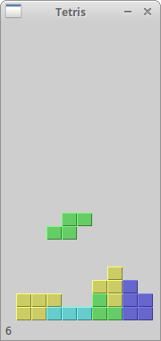

# The Tetris game in wxPython

俄罗斯方块游戏是有史以来最受欢迎的电脑游戏之一。最初的游戏是由俄罗斯程序员 Alexey Pajitnov 于 1985 年设计和编程的。从那以后，俄罗斯方块在几乎所有的计算机平台上都有很多变种。

俄罗斯方块被称为下降块益智游戏。在这个游戏中，我们有七种不同的形状，称为 tetromino：S形、Z形、T形、L形、线形、Mirrored L形和方形。每个形状都由四个正方形构成。形状将跌落在板子 board 上。俄罗斯方块游戏的目标是移动和旋转形状，使它们尽可能适合。 如果我们设法形成一排，那么这一排就会被消掉，然后得分。我们玩俄罗斯方块游戏，直到最上面顶出去。


wxPython 是一个用于创建应用程序的工具包。还有其他一些旨在创建电脑游戏的库。尽管如此，wxPython 和其他应用程序工具包都可用于创建游戏。

## The development

我们没有俄罗斯方块游戏的图像，我们使用 wxPython 中的绘图 API 绘制 tetrominoes。每个电脑游戏的背后都有一个数学模型。 俄罗斯方块也不例外。

游戏背后的一些思想：

- 我们用 `wx.Timer` 创建游戏循环
- 绘制 tetrominoes
- 形状以方形为基础逐个移动（而不是逐个移动像素）
- 在数学上， board 是一个简单的数字列表

**tetris.py**

```python
#!/usr/bin/env python3
# -*- coding: utf-8 -*-

"""
ZetCode wxPython tutorial

This is Tetris game clone in wxPython.

author: Jan Bodnar
website: www.zetcode.com
last modified: May 2018
"""

import wx
import random

class Tetris(wx.Frame):

    def __init__(self, parent):
        wx.Frame.__init__(self, parent, size=(180, 380),
            style=wx.DEFAULT_FRAME_STYLE ^ wx.RESIZE_BORDER ^ wx.MAXIMIZE_BOX)

        self.initFrame()

    def initFrame(self):

        self.statusbar = self.CreateStatusBar()
        self.statusbar.SetStatusText('0')
        self.board = Board(self)
        self.board.SetFocus()
        self.board.start()

        self.SetTitle("Tetris")
        self.Centre()


class Board(wx.Panel):

    BoardWidth = 10
    BoardHeight = 22
    Speed = 300
    ID_TIMER = 1

    def __init__(self, *args, **kw):

        super(Board, self).__init__(*args, **kw)

        self.initBoard()

    def initBoard(self):

        self.timer = wx.Timer(self, Board.ID_TIMER)
        self.isWaitingAfterLine = False
        self.curPiece = Shape()
        self.nextPiece = Shape()
        self.curX = 0
        self.curY = 0
        self.numLinesRemoved = 0
        self.board = []

        self.isStarted = False
        self.isPaused = False

        self.Bind(wx.EVT_PAINT, self.OnPaint)
        self.Bind(wx.EVT_KEY_DOWN, self.OnKeyDown)
        self.Bind(wx.EVT_TIMER, self.OnTimer, id=Board.ID_TIMER)

        self.clearBoard()

    def shapeAt(self, x, y):

        return self.board[(y * Board.BoardWidth) + x]

    def setShapeAt(self, x, y, shape):

        self.board[(y * Board.BoardWidth) + x] = shape

    def squareWidth(self):

        return self.GetClientSize().GetWidth() // Board.BoardWidth

    def squareHeight(self):

        return self.GetClientSize().GetHeight() // Board.BoardHeight

    def start(self):

        if self.isPaused:
            return

        self.isStarted = True
        self.isWaitingAfterLine = False
        self.numLinesRemoved = 0
        self.clearBoard()

        self.newPiece()
        self.timer.Start(Board.Speed)

    def pause(self):

        if not self.isStarted:
            return

        self.isPaused = not self.isPaused
        statusbar = self.GetParent().statusbar

        if self.isPaused:
            self.timer.Stop()
            statusbar.SetStatusText('paused')
        else:
            self.timer.Start(Board.Speed)
            statusbar.SetStatusText(str(self.numLinesRemoved))

        self.Refresh()

    def clearBoard(self):

        for i in range(Board.BoardHeight * Board.BoardWidth):
            self.board.append(Tetrominoes.NoShape)

    def OnPaint(self, event):

        dc = wx.PaintDC(self)

        size = self.GetClientSize()
        boardTop = size.GetHeight() - Board.BoardHeight * self.squareHeight()

        for i in range(Board.BoardHeight):
            for j in range(Board.BoardWidth):

                shape = self.shapeAt(j, Board.BoardHeight - i - 1)

                if shape != Tetrominoes.NoShape:
                    self.drawSquare(dc,
                        0 + j * self.squareWidth(),
                        boardTop + i * self.squareHeight(), shape)

        if self.curPiece.shape() != Tetrominoes.NoShape:

            for i in range(4):

                x = self.curX + self.curPiece.x(i)
                y = self.curY - self.curPiece.y(i)

                self.drawSquare(dc, 0 + x * self.squareWidth(),
                    boardTop + (Board.BoardHeight - y - 1) * self.squareHeight(),
                    self.curPiece.shape())


    def OnKeyDown(self, event):

        if not self.isStarted or self.curPiece.shape() == Tetrominoes.NoShape:
            event.Skip()
            return

        keycode = event.GetKeyCode()

        if keycode == ord('P') or keycode == ord('p'):
            self.pause()
            return

        if self.isPaused:
            return

        elif keycode == wx.WXK_LEFT:
            self.tryMove(self.curPiece, self.curX - 1, self.curY)

        elif keycode == wx.WXK_RIGHT:
            self.tryMove(self.curPiece, self.curX + 1, self.curY)

        elif keycode == wx.WXK_DOWN:
            self.tryMove(self.curPiece.rotatedRight(), self.curX, self.curY)

        elif keycode == wx.WXK_UP:
            self.tryMove(self.curPiece.rotatedLeft(), self.curX, self.curY)

        elif keycode == wx.WXK_SPACE:
            self.dropDown()

        elif keycode == ord('D') or keycode == ord('d'):
            self.oneLineDown()

        else:
            event.Skip()


    def OnTimer(self, event):

        if event.GetId() == Board.ID_TIMER:

            if self.isWaitingAfterLine:
                self.isWaitingAfterLine = False
                self.newPiece()

            else:
                self.oneLineDown()

        else:
            event.Skip()


    def dropDown(self):

        newY = self.curY

        while newY > 0:
            if not self.tryMove(self.curPiece, self.curX, newY - 1):
                break
            newY -= 1

        self.pieceDropped()

    def oneLineDown(self):

        if not self.tryMove(self.curPiece, self.curX, self.curY - 1):
            self.pieceDropped()


    def pieceDropped(self):

        for i in range(4):

            x = self.curX + self.curPiece.x(i)
            y = self.curY - self.curPiece.y(i)
            self.setShapeAt(x, y, self.curPiece.shape())

        self.removeFullLines()

        if not self.isWaitingAfterLine:
            self.newPiece()


    def removeFullLines(self):

        numFullLines = 0

        statusbar = self.GetParent().statusbar

        rowsToRemove = []

        for i in range(Board.BoardHeight):
            n = 0
            for j in range(Board.BoardWidth):
                if not self.shapeAt(j, i) == Tetrominoes.NoShape:
                    n = n + 1

            if n == 10:
                rowsToRemove.append(i)

        rowsToRemove.reverse()

        for m in rowsToRemove:
            for k in range(m, Board.BoardHeight):
                for l in range(Board.BoardWidth):
                        self.setShapeAt(l, k, self.shapeAt(l, k + 1))

            numFullLines = numFullLines + len(rowsToRemove)

            if numFullLines > 0:

                self.numLinesRemoved = self.numLinesRemoved + numFullLines
                statusbar.SetStatusText(str(self.numLinesRemoved))
                self.isWaitingAfterLine = True
                self.curPiece.setShape(Tetrominoes.NoShape)
                self.Refresh()


    def newPiece(self):

        self.curPiece = self.nextPiece
        statusbar = self.GetParent().statusbar
        self.nextPiece.setRandomShape()

        self.curX = Board.BoardWidth // 2 + 1
        self.curY = Board.BoardHeight - 1 + self.curPiece.minY()

        if not self.tryMove(self.curPiece, self.curX, self.curY):

            self.curPiece.setShape(Tetrominoes.NoShape)
            self.timer.Stop()
            self.isStarted = False
            statusbar.SetStatusText('Game over')


    def tryMove(self, newPiece, newX, newY):

        for i in range(4):

            x = newX + newPiece.x(i)
            y = newY - newPiece.y(i)

            if x < 0 or x >= Board.BoardWidth or y < 0 or y >= Board.BoardHeight:
                return False

            if self.shapeAt(x, y) != Tetrominoes.NoShape:
                return False

        self.curPiece = newPiece
        self.curX = newX
        self.curY = newY
        self.Refresh()

        return True


    def drawSquare(self, dc, x, y, shape):

        colors = ['#000000', '#CC6666', '#66CC66', '#6666CC',
                  '#CCCC66', '#CC66CC', '#66CCCC', '#DAAA00']

        light = ['#000000', '#F89FAB', '#79FC79', '#7979FC',
                 '#FCFC79', '#FC79FC', '#79FCFC', '#FCC600']

        dark = ['#000000', '#803C3B', '#3B803B', '#3B3B80',
                 '#80803B', '#803B80', '#3B8080', '#806200']

        pen = wx.Pen(light[shape])
        pen.SetCap(wx.CAP_PROJECTING)
        dc.SetPen(pen)

        dc.DrawLine(x, y + self.squareHeight() - 1, x, y)
        dc.DrawLine(x, y, x + self.squareWidth() - 1, y)

        darkpen = wx.Pen(dark[shape])
        darkpen.SetCap(wx.CAP_PROJECTING)
        dc.SetPen(darkpen)

        dc.DrawLine(x + 1, y + self.squareHeight() - 1,
            x + self.squareWidth() - 1, y + self.squareHeight() - 1)
        dc.DrawLine(x + self.squareWidth() - 1,
        y + self.squareHeight() - 1, x + self.squareWidth() - 1, y + 1)

        dc.SetPen(wx.TRANSPARENT_PEN)
        dc.SetBrush(wx.Brush(colors[shape]))
        dc.DrawRectangle(x + 1, y + 1, self.squareWidth() - 2,
        self.squareHeight() - 2)


class Tetrominoes(object):

    NoShape = 0
    ZShape = 1
    SShape = 2
    LineShape = 3
    TShape = 4
    SquareShape = 5
    LShape = 6
    MirroredLShape = 7


class Shape(object):

    coordsTable = (
        ((0, 0),     (0, 0),     (0, 0),     (0, 0)),
        ((0, -1),    (0, 0),     (-1, 0),    (-1, 1)),
        ((0, -1),    (0, 0),     (1, 0),     (1, 1)),
        ((0, -1),    (0, 0),     (0, 1),     (0, 2)),
        ((-1, 0),    (0, 0),     (1, 0),     (0, 1)),
        ((0, 0),     (1, 0),     (0, 1),     (1, 1)),
        ((-1, -1),   (0, -1),    (0, 0),     (0, 1)),
        ((1, -1),    (0, -1),    (0, 0),     (0, 1))
    )

    def __init__(self):

        self.coords = [[0,0] for i in range(4)]
        self.pieceShape = Tetrominoes.NoShape

        self.setShape(Tetrominoes.NoShape)

    def shape(self):

        return self.pieceShape

    def setShape(self, shape):

        table = Shape.coordsTable[shape]
        for i in range(4):
            for j in range(2):
                self.coords[i][j] = table[i][j]

        self.pieceShape = shape

    def setRandomShape(self):

        self.setShape(random.randint(1, 7))

    def x(self, index):

        return self.coords[index][0]

    def y(self, index):

        return self.coords[index][1]

    def setX(self, index, x):

        self.coords[index][0] = x

    def setY(self, index, y):

        self.coords[index][1] = y

    def minX(self):

        m = self.coords[0][0]
        for i in range(4):
            m = min(m, self.coords[i][0])

        return m

    def maxX(self):

        m = self.coords[0][0]
        for i in range(4):
            m = max(m, self.coords[i][0])

        return m

    def minY(self):

        m = self.coords[0][1]
        for i in range(4):
            m = min(m, self.coords[i][1])

        return m

    def maxY(self):

        m = self.coords[0][1]

        for i in range(4):
            m = max(m, self.coords[i][1])

        return m

    def rotatedLeft(self):

        if self.pieceShape == Tetrominoes.SquareShape:
            return self

        result = Shape()
        result.pieceShape = self.pieceShape

        for i in range(4):
            result.setX(i, self.y(i))
            result.setY(i, -self.x(i))

        return result

    def rotatedRight(self):

        if self.pieceShape == Tetrominoes.SquareShape:
            return self

        result = Shape()
        result.pieceShape = self.pieceShape

        for i in range(4):
            result.setX(i, -self.y(i))
            result.setY(i, self.x(i))

        return result


def main():

    app = wx.App()
    ex = Tetris(None)
    ex.Show()
    app.MainLoop()


if __name__ == '__main__':
    main()
```

游戏简化了一点，以便更容易理解。它在应用程序启动后立即启动。我们可以通过按 p 键暂停游戏。空格键立即将下降的俄罗斯方块将到底部。d 键将方块片段往下走下一行（它可以用来加速下降）。游戏以恒定速度进行，没有实现加速。得分是我们消掉的行数。

```python
def __init__(self, *args, **kw):
    
    super(Board, self).__init__(*args, **kw)
```

Windows 用户注意事项：如果您不能使用箭头键，请将 `style = wx.WANTS_CHARS` 添加到 board 的构造函数中。

```python
...
self.curX = 0
self.curY = 0
self.numLinesRemoved = 0
self.board = []
...
```

在我们开始游戏循环之前，我们初始化一些重要变量。`self.board` 变量是一个从 0 到 7 的数字列表。它表示 board 上方块的各种形状和方块的残存形状。

```python
for i in range(Board.BoardHeight):
    for j in range(Board.BoardWidth):
       
        shape = self.shapeAt(j, Board.BoardHeight - i - 1)
        
        if shape != Tetrominoes.NoShape:
            self.drawSquare(dc,
                0 + j * self.squareWidth(),
                boardTop + i * self.squareHeight(), shape)
```

游戏画分为两步。在第一步中，我们绘制所有形状，或者保留已经掉到板子 board 底部的残存形状。 所有的形状都记录在 `self.board` 列表变量中。 我们使用 `shapeAt()` 方法来访问它。

```python
if self.curPiece.shape() != Tetrominoes.NoShape:
   
    for i in range(4):
       
        x = self.curX + self.curPiece.x(i)
        y = self.curY - self.curPiece.y(i)
        
        self.drawSquare(dc, 0 + x * self.squareWidth(),
            boardTop + (Board.BoardHeight - y - 1) * self.squareHeight(),
            self.curPiece.shape())
```

下一步是绘制正在下将的实际方块片段。

```python
elif keycode == wx.WXK_LEFT:
    self.tryMove(self.curPiece, self.curX - 1, self.curY)
```

在 `OnKeyDown()` 方法中，我们检查按下的键。 如果我们按下左箭头键，我们试着将方块片段移向左边。 我们说试着，是因为方块片段可能无法移动。

```python
def tryMove(self, newPiece, newX, newY):

    for i in range(4):
        x = newX + newPiece.x(i)
        y = newY - newPiece.y(i)
        if x < 0 or x >= Board.BoardWidth or y < 0 or y >= Board.BoardHeight:
            return False
        if self.shapeAt(x, y) != Tetrominoes.NoShape:
            return False

    self.curPiece = newPiece
    self.curX = newX
    self.curY = newY
    self.Refresh()
    
    return True
```

在 `tryMove()` 方法中，我们尝试移动我们的形状。如果形状位于板子 board 的边缘或与其他方块片段相邻，则返回 False；否则我们将当前下降的棋子放到新的位置并返回 True。

```python
def OnTimer(self, event):

    if event.GetId() == Board.ID_TIMER:
        if self.isWaitingAfterLine:
            self.isWaitingAfterLine = False
            self.newPiece()
        else:
            self.oneLineDown()
    else:
        event.Skip()
```

在 `OnTimer()` 方法中，我们要么在前一个被放到底部之后，创建一个新的方块片段，或者我们将一个下降的方块片段向下移动一行。

```python
def removeFullLines(self):

    numFullLines = 0

    rowsToRemove = []

    for i in range(Board.BoardHeight):
        n = 0
        for j in range(Board.BoardWidth):
            if not self.shapeAt(j, i) == Tetrominoes.NoShape:
                n = n + 1

        if n == 10:
            rowsToRemove.append(i)

    rowsToRemove.reverse()

    for m in rowsToRemove:
        for k in range(m, Board.BoardHeight):
            for l in range(Board.BoardWidth):
                self.setShapeAt(l, k, self.shapeAt(l, k + 1))
...
```

如果方块片段碰到底部，我们调用 `removeFullLines()` 方法。 首先我们找出整行并删除它。 我们让当前行上方的所有行整体下移一行，来删除这一行。请注意，我们颠倒了要删除的行的顺序。否则，它将无法正确工作。在我们的情况下，我们使用 naive gravity。 也就是说这些方块片段可能会漂浮在空隙之上。

```python
def newPiece(self):

    self.curPiece = self.nextPiece
    statusbar = self.GetParent().statusbar
    self.nextPiece.setRandomShape()
    self.curX = Board.BoardWidth / 2 + 1
    self.curY = Board.BoardHeight - 1 + self.curPiece.minY()

    if not self.tryMove(self.curPiece, self.curX, self.curY):
    
        self.curPiece.setShape(Tetrominoes.NoShape)
        self.timer.Stop()
        self.isStarted = False
        statusbar.SetStatusText('Game over')
```

 `newPiece()` 方法随机创建一个新的俄罗斯方块片段。 如果方块片段无法进入初始位置，游戏结束。

The `Shape` class saves information about the tetris piece.

`Shape` 类保存有关俄罗斯方块的信息。

```python
self.coords = [[0,0] for i in range(4)]
```

创建形状后，我们创建一个空的坐标列表。 该列表将保存俄罗斯方块的坐标。 例如，元组 (0, -1)、(0, 0)、(-1, 0)、(-1, -1) 表示旋转的 S 形。 下图阐明了该形状。


当我们画出当前正在下落的方块片段时，我们在 `self.curX` 和 `self.curY` 位置绘制它。然后我们查看坐标表并绘制所有四个方块。



这是 wxPython 中的一个俄罗斯方块游戏。