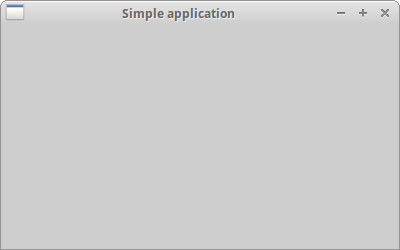
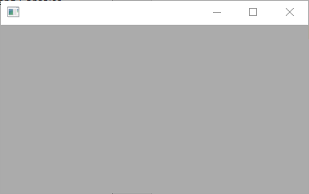
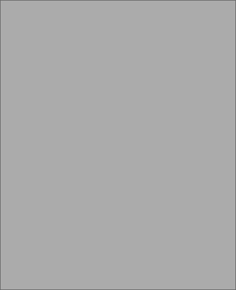
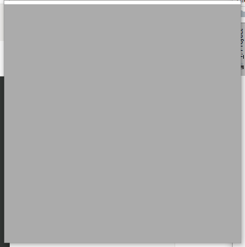

# First steps in wxPython

## 简单的例子

我们从一个非常简单的例子开始。 我们的第一个脚本只会显示一个小窗口。

它不会做太多。 我们将逐行分析脚本。

**simple.py**

```python
#!/usr/bin/env python3
# -*- coding: utf-8 -*-

import wx

app = wx.App()

frame = wx.Frame(None, title='Simple application')
frame.Show()

app.MainLoop()
```

讲解：

```python
import wx
```

这一行导入基本的 wxPython 模块。 即 core、controls、gdi、misc 和 windows。 从技术上讲，`wx` 是一个命名空间。 基本模块中的所有功能和对象都将以 `wx.` 开头 `wx.`  字首。

下一行代码将创建一个应用程序对象。 

```python
app = wx.App()
```

每个 wxPython 程序都必须有一个应用程序对象。 

```python
frame = wx.Frame(None, title='Simple application')
frame.Show()
```

这里我们创建一个 `wx.Frame` 对象。 `wx.Frame` 组件是一个重要的容器组件。 我们将在稍后详细分析这个组件。 `wx.Frame` 组件是其他组件的父组件。 它本身没有父母 parent。 如果我们为父参数 parent parameter 指定 `None` ，则表明我们的组件没有父母。 它是组件层次结构中的顶级组件。在我们创建了 `wx.Frame` 组件之后，我们必须调用 `Show()` 方法将其显示在屏幕上。 

```python
app.MainLoop()
```

最后一行进入主循环。主循环是一个无限循环。它捕获和分发我们应用程序生命周期中存在的所有事件。

这是一个非常简单的例子。尽管这个简单，我们可以用这个窗口做很多事情。 我们可以调整窗口大小，最大限度地缩小窗口大小。这个功能需要编写很多代码。 所有这些都是隐藏的，并由 wxPython 工具箱默认提供。没有理由重新发明轮子。



## wx.Frame

wx.Frame 组件是 wxPython 中最重要的组件之一。它是一个容器组件。这意味着它可以包含其他组件。实际上它可以包含任何不是框架 frame 或对话框 dialog 的窗口。 `wx.Frame` 包含一个标题栏 title bar，边框 borders 和一个中央容器区域 central container area。标题栏和边框是可选的。他们可以通过各种标志 flags 去除。

`wx.Frame` 具有以下构造函数：

展示形式：`类型 参数名=默认值`

```python
wx.Frame(wx.Window parent, int id=-1, string title='', wx.Point pos=wx.DefaultPosition, 
    wx.Size size=wx.DefaultSize, style=wx.DEFAULT_FRAME_STYLE, string name="frame")
```

构造函数有七个参数。第一个参数没有默认值。其他六个参数有。

### wx.DEFAULT_FRAME_STYLE

`wx.DEFAULT_FRAME_STYLE` 是一组默认标志 flags： `wx.MINIMIZE_BOX` | `wx.MAXIMIZE_BOX` | `wx.RESIZE_BORDER` |`wx.SYSTEM_MENU` | `wx.CAPTION` | `wx.CLOSE_BOX` | `wx.CLIP_CHILDREN` 。通过组合各种样式，我们可以改变 `wx.Frame` 组件的样式。

#### 默认

具备所有风格属性

```python
import wx

app = wx.App()
frame = wx.Frame(None)
frame.Show(True)

app.MainLoop()
```



#### wx.MINIMIZE_BOX



#### wx.RESIZE_BORDER

可以伸缩



这些属性单独使用其实看不出效果，一般是组合使用

#### 组合

**no_minimize.py**

```python
#!/usr/bin/env python3
# -*- coding: utf-8 -*-
 
# no_minimize.py

import wx

app = wx.App()
frame = wx.Frame(None, style=wx.MAXIMIZE_BOX | wx.RESIZE_BORDER
	| wx.SYSTEM_MENU | wx.CAPTION |	 wx.CLOSE_BOX)
frame.Show(True)

app.MainLoop()
```

我们的目的是显示一个没有最小化框的窗口。 所以我们没有在 style 参数中指定这个标志。 

## 大小和位置

我们可以通过两种方式指定应用程序的大小：在构造函数中使用 size 参数，或者我们可以调用 `SetSize()` 方法。 

**set_size.py**

```python
#!/usr/bin/env python3
# -*- coding: utf-8 -*-

# set_size.py

import wx


class Example(wx.Frame):
    def __init__(self, parent, title):
        super(Example, self).__init__(parent, title=title,
            size=(350, 250))


def main():
    app = wx.App()
    ex = Example(None, title='Sizing')
    ex.Show()
    app.MainLoop()


if __name__ == '__main__':
    main()
```

在这个例子中，应用程序的大小为 250 x 200 像素。 

```python
def __init__(self, parent, title):
    super(Example, self).__init__(parent, title=title, 
        size=(350, 250))
```

在构造函数中，我们将 `wx.Frame` 组件的宽度设置为 350 像素。 组件的高度为 250 像素。

同样，我们可以将我们的应用程序放置在屏幕上。默认情况下，窗口放置在屏幕的左上角。但是在不同的操作系统平台甚至窗口管理器上它可能不同。一些窗口管理器自己放置应用程序窗。它们中的一些还做了一些优化，让窗口不重叠。程序员可以通过编程来定位窗口。我们已经在我们的 `wx.Frame` 组件的构造函数中看到了一个 `pos` 参数。通过提供非默认值，我们可以自己控制位置。

| 方法                                            | 描述                     |
| ----------------------------------------------- | ------------------------ |
| `Move(wx.Point point)`                          | 移动一个窗口到指定的位置 |
| `MoveXY(int x, int y)`                          | 移动一个窗口到指定的位置 |
| `SetPosition(wx.Point point)`                   | 设置窗口的位置           |
| `SetDimensions(x, y, width, height, sizeFlags)` | 设置窗口的位置和大小     |

有几种方法可以做到这一点。 

**moving.py**

```python
#!/usr/bin/env python3
# -*- coding: utf-8 -*-

# moving.py

import wx


class Example(wx.Frame):

    def __init__(self, parent, title):
        super(Example, self).__init__(parent, title=title,
            size=(300, 200))

        self.Move((800, 250))


def  main():

    app = wx.App()
    ex = Example(None, title='Moving')
    ex.Show()
    app.MainLoop()


if __name__ == '__main__':
    main()
```

有一种特殊情况，我们可能希望我们的窗口最大化显示。在这种情况下，窗口位于 (0, 0) 并占据整个屏幕。wxPython 内部计算屏幕坐标。为了最大化我们的 `wx.Frame`，我们调用 `Maximize()` 方法。 

## Centering on the screen

如果我们想要将我们的应用程序居中在屏幕上，wxPython 有一个方便的方法。Centre()` 方法将窗口置于屏幕中央。无需计算屏幕的宽度和高度。只需调用该方法即可。 

**centering.py**

```python
#!/usr/bin/env python3
# -*- coding: utf-8 -*-

# centering.py

import wx


class Example(wx.Frame):

    def __init__(self, parent, title):
        super(Example, self).__init__(parent, title=title,
            size=(300, 200))

        self.Centre()


def main():

    app = wx.App()
    ex = Example(None, title='Centering')
    ex.Show()
    app.MainLoop()


if __name__ == '__main__':
    main()
```

在这个例子中，我们在屏幕上居中放置一个小窗口。 

```python
self.Centre()
```

`Centre()` 方法将窗口在屏幕上居中。

在本章中，我们在 wxPython 中创建了一些简单的代码示例。


