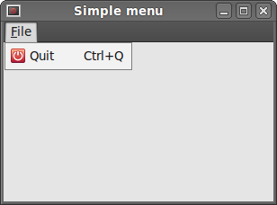
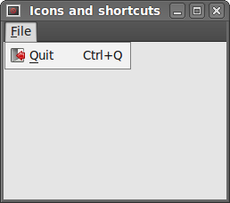
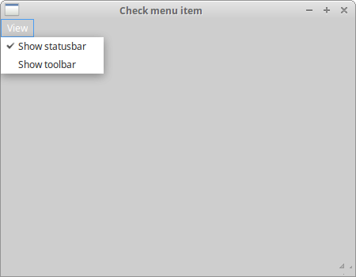
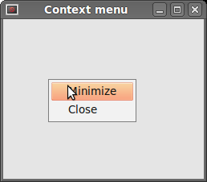
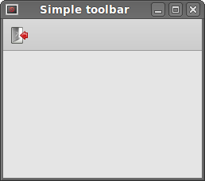
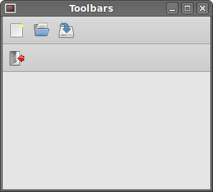
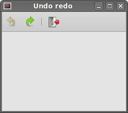

# Menus and toolbars

GUI 应用程序中的一个常见部分是菜单栏。菜单栏由称为 menus 的对象组成。顶层菜单在菜单栏上有自己的标签 labels。菜单有菜单项 menu items。菜单项是在应用程序内部执行特定操作的命令。菜单也可以有子菜单 submenus，它们有自己的菜单项。在 wxPython 中有三个类用于创建菜单栏 menubars：`wx.MenuBar`，`wx.Menu` 和 `wx.MenuItem`。

## 简单的菜单

在我们的第一个例子中，我们将创建一个菜单文件。菜单将只有一个菜单项。 通过选择菜单项目让应用程序退出。 

**simple_menu.py**

```python
#!/usr/bin/env python3
# -*- coding: utf-8 -*-

"""
ZetCode wxPython tutorial

This example shows a simple menu.

author: Jan Bodnar
website: www.zetcode.com
last modified: April 2018
"""

import wx


class Example(wx.Frame):

    def __init__(self, *args, **kwargs):
        super(Example, self).__init__(*args, **kwargs)

        self.InitUI()

    def InitUI(self):

        menubar = wx.MenuBar()
        fileMenu = wx.Menu()
        fileItem = fileMenu.Append(wx.ID_EXIT, 'Quit', 'Quit application')
        menubar.Append(fileMenu, '&File')
        self.SetMenuBar(menubar)

        self.Bind(wx.EVT_MENU, self.OnQuit, fileItem)

        self.SetSize((300, 200))
        self.SetTitle('Simple menu')
        self.Centre()

    def OnQuit(self, e):
        self.Close()


def main():

    app = wx.App()
    ex = Example(None)
    ex.Show()
    app.MainLoop()


if __name__ == '__main__':
    main()
```

这是一个最小菜单栏功能的小例子。 

```python
menubar = wx.MenuBar()
```

首先我们创建一个菜单栏对象。 

```python
fileMenu = wx.Menu()
```

接下来我们创建一个菜单对象。 

```python
fileItem = fileMenu.Append(wx.ID_EXIT, 'Quit', 'Quit application')
```

我们将菜单项追加到菜单对象中。 第一个参数是菜单项的 ID。 标准 id 会自动添加图标和快捷键，在我们的例子，是 Ctrl + Q（然而译者我用的 Windows 并没有生成图标和快捷键）。 第二个参数是菜单项的名称。 最后一个参数定义了选择菜单项时的简短帮助。 这里我们没有明确地创建一个 `wx.MenuItem` 。 它由幕后的 `Append()` 方法创建。 该方法返回创建的菜单项  menu item。 该引用在稍后将用于绑定事件。 

```python
self.Bind(wx.EVT_MENU, self.OnQuit, fileItem)
```

我们将菜单项的 `wx.EVT_MENU` （菜单退出事件绑定器）绑定到自定义的 `OnQuit()` 方法。 该方法将关闭应用程序。

```python
menubar.Append(fileMenu, '&File')
self.SetMenuBar(menubar)
```

之后，我们将菜单添加到菜单栏中。& 符号创建一个加速键，& 后面的字符加下划线（Windows 无效，Ubuntu 上也没看到效果，鸡肋，可以去掉）。这样菜单可以通过 Alt + F 快捷键访问。 最后，我们调用 `SetMenuBar()` 方法。此方法属于 `wx.Frame` 组件。 它设置菜单栏。



## 图标和快捷键

下一个例子与前一个例子基本相同。 这一次，我们手动创建一个 `wx.MenuItem` 。 

**icons_shortcuts.py**

```python
#!/usr/bin/env python3
# -*- coding: utf-8 -*-

"""
ZetCode wxPython tutorial

In this example, we manually create
a menu item.

author: Jan Bodnar
website: www.zetcode.com
last modified: April 2018
"""

import wx

APP_EXIT = 1


class Example(wx.Frame):

    def __init__(self, *args, **kwargs):
        super(Example, self).__init__(*args, **kwargs)

        self.InitUI()

    def InitUI(self):

        menubar = wx.MenuBar()
        fileMenu = wx.Menu()
        qmi = wx.MenuItem(fileMenu, APP_EXIT, '&Quit\tCtrl+Q')
        qmi.SetBitmap(wx.Bitmap('exit.png'))
        fileMenu.Append(qmi)

        self.Bind(wx.EVT_MENU, self.OnQuit, id=APP_EXIT)

        menubar.Append(fileMenu, '&File')
        self.SetMenuBar(menubar)

        self.SetSize((350, 250))
        self.SetTitle('Icons and shortcuts')
        self.Centre()
        
    def OnQuit(self, e):
        self.Close()


def main():

    app = wx.App()
    ex = Example(None)
    ex.Show()
    app.MainLoop()


if __name__ == '__main__':
    main()
```

在这个例子中，我们创建了一个退出菜单项。 我们选择一个自定义图标和菜单项的快捷键。 

```python
qmi = wx.MenuItem(fileMenu, APP_EXIT, '&Quit\tCtrl+Q')
qmi.SetBitmap(wx.Bitmap('exit.png'))
fileMenu.Append(qmi)
```

我们创建一个 `wx.MenuItem` 对象。 & 符号指定一个加速键。 & 符号后面的字符加下划线（没啥用，去掉也不影响后面的快捷键）。实际的快捷键由字符组合定义。我们指定了 Ctrl + Q。 所以如果我们按 Ctrl + Q ，应用程序会关闭。我们在 & 符号和快捷方式之间放置了一个 tab 符。这样，我们设法在它们之间留出一些空间。要为菜单项提供图标，我们调用 `SetBitmap()` 方法，手动创建的菜单项通过调用 `AppendItem()` 方法附加到菜单。 

```python
self.Bind(wx.EVT_MENU, self.OnQuit, id=APP_EXIT)
```

当我们选择菜单项时，`OnQuit()` 方法被调用。 

 

## 子菜单和分隔符

每个菜单也可以有一个子菜单，这样我们可以将类似的命令放入组中。例如，它可以隐藏/显示各种工具栏（如个人栏，地址栏，状态栏或导航栏）到称为工具栏 toolbars 的子菜单 submenu 的命令。在菜单中，我们可以用分隔符分隔命令。这是一条简单的线路。通常的做法是使用单个分隔符来分隔诸如新建、打开、保存命令和打印、打印预览等命令。在我们的例子中，我们将看到，我们如何创建子菜单和菜单分隔符。 

**submenu.py**

```python
#!/usr/bin/env python3
# -*- coding: utf-8 -*-

"""
ZetCode wxPython tutorial

In this example, we create a submenu and a menu
separator.

author: Jan Bodnar
website: www.zetcode.com
last modified: April 2018
"""

import wx


class Example(wx.Frame):

    def __init__(self, *args, **kwargs):
        super(Example, self).__init__(*args, **kwargs)

        self.InitUI()

    def InitUI(self):

        menubar = wx.MenuBar()

        fileMenu = wx.Menu()
        fileMenu.Append(wx.ID_NEW, '&New')
        fileMenu.Append(wx.ID_OPEN, '&Open')
        fileMenu.Append(wx.ID_SAVE, '&Save')
        fileMenu.AppendSeparator()

        imp = wx.Menu()
        imp.Append(wx.ID_ANY, 'Import newsfeed list...')
        imp.Append(wx.ID_ANY, 'Import bookmarks...')
        imp.Append(wx.ID_ANY, 'Import mail...')

        fileMenu.Append(wx.ID_ANY, 'I&mport', imp)

        qmi = wx.MenuItem(fileMenu, wx.ID_EXIT, '&Quit\tCtrl+W')
        fileMenu.Append(qmi)

        self.Bind(wx.EVT_MENU, self.OnQuit, qmi)

        menubar.Append(fileMenu, '&File')
        self.SetMenuBar(menubar)

        self.SetSize((350, 250))
        self.SetTitle('Submenu')
        self.Centre()

    def OnQuit(self, e):
        self.Close()


def main():

    app = wx.App()
    ex = Example(None)
    ex.Show()
    app.MainLoop()


if __name__ == '__main__':
    main()
```

在上面的例子中，我们创建了新建，打开和保存标准菜单项。 具有水平分隔符的子菜单。 子菜单还有三个菜单项。 

```python
fileMenu.Append(wx.ID_NEW, '&New')
fileMenu.Append(wx.ID_OPEN, '&Open')
fileMenu.Append(wx.ID_SAVE, '&Save')
```

这里我们有三个常用菜单项：New、Open、Save。

```python
fileMenu.AppendSeparator()
```

菜单分隔符 `AppendSeparator()` 方法添加。 

```python
imp = wx.Menu()
imp.Append(wx.ID_ANY, 'Import newsfeed list...')
imp.Append(wx.ID_ANY, 'Import bookmarks...')
imp.Append(wx.ID_ANY, 'Import mail...')

fileMenu.Append(wx.ID_ANY, 'I&mport', imp)
```

一个子菜单也是一个 `wx.Menu` 。菜单上附有三个菜单项。子菜单通过 `Append()` 方法附加到 File 菜单。 

 

## 勾选菜单项 Check menu item

有下面几种菜单项

- normal item
- check item
- radio item

在下面的例子中，我们将演示检查菜单项。 检查菜单项在菜单中由勾号可视地表示。 

**checkmenu_item.py**

```python
#!/usr/bin/env python3
# -*- coding: utf-8 -*-

"""
ZetCode wxPython tutorial

This example creates a checked
menu item.

author: Jan Bodnar
website: www.zetcode.com
last modified: April 2018
"""

import wx


class Example(wx.Frame):

    def __init__(self, *args, **kwargs):
        super(Example, self).__init__(*args, **kwargs)

        self.InitUI()

    def InitUI(self):

        menubar = wx.MenuBar()
        viewMenu = wx.Menu()

        self.shst = viewMenu.Append(wx.ID_ANY, 'Show statusbar',
            'Show Statusbar', kind=wx.ITEM_CHECK)
        self.shtl = viewMenu.Append(wx.ID_ANY, 'Show toolbar',
            'Show Toolbar', kind=wx.ITEM_CHECK)

        viewMenu.Check(self.shst.GetId(), True)
        viewMenu.Check(self.shtl.GetId(), True)

        self.Bind(wx.EVT_MENU, self.ToggleStatusBar, self.shst)
        self.Bind(wx.EVT_MENU, self.ToggleToolBar, self.shtl)

        menubar.Append(viewMenu, '&View')
        self.SetMenuBar(menubar)

        self.toolbar = self.CreateToolBar()
        self.toolbar.AddTool(1, '', wx.Bitmap('exit.png'))
        self.toolbar.Realize()

        self.statusbar = self.CreateStatusBar()
        self.statusbar.SetStatusText('Ready')

        self.SetSize((450, 350))
        self.SetTitle('Check menu item')
        self.Centre()


    def ToggleStatusBar(self, e):

        if self.shst.IsChecked():
            self.statusbar.Show()
        else:
            self.statusbar.Hide()

    def ToggleToolBar(self, e):

        if self.shtl.IsChecked():
            self.toolbar.Show()
        else:
            self.toolbar.Hide()


def main():

    app = wx.App()
    ex = Example(None)
    ex.Show()
    app.MainLoop()


if __name__ == '__main__':
    main()
```

我们有一个 viewMenu，上面有两个勾选的菜单项。两个菜单项将会显示或隐藏状态栏和工具栏。 

```python
self.shst = viewMenu.Append(wx.ID_ANY, 'Show statusbar', 
    'Show Statusbar', kind=wx.ITEM_CHECK)
self.shtl = viewMenu.Append(wx.ID_ANY, 'Show toolbar', 
    'Show Toolbar', kind=wx.ITEM_CHECK)
```

如果我们想添加一个勾选菜单项，我们为 `wx.ITEM_CHECK` 设置一个 `kind` 参数。默认参数是 `wx.ITEM_NORMAL`。 `Append()` 方法返回一个 `wx.MenuItem` 。 

```python
viewMenu.Check(self.shst.GetId(), True)
viewMenu.Check(self.shtl.GetId(), True)
```

当程序启动，状态栏和工具栏都可见。 所以我们用 `Check()` 方法检查两个项目。 

```python
def ToggleStatusBar(self, e):
    
    if self.shst.IsChecked():
        self.statusbar.Show()
    else:
        self.statusbar.Hide()
```

We show or hide the statusbar according to the state of the check menu item. We find out the state of the check menu item with the `IsChecked()` method. Same with toolbar.

我们根据勾选菜单项的状态显示或隐藏状态栏。 通过 `IsChecked()` 方法找到的菜单项的状态。工具栏同理。 



## 上下文菜单 Context menu

上下文菜单是在某种上下文条件下出现的命令列表。 例如，在 Firefox 网页浏览器中，当我们右击一个网页时，我们会得到一个上下文菜单。在上下文菜单处，我们可以重新加载页面，返回或查看页面源代码。如果我们点击一个工具栏，我们会得到另一个用于管理工具栏的上下文菜单。上下文菜单有时称为弹出式菜单。

**context_menu.py**

```python
#!/usr/bin/env python3
# -*- coding: utf-8 -*-

"""
ZetCode wxPython tutorial

In this example, we create a context menu.

author: Jan Bodnar
website: www.zetcode.com
last modified: April 2018
"""

import wx

class MyPopupMenu(wx.Menu):

    def __init__(self, parent):
        super(MyPopupMenu, self).__init__()

        self.parent = parent

        mmi = wx.MenuItem(self, wx.NewId(), 'Minimize')
        self.Append(mmi)
        self.Bind(wx.EVT_MENU, self.OnMinimize, mmi)

        cmi = wx.MenuItem(self, wx.NewId(), 'Close')
        self.Append(cmi)
        self.Bind(wx.EVT_MENU, self.OnClose, cmi)


    def OnMinimize(self, e):
        self.parent.Iconize()

    def OnClose(self, e):
        self.parent.Close()


class Example(wx.Frame):

    def __init__(self, *args, **kwargs):
        super(Example, self).__init__(*args, **kwargs)

        self.InitUI()

    def InitUI(self):

        self.Bind(wx.EVT_RIGHT_DOWN, self.OnRightDown)

        self.SetSize((350, 250))
        self.SetTitle('Context menu')
        self.Centre()

    def OnRightDown(self, e):
        self.PopupMenu(MyPopupMenu(self), e.GetPosition())


def main():

    app = wx.App()
    ex = Example(None)
    ex.Show()
    app.MainLoop()


if __name__ == '__main__':
    main()
```

在这个例子中，我们为主窗口创建了一个上下文菜单。它有两个项目。 一个将最小化应用程序，另一个将终止它。

```python
class MyPopupMenu(wx.Menu):
    
    def __init__(self, parent):
        super(MyPopupMenu, self).__init__()
```

我们创建一个单独的 `wx.Menu` 类。 

```python
mmi = wx.MenuItem(self, wx.NewId(), 'Minimize')
self.Append(mmi)
self.Bind(wx.EVT_MENU, self.OnMinimize, mmi)
```

一个菜单项被创建并附加到上下文菜单。一个事件处理程序 event handler 绑定到此菜单项。 

```python
self.Bind(wx.EVT_RIGHT_DOWN, self.OnRightDown)
```

如果我们右键点击框架 frame，我们调用 `OnRightDown()` 方法。 为此，我们使用 `wx.EVT_RIGHT_DOWN` 事件绑定程序 event binder。 

```python
def OnRightDown(self, e):
    self.PopupMenu(MyPopupMenu(self), e.GetPosition())
```

在 `OnRightDown()` 方法中，我们调用 `PopupMenu()` 方法，该方法显示上下文菜单。 第一个参数是要显示的菜单，第二个参数是上下文菜单出现的位置。上下文菜单出现在鼠标光标的位置。 为了获得实际的鼠标位置，我们调用提供的事件对象的 `GetPosition()` 方法。 

 

## 工具栏 Toolbars

菜单将我们可以在应用程序中使用的所有命令分组。工具栏提供了对最常用命令的快速访问。

要创建一个工具栏，我们调用框架组件 frame widget 的 `CreateToolBar()` 方法。

**toolbar.py**

```python
#!/usr/bin/env python3
# -*- coding: utf-8 -*-

"""
ZetCode wxPython tutorial

This example creates a simple toolbar.

author: Jan Bodnar
website: www.zetcode.com
last modified: April 2018
"""

import wx


class Example(wx.Frame):

    def __init__(self, *args, **kwargs):
        super(Example, self).__init__(*args, **kwargs)

        self.InitUI()

    def InitUI(self):

        toolbar = self.CreateToolBar()
        qtool = toolbar.AddTool(wx.ID_ANY, 'Quit', wx.Bitmap('exit.png'))
        toolbar.Realize()

        self.Bind(wx.EVT_TOOL, self.OnQuit, qtool)

        self.SetSize((350, 250))
        self.SetTitle('Simple toolbar')
        self.Centre()

    def OnQuit(self, e):
        self.Close()


def main():

    app = wx.App()
    ex = Example(None)
    ex.Show()
    app.MainLoop()


if __name__ == '__main__':
    main()
```

在我们的例子中，我们有一个带有一个工具的工具栏。 当我们点击它时，该工具将关闭应用程序。 

```python
toolbar = self.CreateToolBar()
```

我们创建一个工具栏。 默认情况下，工具栏是水平的，没有边框和显示。 

```python
qtool = toolbar.AddTool(wx.ID_ANY, 'Quit', wx.Bitmap('texit.png'))
```

要创建一个工具栏工具，我们调用 `AddTool()` 方法。第二个参数是工具的标签，第三个参数是工具的图像。请注意，标签 label 不可见，因为默认样式仅显示图标。 

```python
toolbar.Realize()
```

将我们的项目放到工具栏后，我们调用 `Realize()` 方法。 在 Linux 上调用此方法不是强制性的。 在 windows  上是必须的（不然不会添加工具）。 

```python
self.Bind(wx.EVT_TOOL, self.OnQuit, qtool)
```

要处理工具栏的事件，我们使用 `wx.EVT_TOOL` 事件绑定器。 

 

如果我们想创建多个工具栏，我们必须以不同的方式处理。 

**toolbars.py**

```python
#!/usr/bin/env python3
# -*- coding: utf-8 -*-

'''
ZetCode wxPython tutorial

In this example, we create two horizontal
toolbars.

author: Jan Bodnar
website: www.zetcode.com
last modified: April 2018
'''

import wx


class Example(wx.Frame):

    def __init__(self, *args, **kwargs):
        super(Example, self).__init__(*args, **kwargs)

        self.InitUI()

    def InitUI(self):

        vbox = wx.BoxSizer(wx.VERTICAL)

        toolbar1 = wx.ToolBar(self)
        toolbar1.AddTool(wx.ID_ANY, '', wx.Bitmap('tnew.png'))
        toolbar1.AddTool(wx.ID_ANY, '', wx.Bitmap('topen.png'))
        toolbar1.AddTool(wx.ID_ANY, '', wx.Bitmap('tsave.png'))
        toolbar1.Realize()

        toolbar2 = wx.ToolBar(self)
        qtool = toolbar2.AddTool(wx.ID_EXIT, '', wx.Bitmap('texit.png'))
        toolbar2.Realize()

        vbox.Add(toolbar1, 0, wx.EXPAND)
        vbox.Add(toolbar2, 0, wx.EXPAND)

        self.Bind(wx.EVT_TOOL, self.OnQuit, qtool)

        self.SetSizer(vbox)

        self.SetSize((350, 250))
        self.SetTitle('Toolbars')
        self.Centre()

    def OnQuit(self, e):
        self.Close()


def main():

    app = wx.App()
    ex = Example(None)
    ex.Show()
    app.MainLoop()


if __name__ == '__main__':
    main()
```

在上面的例子中，我们创建了两个水平工具栏。 

```python
toolbar1 = wx.ToolBar(self)
... 
toolbar2 = wx.ToolBar(self)
```

我们创建了两个工具栏对象，并把它们放入一个垂直的盒子里。 

 

## 启用和禁用 Enable & disable

下面的例子中，我们展示了如何启用和禁用工具栏按钮。 我们还添加到分隔线。

**undo_redo.py**

```python
#!/usr/bin/env python3
# -*- coding: utf-8 -*-

"""
ZetCode wxPython tutorial

In this example, we create two horizontal
toolbars.

author: Jan Bodnar
website: www.zetcode.com
last modified: April 2018
"""

import wx

class Example(wx.Frame):

    def __init__(self, *args, **kwargs):
        super(Example, self).__init__(*args, **kwargs)

        self.InitUI()

    def InitUI(self):

        self.count = 5

        self.toolbar = self.CreateToolBar()
        tundo = self.toolbar.AddTool(wx.ID_UNDO, '', wx.Bitmap('tundo.png'))
        tredo = self.toolbar.AddTool(wx.ID_REDO, '', wx.Bitmap('tredo.png'))
        self.toolbar.EnableTool(wx.ID_REDO, False)
        self.toolbar.AddSeparator()
        texit = self.toolbar.AddTool(wx.ID_EXIT, '', wx.Bitmap('texit.png'))
        self.toolbar.Realize()

        self.Bind(wx.EVT_TOOL, self.OnQuit, texit)
        self.Bind(wx.EVT_TOOL, self.OnUndo, tundo)
        self.Bind(wx.EVT_TOOL, self.OnRedo, tredo)

        self.SetSize((350, 250))
        self.SetTitle('Undo redo')
        self.Centre()

    def OnUndo(self, e):
        if self.count > 1 and self.count <= 5:
            self.count = self.count - 1

        if self.count == 1:
            self.toolbar.EnableTool(wx.ID_UNDO, False)

        if self.count == 4:
            self.toolbar.EnableTool(wx.ID_REDO, True)

    def OnRedo(self, e):
        if self.count < 5 and self.count >= 1:
            self.count = self.count + 1

        if self.count == 5:
            self.toolbar.EnableTool(wx.ID_REDO, False)

        if self.count == 2:
            self.toolbar.EnableTool(wx.ID_UNDO, True)


    def OnQuit(self, e):
        self.Close()


def main():

    app = wx.App()
    ex = Example(None)
    ex.Show()
    app.MainLoop()


if __name__ == '__main__':
    main()
```

在我们的例子中，我们有三个工具栏按钮。一个按钮用于退出应用程序。 另外两个用于撤消和重做按钮。它们模拟应用程序中的 撤销/重做 功能。（有关实际示例，请参阅提示和技巧）我们有 4 次变化。 撤销/重做 按钮相应地进行启用和禁用。 

```python
self.toolbar.EnableTool(wx.ID_REDO, False)
self.toolbar.AddSeparator()
```

在开始时，重做按钮被禁用。我们通过调用 `EnableTool()` 方法来实现。我们可以在工具栏中创建一些逻辑组。 我们可以用分隔符分开各种按钮组。 为此，我们调用 `AddSeparator()` 方法。 

```python
def OnUndo(self, e):
    if self.count > 1 and self.count <= 5:
        self.count = self.count - 1

    if self.count == 1:
        self.toolbar.EnableTool(wx.ID_UNDO, False)

    if self.count == 4:
        self.toolbar.EnableTool(wx.ID_REDO, True)
```

我们模拟撤销和重做功能，有四次变化。 如果没有任何可撤消的内容，撤消按钮被禁用。 撤消第一次更改后，我们启用重做按钮。同样的逻辑适用于 `OnRedo()` 方法。 

 

在 wxPython 教程的这一部分，我们使用了菜单和工具栏。 