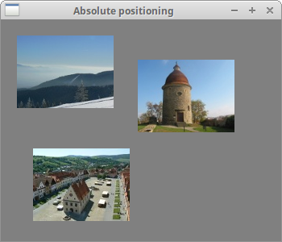
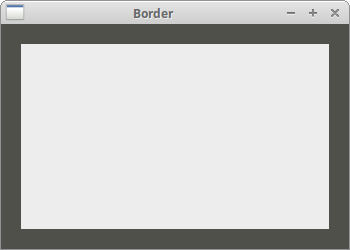
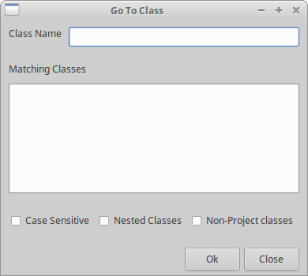
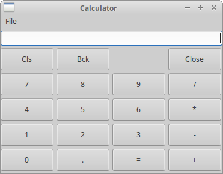
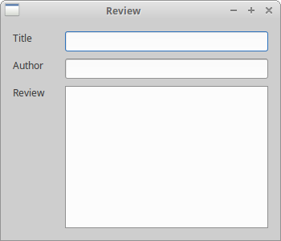
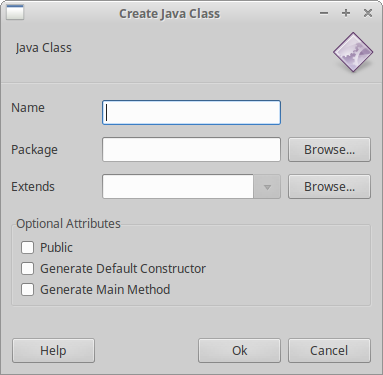

# Layout management in wxPython

一个典型的应用程序由各种组件组成。这些组件放置在容器组件中。 程序员必须管理应用程序的布局。这不是一件容易的事。 在 wxPython 中，可以使用绝对定位或使用 sizers 来布局组件。 

## 绝对定位

绝对定位：程序员以像素为单位指定组件的位置和大小。 绝对定位有几个缺点：

- 如果我们调整窗口的大小，组件的大小和位置不会随之改变。
- 应用在各种平台上看起来不同。
- 更改应用程序中的字体可能会破坏布局。
- 如果我们决定改变布局，我们必须完全重做我们的布局，这是乏味和耗时的。

我们可能会出现要使用绝对定位的情况。 例如，小的测试例子中。 但大多数情况下，在真实世界的程序中，程序员使用 sizers。

在我们的例子中，我们有一个简单的文本编辑框架。 如果我们调整窗口大小，`wx.TextCtrl` 的大小不会像我们预期的那样改变。

**absolute.py**

```python
#!/usr/bin/env python3
# -*- coding: utf-8 -*-

"""
ZetCode wxPython tutorial

In this example, we lay out widgets using
absolute positioning.

author: Jan Bodnar
website: www.zetcode.com
last modified: April 2018
"""

import wx


class Example(wx.Frame):

    def __init__(self, parent, title):
        super(Example, self).__init__(parent, title=title,
            size=(350, 300))

        self.InitUI()
        self.Centre()

    def InitUI(self):

        self.panel = wx.Panel(self)

        self.panel.SetBackgroundColour("gray")

        self.LoadImages()

        self.mincol.SetPosition((20, 20))
        self.bardejov.SetPosition((40, 160))
        self.rotunda.SetPosition((170, 50))


    def LoadImages(self):

        self.mincol = wx.StaticBitmap(self.panel, wx.ID_ANY,
            wx.Bitmap("mincol.jpg", wx.BITMAP_TYPE_ANY))

        self.bardejov = wx.StaticBitmap(self.panel, wx.ID_ANY,
            wx.Bitmap("bardejov.jpg", wx.BITMAP_TYPE_ANY))

        self.rotunda = wx.StaticBitmap(self.panel, wx.ID_ANY,
            wx.Bitmap("rotunda.jpg", wx.BITMAP_TYPE_ANY))


def main():

    app = wx.App()
    ex = Example(None, title='Absolute positioning')
    ex.Show()
    app.MainLoop()


if __name__ == '__main__':
    main()
```

在上面的例子中，我们使用绝对坐标定位三个图像。

```
self.mincol.SetPosition((20, 20))
```

使用 `SetPosition()` 方法，我们将图像放置在 x = 20，y = 20 坐标处。 

 

## 使用 sizer

Sizer 确实解决了我们提到的绝对定位问题。 wxPython 有以下 sizer： 

- wx.BoxSizer
- wx.StaticBoxSizer
- wx.GridSizer
- wx.FlexGridSizer
- wx.GridBagSizer

## wx.BoxSizer

`wx.BoxSizer` 使我们能够将多个组件放入行或列中。 我们可以将另一个 sizer 放入现有的 sizer 中。 这样我们可以创建非常复杂的布局。 

```python
 box = wx.BoxSizer(integer orient)  # orient：v. 确定自己的方向
 box.Add(wx.Window window, integer proportion=0, integer flag = 0, integer border = 0)
```

orient：方向可以是 `wx.HORIZONTAL` 或 `wx.HORIZONTAL`。 通过 `Add()` 方法将组件添加到 `wx.BoxSizer` 中。 为了理解它，我们需要看看它的参数。

proportion：比例参数定义组件在定义的方向上更改的比率。 假设我们有三个比例为 0, 1 和 2 的按钮，它们被添加到一个水平的 `wx.BoxSizer`。比例为 0 的按钮根本不会改变。比例为 2 的按钮在水平方向的变化是比例为 1 的 2 倍。

flag：使用 flag 参数，您可以进一步配置 `wx.BoxSizer` 中的组件的行为。

border：我们可以控制组件之间的外边距 border，以像素为单位在组件之间添加一些空间。

为了用到 border，我们需要定义 border 的边界 sides。我们可以将它们与 `|` 操作符相结合；例如 `wx.LEFT | wx.BOTTOM`。 我们可以在这些标志 flag 之间选择：

- wx.LEFT
- wx.RIGHT
- wx.BOTTOM
- wx.TOP
- wx.ALL

使用 `setSizer()` 方法将 sizer 设置为面板 panel。 

**border.py**

```python
#!/usr/bin/env python3
# -*- coding: utf-8 -*-

"""
ZetCode wxPython tutorial

In this example we place a panel inside 
another panel.

author: Jan Bodnar
website: www.zetcode.com
last modified: April 2018
"""

import wx


class Example(wx.Frame):

    def __init__(self, parent, title):
        super(Example, self).__init__(parent, title=title)

        self.InitUI()
        self.Centre()

    def InitUI(self):

        panel = wx.Panel(self)

        panel.SetBackgroundColour('#4f5049')
        vbox = wx.BoxSizer(wx.VERTICAL)

        midPan = wx.Panel(panel)
        midPan.SetBackgroundColour('#ededed')

        vbox.Add(midPan, wx.ID_ANY, wx.EXPAND | wx.ALL, 20)
        panel.SetSizer(vbox)


def main():

    app = wx.App()
    ex = Example(None, title='Border')
    ex.Show()
    app.MainLoop()


if __name__ == '__main__':
    main()
```

在上面的例子中，我们在面板 panel 周围放置了一些空间。 

```python
vbox.Add(midPan, wx.ID_ANY, wx.EXPAND | wx.ALL, 20)
```

`wx.ID_ANY`：代指任意 id。即不管是安装 installing 事件处理器 event handler，还是创建一个新的窗口，我们都不关心 id 的值。

在 `border.py` 我们在 `midPan` 面板上放置了 20px 的 border。 `wx.ALL` 将边框大小应用于所有四条边 sides。

如果我们使用 `wx.EXPAND` 标志 flag，我们的组件将使用分配给它的所有空间。最后，我们还可以定义我们的组件的对齐方式。我们用下列标志来做：

- wx.ALIGN_LEFT
- wx.ALIGN_RIGHT
- wx.ALIGN_TOP
- wx.ALIGN_BOTTOM
- wx.ALIGN_CENTER_VERTICAL
- wx.ALIGN_CENTER_HORIZONTAL
- wx.ALIGN_CENTER

 

## GoToClass example

在下面的例子中，我们介绍几个重要的想法。 

**goto_class.py**

```python
#!/usr/bin/env python3
# -*- coding: utf-8 -*-


"""
ZetCode wxPython tutorial

In this example we create a Go To class
layout with wx.BoxSizer.

author: Jan Bodnar
website: www.zetcode.com
last modified: April 2018
"""

import wx

class Example(wx.Frame):

    def __init__(self, parent, title):
        super(Example, self).__init__(parent, title=title)

        self.InitUI()
        self.Centre()

    def InitUI(self):

        panel = wx.Panel(self)

        font = wx.SystemSettings.GetFont(wx.SYS_SYSTEM_FONT)

        font.SetPointSize(9)

        vbox = wx.BoxSizer(wx.VERTICAL)

        hbox1 = wx.BoxSizer(wx.HORIZONTAL)
        st1 = wx.StaticText(panel, label='Class Name')
        st1.SetFont(font)
        hbox1.Add(st1, flag=wx.RIGHT, border=8)
        tc = wx.TextCtrl(panel)
        hbox1.Add(tc, proportion=1)
        vbox.Add(hbox1, flag=wx.EXPAND|wx.LEFT|wx.RIGHT|wx.TOP, border=10)

        vbox.Add((-1, 10))

        hbox2 = wx.BoxSizer(wx.HORIZONTAL)
        st2 = wx.StaticText(panel, label='Matching Classes')
        st2.SetFont(font)
        hbox2.Add(st2)
        vbox.Add(hbox2, flag=wx.LEFT | wx.TOP, border=10)

        vbox.Add((-1, 10))

        hbox3 = wx.BoxSizer(wx.HORIZONTAL)
        tc2 = wx.TextCtrl(panel, style=wx.TE_MULTILINE)
        hbox3.Add(tc2, proportion=1, flag=wx.EXPAND)
        vbox.Add(hbox3, proportion=1, flag=wx.LEFT|wx.RIGHT|wx.EXPAND,
            border=10)

        vbox.Add((-1, 25))

        hbox4 = wx.BoxSizer(wx.HORIZONTAL)
        cb1 = wx.CheckBox(panel, label='Case Sensitive')
        cb1.SetFont(font)
        hbox4.Add(cb1)
        cb2 = wx.CheckBox(panel, label='Nested Classes')
        cb2.SetFont(font)
        hbox4.Add(cb2, flag=wx.LEFT, border=10)
        cb3 = wx.CheckBox(panel, label='Non-Project classes')
        cb3.SetFont(font)
        hbox4.Add(cb3, flag=wx.LEFT, border=10)
        vbox.Add(hbox4, flag=wx.LEFT, border=10)

        vbox.Add((-1, 25))

        hbox5 = wx.BoxSizer(wx.HORIZONTAL)
        btn1 = wx.Button(panel, label='Ok', size=(70, 30))
        hbox5.Add(btn1)
        btn2 = wx.Button(panel, label='Close', size=(70, 30))
        hbox5.Add(btn2, flag=wx.LEFT|wx.BOTTOM, border=5)
        vbox.Add(hbox5, flag=wx.ALIGN_RIGHT|wx.RIGHT, border=10)

        panel.SetSizer(vbox)


def main():

    app = wx.App()
    ex = Example(None, title='Go To Class')
    ex.Show()
    app.MainLoop()


if __name__ == '__main__':
    main()
```

布局很明了，我们创建一个 垂直 sizer，再把五个水平 sizers 放进去。 

```python
font = wx.SystemSettings.GetFont(wx.SYS_SYSTEM_FONT)

font.SetPointSize(9)
```

我们将字体大小更改为 9 像素。 

```python
vbox.Add(hbox3, proportion=1, flag=wx.LEFT|wx.RIGHT|wx.EXPAND, 
    border=10)

vbox.Add((-1, 25))
```

我们已经知道我们可以控制结合了 flag 参数和 border 参数的 widgets 之间的距离。但是有一个真正的约束。 在 `Add()` 方法中，我们只能为所有给定的边 sides 指定一个边框。 例子中，我们给右边和左边 10 个像素。我们不能给 25 px 的底部。我们可以做的是给底部 10 像素，或者 0 像素，即省略 `wx.BOTTOM`。 所以如果我们需要不同的值，我们可以添加一些额外的空间。 使用 `Add()` 方法，我们也可以插入组件和空间。 

```python
vbox.Add(hbox5, flag=wx.ALIGN_RIGHT|wx.RIGHT, border=10)
```

我们将两个按钮放在窗口的右侧。要实现这需要做三件事：proportion、align flag 和 `wx.EXPAND` flag。 比例 proportion 必须为 0。当我们调整窗口大小时，我们不应该改变它们的大小。我们不能指定 `wx.EXPAND` 标志。这些按钮仅覆盖已经分配给它们的区域。最后，我们必须指定 `wx.ALIGN_RIGHT` 标志。水平 sizer 从窗口左侧扩展到右侧。所以如果我们指定了 `wx.ALIGN_RIGHT` 标志，那么这些按钮就会放在右侧。

 

## wx.GridSizer

`wx.GridSizer` 在二维表格中展示组件。 表格中的每个单元具有相同的大小。 

```python
wx.GridSizer(int rows=1, int cols=0, int vgap=0, int hgap=0)
```

在构造函数中，我们指定表中的行数和列数，纵向和横向的单元格之间的间隔（单位是像素）。

在我们的例子中，我们创建了一个计算器的骨架。

**calculator.py**

```python
#!/usr/bin/env python3
# -*- coding: utf-8 -*-


"""
ZetCode wxPython tutorial

In this example we create a layout
of a calculator with wx.GridSizer.

author: Jan Bodnar
website: www.zetcode.com
last modified: April 2018
"""

import wx


class Example(wx.Frame):

    def __init__(self, parent, title):
        super(Example, self).__init__(parent, title=title)

        self.InitUI()
        self.Centre()


    def InitUI(self):

        menubar = wx.MenuBar()
        fileMenu = wx.Menu()
        menubar.Append(fileMenu, '&File')
        self.SetMenuBar(menubar)

        vbox = wx.BoxSizer(wx.VERTICAL)
        self.display = wx.TextCtrl(self, style=wx.TE_RIGHT)
        vbox.Add(self.display, flag=wx.EXPAND|wx.TOP|wx.BOTTOM, border=4)
        gs = wx.GridSizer(5, 4, 5, 5)

        gs.AddMany( [(wx.Button(self, label='Cls'), 0, wx.EXPAND),
            (wx.Button(self, label='Bck'), 0, wx.EXPAND),
            (wx.StaticText(self), wx.EXPAND),
            (wx.Button(self, label='Close'), 0, wx.EXPAND),
            (wx.Button(self, label='7'), 0, wx.EXPAND),
            (wx.Button(self, label='8'), 0, wx.EXPAND),
            (wx.Button(self, label='9'), 0, wx.EXPAND),
            (wx.Button(self, label='/'), 0, wx.EXPAND),
            (wx.Button(self, label='4'), 0, wx.EXPAND),
            (wx.Button(self, label='5'), 0, wx.EXPAND),
            (wx.Button(self, label='6'), 0, wx.EXPAND),
            (wx.Button(self, label='*'), 0, wx.EXPAND),
            (wx.Button(self, label='1'), 0, wx.EXPAND),
            (wx.Button(self, label='2'), 0, wx.EXPAND),
            (wx.Button(self, label='3'), 0, wx.EXPAND),
            (wx.Button(self, label='-'), 0, wx.EXPAND),
            (wx.Button(self, label='0'), 0, wx.EXPAND),
            (wx.Button(self, label='.'), 0, wx.EXPAND),
            (wx.Button(self, label='='), 0, wx.EXPAND),
            (wx.Button(self, label='+'), 0, wx.EXPAND) ])

        vbox.Add(gs, proportion=1, flag=wx.EXPAND)
        self.SetSizer(vbox)


def main():

    app = wx.App()
    ex = Example(None, title='Calculator')
    ex.Show()
    app.MainLoop()


if __name__ == '__main__':
    main()
```

注意我们是如何设置在 Bck 和 Close 按钮之间的间隔。 我们只需在其中放置一个空的 `wx.StaticText` 。

在我们的例子中，我们使用了 `AddMany()` 方法。 这是一次添加多个组件的便捷方法。

```python
gs.AddMany( [(wx.Button(self, label='Cls'), 0, wx.EXPAND),
...
```

组件 Widgets 按顺序被放置在表格内。第一行先填充，然后是第二行等 

Figure: Calculator

## wx.FlexGridSizer

这个 sizer 与 `wx.GridSizer` 类似。它也在一个二维表中的放置组件。它增加了一些灵活性。`wx.GridSizer` 单元格大小相同。`wx.FlexGridSizer` 中的所有单元格在同一行中具有相同的高度。所有单元在一列中具有相同的宽度。但是所有的行和列不需要是同样的高度或宽度。 

```python
wx.FlexGridSizer(int rows=1, int cols=0, int vgap=0, int hgap=0)
```

`rows` 和 `cols` 指定了 sizer 中的行数和列数。 `vgap` 和 `hgap` 在两个方向上的组件之间添加一些空间。

很多时候开发人员必须开发用于数据输入和修改的对话框。 我发现 `wx.FlexGridSizer` 适合这样的任务。 开发人员可以使用此 sizer 轻松设置对话窗口 dialog window。 使用 `wx.GridSizer` 也可以实现，但由于每个单元必须具有相同的大小，所以它看起来不太好。

**review.py**

```python
#!/usr/bin/env python3
# -*- coding: utf-8 -*-

"""
ZetCode wxPython tutorial

In this example we create review
layout with wx.FlexGridSizer.

author: Jan Bodnar
website: www.zetcode.com
last modified: April 2018
"""

import wx

class Example(wx.Frame):

    def __init__(self, parent, title):
        super(Example, self).__init__(parent, title=title)

        self.InitUI()
        self.Centre()
        self.Show()

    def InitUI(self):

        panel = wx.Panel(self)

        hbox = wx.BoxSizer(wx.HORIZONTAL)

        fgs = wx.FlexGridSizer(3, 2, 9, 25)

        title = wx.StaticText(panel, label="Title")
        author = wx.StaticText(panel, label="Author")
        review = wx.StaticText(panel, label="Review")

        tc1 = wx.TextCtrl(panel)
        tc2 = wx.TextCtrl(panel)
        tc3 = wx.TextCtrl(panel, style=wx.TE_MULTILINE)

        fgs.AddMany([(title), (tc1, 1, wx.EXPAND), (author),
            (tc2, 1, wx.EXPAND), (review, 1, wx.EXPAND), (tc3, 1, wx.EXPAND)])

        fgs.AddGrowableRow(2, 1)
        fgs.AddGrowableCol(1, 1)

        hbox.Add(fgs, proportion=1, flag=wx.ALL|wx.EXPAND, border=15)
        panel.SetSizer(hbox)


def main():

    app = wx.App()
    ex = Example(None, title='Review')
    ex.Show()
    app.MainLoop()


if __name__ == '__main__':
    main()
```

在上面的代码示例中，我们使用 `FlexGridSizer` 创建了一个 Review 窗口。 

```python
hbox = wx.BoxSizer(wx.HORIZONTAL)
...
hbox.Add(fgs, proportion=1, flag=wx.ALL|wx.EXPAND, border=15)
```

我们创建一个水平 box sizer，为了在组件的表格周围放一些间隔空间（15px）。

```python
fgs.AddMany([(title), (tc1, 1, wx.EXPAND), (author), 
    (tc2, 1, wx.EXPAND), (review, 1, wx.EXPAND), (tc3, 1, wx.EXPAND)])
```

我们使用 `AddMany()` 方法将组件添加到 sizer 中。 `wx.FlexGridSizer` 和 `wx.GridSizer` 共用此方法。

```python
fgs.AddGrowableRow(2, 1)
fgs.AddGrowableCol(1, 1)
```

我们使第三行和第二列可以成长。通过这种方式，我们可以在窗口大小调整时让文本框增长。第一个和第二个文本框在水平方向增长，第三个双向增长。我们必须谨记使用 `wx.EXPAND` 使组件可扩展。 

 

## wx.GridBagSizer

`wx.GridBagSizer` 是 wxPython 中最灵活的 sizer。这种 sizer 不仅适用于 wxPython，我们也可以在其他工具包中找到它。

此 sizer 可以显式定位项目。项目也可以选择跨越多个行或列。`wx.GridBagSizer` 有一个简单的构造函数。

```python
wx.GridBagSizer(integer vgap, integer hgap)
```

垂直和水平 gap：定义所有孩子的间隔（单位为像素）。 我们用 `Add()` 方法将项目添加到网格中。 

```python
Add(self, item, tuple pos, tuple span=wx.DefaultSpan, integer flag=0, 
    integer border=0, userData=None)
```

item：一个插入到网格中的组件。

pos：指定虚拟网格中的位置。左上角的单元格的位置为 (0, 0)。 

span：是一个可选的 spanning 组件的；例如，一个 (3, 2) 的 span，跨越 3 行 2 列的组件。 

flag 和 border：在前面的 `wx.BoxSizer` 中讨论过。

调整窗口大小时，网格中的项目可以更改其大小或保持默认大小。 如果我们想要增长和缩小，我们可以使用以下两种方法： 

```python
AddGrowableRow(integer row)
AddGrowableCol(integer col)
```

## Rename window example

在我们的第一个例子中，我们创建了一个 Rename 窗口。它将有一个 `wx.StaticText`，一个 `wx.TextCtrl` 和两个 `wx.Button` 组件。 

**rename.py**

```python
#!/usr/bin/env python3
# -*- coding: utf-8 -*-

"""
ZetCode wxPython tutorial

In this example we create a rename layout
with wx.GridBagSizer.

author: Jan Bodnar
website: www.zetcode.com
last modified: April 2018
"""

import wx


class Example(wx.Frame):

    def __init__(self, parent, title):
        super(Example, self).__init__(parent, title=title)

        self.InitUI()
        self.Centre()

    def InitUI(self):

        panel = wx.Panel(self)
        sizer = wx.GridBagSizer(4, 4)

        text = wx.StaticText(panel, label="Rename To")
        sizer.Add(text, pos=(0, 0), flag=wx.TOP|wx.LEFT|wx.BOTTOM, border=5)

        tc = wx.TextCtrl(panel)
        sizer.Add(tc, pos=(1, 0), span=(1, 5),
            flag=wx.EXPAND|wx.LEFT|wx.RIGHT, border=5)

        buttonOk = wx.Button(panel, label="Ok", size=(90, 28))
        buttonClose = wx.Button(panel, label="Close", size=(90, 28))
        sizer.Add(buttonOk, pos=(3, 3))
        sizer.Add(buttonClose, pos=(3, 4), flag=wx.RIGHT|wx.BOTTOM, border=10)

        sizer.AddGrowableCol(1)
        sizer.AddGrowableRow(2)
        panel.SetSizer(sizer)


def main():

    app = wx.App()
    ex = Example(None, title='Rename')
    ex.Show()
    app.MainLoop()


if __name__ == '__main__':
    main()
```

我们必须将窗口看做一个大的网格。 

```python
text = wx.StaticText(panel, label="Rename To")
sizer.Add(text, pos=(0, 0), flag=wx.TOP|wx.LEFT|wx.BOTTOM, border=10)
```

The text "Rename to" goes to the left upper corner. So we specify the (0, 0) position. And we add some space to the bottom, left, and bottom.

文本“重命名”放在左上角，所以我们指定 (0, 0) 的位置。我们在底部，左侧和底部添加一些空间。 

```python
tc = wx.TextCtrl(panel)
sizer.Add(tc, pos=(1, 0), span=(1, 5), 
    flag=wx.EXPAND|wx.LEFT|wx.RIGHT, border=5)
```

`wx.TextCtrl` 进入第二行的开始处 (1, 0)。 请记住，我们从零开始计数。它扩展了 1 行 和 5 列 (1, 5)。我们把5个像素的空间放在左边。 

```python
sizer.Add(buttonOk, pos=(3, 3))
sizer.Add(buttonClose, pos=(3, 4), flag=wx.RIGHT|wx.BOTTOM, border=10)
```

我们把两个按钮放到第四行，第三行留空，所以在 `wx.TextCtrl` 和按钮之间有一些空间。我们把 OK 按钮放到第四列，Close 按钮放在第五列。注意我们将间隔空间应用到一个组件，它会应用到整行。这就是为什么我们不给OK 按钮指定间隔。细心的读者可能注意到我们没有在两个按钮之间指定任何空间。 也就是说，我们没有在右侧 OK 按钮和右侧是 Close 按钮上放置任何空间。 在 `wx.GridBagSizer` 的构造函数中，我们在所有组件之间放置了一些空间。 所以已经有一些空间了。 

```python
sizer.AddGrowableCol(1)
sizer.AddGrowableRow(2)
```

我们必须做的最后一件事是让我们的对话框可调整大小。我们让第二列和第三列可增长。现在我们可以扩大或缩小我们的窗口。尝试评论这两行，看看会发生什么。

 

## New class example

在下一个示例中，我们创建一个窗口，该窗口可以在 JDeveloper 中找到。 这是用于给 Java 创建一个新类的窗口。 

**new_class.py**

```python
#!/usr/bin/env python3
# -*- coding: utf-8 -*-

"""
ZetCode wxPython tutorial

In this example we create a new class layout
with wx.GridBagSizer.

author: Jan Bodnar
website: www.zetcode.com
last modified: April 2018
"""

import wx

class Example(wx.Frame):

    def __init__(self, parent, title):
        super(Example, self).__init__(parent, title=title)

        self.InitUI()
        self.Centre()

    def InitUI(self):

        panel = wx.Panel(self)

        sizer = wx.GridBagSizer(5, 5)

        text1 = wx.StaticText(panel, label="Java Class")
        sizer.Add(text1, pos=(0, 0), flag=wx.TOP|wx.LEFT|wx.BOTTOM,
            border=15)

        icon = wx.StaticBitmap(panel, bitmap=wx.Bitmap('exec.png'))
        sizer.Add(icon, pos=(0, 4), flag=wx.TOP|wx.RIGHT|wx.ALIGN_RIGHT,
            border=5)

        line = wx.StaticLine(panel)
        sizer.Add(line, pos=(1, 0), span=(1, 5),
            flag=wx.EXPAND|wx.BOTTOM, border=10)

        text2 = wx.StaticText(panel, label="Name")
        sizer.Add(text2, pos=(2, 0), flag=wx.LEFT, border=10)

        tc1 = wx.TextCtrl(panel)
        sizer.Add(tc1, pos=(2, 1), span=(1, 3), flag=wx.TOP|wx.EXPAND)

        text3 = wx.StaticText(panel, label="Package")
        sizer.Add(text3, pos=(3, 0), flag=wx.LEFT|wx.TOP, border=10)

        tc2 = wx.TextCtrl(panel)
        sizer.Add(tc2, pos=(3, 1), span=(1, 3), flag=wx.TOP|wx.EXPAND,
            border=5)

        button1 = wx.Button(panel, label="Browse...")
        sizer.Add(button1, pos=(3, 4), flag=wx.TOP|wx.RIGHT, border=5)

        text4 = wx.StaticText(panel, label="Extends")
        sizer.Add(text4, pos=(4, 0), flag=wx.TOP|wx.LEFT, border=10)

        combo = wx.ComboBox(panel)
        sizer.Add(combo, pos=(4, 1), span=(1, 3),
            flag=wx.TOP|wx.EXPAND, border=5)

        button2 = wx.Button(panel, label="Browse...")
        sizer.Add(button2, pos=(4, 4), flag=wx.TOP|wx.RIGHT, border=5)

        sb = wx.StaticBox(panel, label="Optional Attributes")

        boxsizer = wx.StaticBoxSizer(sb, wx.VERTICAL)
        boxsizer.Add(wx.CheckBox(panel, label="Public"),
            flag=wx.LEFT|wx.TOP, border=5)
        boxsizer.Add(wx.CheckBox(panel, label="Generate Default Constructor"),
            flag=wx.LEFT, border=5)
        boxsizer.Add(wx.CheckBox(panel, label="Generate Main Method"),
            flag=wx.LEFT|wx.BOTTOM, border=5)
        sizer.Add(boxsizer, pos=(5, 0), span=(1, 5),
            flag=wx.EXPAND|wx.TOP|wx.LEFT|wx.RIGHT , border=10)

        button3 = wx.Button(panel, label='Help')
        sizer.Add(button3, pos=(7, 0), flag=wx.LEFT, border=10)

        button4 = wx.Button(panel, label="Ok")
        sizer.Add(button4, pos=(7, 3))

        button5 = wx.Button(panel, label="Cancel")
        sizer.Add(button5, pos=(7, 4), span=(1, 1),
            flag=wx.BOTTOM|wx.RIGHT, border=10)

        sizer.AddGrowableCol(2)

        panel.SetSizer(sizer)
        sizer.Fit(self)
        

def main():

    app = wx.App()
    ex = Example(None, title="Create Java Class")
    ex.Show()
    app.MainLoop()


if __name__ == '__main__':
    main()
```

这是一个更复杂的布局，我们使用 `wx.GridBagSizer` 和 `wx.StaticBoxsizer`。

```python
line = wx.StaticLine(panel)
sizer.Add(line, pos=(1, 0), span=(1, 5), 
    flag=wx.EXPAND|wx.BOTTOM, border=10)
```

这是用于在布局中分隔小组件组的一行。 

```python
icon = wx.StaticBitmap(panel, bitmap=wx.Bitmap('exec.png'))
sizer.Add(icon, pos=(0, 4), flag=wx.TOP|wx.RIGHT|wx.ALIGN_RIGHT, 
    border=5)
```

我们把一个 `wx.StaticBitmap` 放进网格的第一行，我们把它放在行的右侧。 

```python
sb = wx.StaticBox(panel, label="Optional Attributes")
boxsizer = wx.StaticBoxSizer(sb, wx.VERTICAL)
```

`wxStaticBoxSizer` 就像一个普通的 `wx.BoxSizer`，但它在 sizer 周围添加 static box。我们将复选框放入 static box sizer 中。

 

这部分 wxPython 教程专门用于布局管理。 