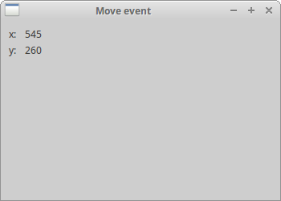
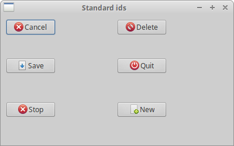
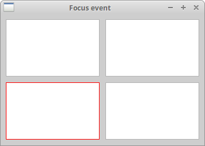

# Events in wxPython

事件是每个 GUI 应用程序的必需组成部分。所有 GUI 应用程序都是事件驱动的。应用程序会对其生命期间生成的不同事件类型作出反应。事件主要由应用程序的用户生成。但它们也可以通过其他方式产生；例如互联网连接，窗口管理器或计时器。所以当我们调用 `MainLoop()` 方法时，我们的应用程序会等待事件产生。当我们退出应用程序时，`MainLoop()` 方法结束。 

## 定义

从底层框架（一般是 GUI 工具包）看，事件是一段应用层级的信息。事件循环是一种编程结构，用于等待分发 dispatch 程序中的事件或消息。事件循环重复查找要处理的事件。调度员 dispatcher 是将事件 event 映射到事件处理器 event handlers 的过程 。事件处理器是对事件做出反应的方法 methods。

Event object：事件对象是与事件关联的对象，通常是一个窗口。

Event type：事件类型是一种已生成的特殊事件。

Event binder：事件绑定器是一个将事件类型与事件处理器绑定的对象。

## wxPython wx.EVT_MOVE example

我们对 `wx.MoveEvent`  事件做出反应。当我们将窗口移动到新的位置时，会产生事件。这个事件的 event binder 是 `wx.EVT_MOVE` 。 

**simple_event.py**

```python
#!/usr/bin/env python3
# -*- coding: utf-8 -*-

"""
ZetCode wxPython tutorial

This is a wx.MoveEvent event demostration.

author: Jan Bodnar
website: www.zetcode.com
last modified: April 2018
"""

import wx

class Example(wx.Frame):

    def __init__(self, *args, **kw):
        super(Example, self).__init__(*args, **kw)

        self.InitUI()


    def InitUI(self):

        wx.StaticText(self, label='x:', pos=(10,10))
        wx.StaticText(self, label='y:', pos=(10,30))

        self.st1 = wx.StaticText(self, label='', pos=(30, 10))
        self.st2 = wx.StaticText(self, label='', pos=(30, 30))

        self.Bind(wx.EVT_MOVE, self.OnMove)

        self.SetSize((350, 250))
        self.SetTitle('Move event')
        self.Centre()

    def OnMove(self, e):

        x, y = e.GetPosition()
        self.st1.SetLabel(str(x))
        self.st2.SetLabel(str(y))


def main():

    app = wx.App()
    ex = Example(None)
    ex.Show()
    app.MainLoop()


if __name__ == '__main__':
    main() 
```

该示例显示窗口的当前位置。 

```python
self.Bind(wx.EVT_MOVE, self.OnMove)
```

在这里，我们将 `wx.EVT_MOVE` 事件绑定器绑定到 `OnMove()` 方法。 

```python
def OnMove(self, e):
    
    x, y = e.GetPosition()
    self.st1.SetLabel(str(x))
    self.st2.SetLabel(str(y))
```

`OnMove()` 方法中的 event 参数是针对于特定事件类型的对象。在我们的例子中，它是一个 `wx.MoveEvent` 类的实例。该对象包含有关该事件的信息。例如，事件对象或窗口的位置。在我们的例子中，事件对象是 `wx.Frame` 组件。 我们可以通过调用事件的 `GetPosition()` 方法来找出当前位置。 

 

## wxPython event binding

在 WxPython 中事件的三个步骤：

- 识别事件绑定器 event binder 的名称： `wx.EVT_SIZE`，`wx.EVT_CLOSE` 等
- 创建一个事件处理器 event handler。这个方法在事件产生时被调用。
- 将事件绑定到事件处理器 event handler。

在 wxPython 中我们说要绑定一个方法到一个事件。有时会使用 word hook。你通过调用 `Bind()` 方法来绑定一个事件。 该方法具有以下参数：

```python
Bind(event, handler, source=None, id=wx.ID_ANY, id2=wx.ID_ANY)
```

`event` : 是 EVT_ * 对象之一。它指定事件的类型。

`handler` : 是要调用的对象。换句话说，这是一种程序员绑定到事件的方法。

`source` : 当我们想要区分拥有相同的事件类型的不同组件时使用 `source`。

`id` : 当我们有多个按钮，菜单项等时使用 `id` 参数。 `id` 用于区分它们。 

`id2` : 用于当需要将 handler 绑定到一系列 id 时，例如使用 `EVT_MENU_RANGE`。

请注意，方法 `Bind()` 在类 `EvtHandler` 定义。 它是 `wx.Window` 继承的类。 `wx.Window` 是 wxPython 中大多数组件的基类。还有一个相反的过程。如果我们想要从事件中解除一个方法，我们称之为 `Unbind()` 方法。 它具有与上面相同的参数。

## Vetoing events

有时我们需要停止处理事件。 要做到这一点，我们调用方法 `Veto()` 。 

**event_veto.py**

```python
#!/usr/bin/env python3
# -*- coding: utf-8 -*-

import wx

"""
ZetCode wxPython tutorial

In this example we veto an event.

author: Jan Bodnar
website: www.zetcode.com
last modified: April 2018
"""

class Example(wx.Frame):

    def __init__(self, *args, **kw):
        super(Example, self).__init__(*args, **kw)

        self.InitUI()

    def InitUI(self):

        self.Bind(wx.EVT_CLOSE, self.OnCloseWindow)

        self.SetTitle('Event veto')
        self.Centre()

    def OnCloseWindow(self, e):

        dial = wx.MessageDialog(None, 'Are you sure to quit?', 'Question',
            wx.YES_NO | wx.NO_DEFAULT | wx.ICON_QUESTION)

        ret = dial.ShowModal()

        if ret == wx.ID_YES:
            self.Destroy()
        else:
            e.Veto()


def main():

    app = wx.App()
    ex = Example(None)
    ex.Show()
    app.MainLoop()


if __name__ == '__main__':
    main()
```

在我们的例子中，我们处理了一个 `wx.CloseEvent`。当我们点击标题栏上的 X 按钮时，按下 Alt + F4 或从系统菜单中选择关闭，这个事件被调用。在许多应用程序中，我们希望在我们进行了一些更改时防止意外关闭窗口。 为此，我们必须绑定 `wx.EVT_CLOSE` 事件绑定器。 

```python
dial = wx.MessageDialog(None, 'Are you sure to quit?', 'Question',
    wx.YES_NO | wx.NO_DEFAULT | wx.ICON_QUESTION)
    
ret = dial.ShowModal()
```

在处理关闭事件的过程中，我们显示一个消息对话框。 

```python
if ret == wx.ID_YES:
    self.Destroy()
else:
    event.Veto()
```

根据对话框的返回值，我们销毁窗口，或否决事件。请注意，要关闭窗口，我们必须调用 `Destroy()` 方法。 如果调用 `Close()` 方法，我们最终会陷入无限循环。

## wxPython event propagation

有两种类型的事件：基本事件和命令事件。 它们在传播 propagation 上不同。 事件传播 Event propagation 遍历从 child widgets 到 parent widgets 和 grand parent widgets 的事件。

基本事件不会传播。 命令事件会传播。 例如 `wx.CloseEvent` 是一个基本事件，这个事件传播到 parent widgets 是没有意义的。

默认情况下，事件处理器中捕获的事件停止传播。为了继续传播，我们调用 `Skip()` 方法。

**event_propagation.py**

```python
#!/usr/bin/env python3
# -*- coding: utf-8 -*-

"""
ZetCode wxPython tutorial

This example demonstrates event propagation.

author: Jan Bodnar
website: www.zetcode.com
last modified: April 2018
"""

import wx

class MyPanel(wx.Panel):

    def __init__(self, *args, **kw):
        super(MyPanel, self).__init__(*args, **kw)

        self.Bind(wx.EVT_BUTTON, self.OnButtonClicked)

    def OnButtonClicked(self, e):

        print('event reached panel class')
        e.Skip()


class MyButton(wx.Button):

    def __init__(self, *args, **kw):
        super(MyButton, self).__init__(*args, **kw)

        self.Bind(wx.EVT_BUTTON, self.OnButtonClicked)

    def OnButtonClicked(self, e):

        print('event reached button class')
        e.Skip()


class Example(wx.Frame):

    def __init__(self, *args, **kw):
        super(Example, self).__init__(*args, **kw)

        self.InitUI()


    def InitUI(self):

        mpnl = MyPanel(self)

        MyButton(mpnl, label='Ok', pos=(15, 15))

        self.Bind(wx.EVT_BUTTON, self.OnButtonClicked)

        self.SetTitle('Propagate event')
        self.Centre()

    def OnButtonClicked(self, e):

        print('event reached frame class')
        e.Skip()


def main():

    app = wx.App()
    ex = Example(None)
    ex.Show()
    app.MainLoop()


if __name__ == '__main__':
    main()
```

在我们的例子中，我们在面板 panel 上有一个按钮。 该面板放置在一个框架组件 frame widget 中。 我们为所有组件定义一个处理器。 

```python
def OnButtonClicked(self, e):

    print('event reached button class')
    e.Skip()
```

我们在自定义按钮类中处理按钮单击事件。 `Skip()` 方法将事件传播到面板类。

尝试省略一些 `Skip()` 方法，看看会发生什么。

## Window identifiers

- let the system automatically create an id
- use standard identifiers
- create your own id

窗口标识符 Window identifiers 是唯一确定事件系统中窗口标识 window identity 的整数。有三种方法可以创建窗口 id。

- 让系统自动创建一个id
- 使用标准标识符 standard identifiers
- 创建你自己的 id

```python
wx.Button(parent, -1)
wx.Button(parent, wx.ID_ANY)
```

如果我们为参数  id 提供 -1 或 `wx.ID_ANY`，我们让 wxPython 为我们自动创建一个id。自动创建的 id 始终为负值，而用户指定的 id 必须始终为正值。 我们通常在不需要更改组件状态时使用此选项。例如，在应用程序生命周期中静态文本 static text 永远不会更改。如果我们想要，我们仍然可以得到这个 id。 方法 `GetId()` 可以确定 id。 

**default_ids.py**

```python
#!/usr/bin/env python3
# -*- coding: utf-8 -*-

"""
ZetCode wxPython tutorial

In this example we use automatic ids
with wx.ID_ANY.

author: Jan Bodnar
website: www.zetcode.com
last modified: April 2018
"""

import wx


class Example(wx.Frame):

    def __init__(self, *args, **kw):
        super(Example, self).__init__(*args, **kw)

        self.InitUI()

    def InitUI(self):

        pnl = wx.Panel(self)
        exitButton = wx.Button(pnl, wx.ID_ANY, 'Exit', (10, 10))

        self.Bind(wx.EVT_BUTTON,  self.OnExit, id=exitButton.GetId())

        self.SetTitle("Automatic ids")
        self.Centre()

    def OnExit(self, event):

        self.Close()


def main():

    app = wx.App()
    ex = Example(None)
    ex.Show()
    app.MainLoop()


if __name__ == '__main__':
    main()
```

在这个例子中，我们不关心实际的 id 值。 

```python
self.Bind(wx.EVT_BUTTON,  self.OnExit, id=exitButton.GetId())
```

我们通过调用 `GetId()` 方法来获得自动生成的ID。

建议使用标准标识符 standard identifiers。 标识符可以在某些平台上提供一些标准的图形或行为。

## wxPython standard ids

wxPython 包含一些标准的id，如 `wx.ID_SAVE` 或 `wx.ID_NEW`。 

**standard_ids.py** 

```python
#!/usr/bin/env python3
# -*- coding: utf-8 -*-

"""
ZetCode wxPython tutorial

In this example we create buttons with standard ids.

author: Jan Bodnar
website: www.zetcode.com
last modified: April 2018
"""

import wx

class Example(wx.Frame):

    def __init__(self, *args, **kw):
        super(Example, self).__init__(*args, **kw)

        self.InitUI()

    def InitUI(self):

        pnl = wx.Panel(self)
        grid = wx.GridSizer(3, 2, 0, 0)

        grid.AddMany([(wx.Button(pnl, wx.ID_CANCEL), 0, wx.TOP | wx.LEFT, 9),
            (wx.Button(pnl, wx.ID_DELETE), 0, wx.TOP, 9),
            (wx.Button(pnl, wx.ID_SAVE), 0, wx.LEFT, 9),
            (wx.Button(pnl, wx.ID_EXIT)),
            (wx.Button(pnl, wx.ID_STOP), 0, wx.LEFT, 9),
            (wx.Button(pnl, wx.ID_NEW))])

        self.Bind(wx.EVT_BUTTON, self.OnQuitApp, id=wx.ID_EXIT)

        pnl.SetSizer(grid)

        self.SetTitle("Standard ids")
        self.Centre()

    def OnQuitApp(self, event):

        self.Close()


def main():

    app = wx.App()
    ex = Example(None)
    ex.Show()
    app.MainLoop()


if __name__ == '__main__':
    main()
```

在我们的例子中，我们在按钮上使用标准标识。在Linux上，按钮有图标。 

```python
grid.AddMany([(wx.Button(pnl, wx.ID_CANCEL), 0, wx.TOP | wx.LEFT, 9),
    (wx.Button(pnl, wx.ID_DELETE), 0, wx.TOP, 9),
    (wx.Button(pnl, wx.ID_SAVE), 0, wx.LEFT, 9),
    (wx.Button(pnl, wx.ID_EXIT)),
    (wx.Button(pnl, wx.ID_STOP), 0, wx.LEFT, 9),
    (wx.Button(pnl, wx.ID_NEW))])
```

我们将六个按钮添加到 grid sizer 中。`wx.ID_CANCEL`，`wx.ID_DELETE`， `wx.ID_SAVE`，`wx.ID_EXIT`，`wx.ID_STOP` 和 `wx.ID_NEW` 是标准标识符。 

```python
self.Bind(wx.EVT_BUTTON, self.OnQuitApp, id=wx.ID_EXIT)
```

我们将按钮点击事件绑定到 `OnQuitApp()` 事件处理器。id 参数用于在按钮之间进行区分，这是我们唯一确定事件的来源。

 

## Custom event ids

最后一个选项就是使用自己的标识符。 我们定义了我们自己的 全局 id。

**custom_ids.py**

```python
#!/usr/bin/env python3
# -*- coding: utf-8 -*-

"""
ZetCode wxPython tutorial

In this example we use custom event ids.

author: Jan Bodnar
website: www.zetcode.com
last modified: April 2018
"""

import wx

ID_MENU_NEW = wx.NewId()
ID_MENU_OPEN = wx.NewId()
ID_MENU_SAVE = wx.NewId()


class Example(wx.Frame):

    def __init__(self, *args, **kw):
        super(Example, self).__init__(*args, **kw)

        self.InitUI()

    def InitUI(self):

        self.CreateMenuBar()
        self.CreateStatusBar()

        self.SetSize((350, 250))
        self.SetTitle('Custom ids')
        self.Centre()

    def CreateMenuBar(self):

        mb = wx.MenuBar()

        fMenu = wx.Menu()
        fMenu.Append(ID_MENU_NEW, 'New')
        fMenu.Append(ID_MENU_OPEN, 'Open')
        fMenu.Append(ID_MENU_SAVE, 'Save')

        mb.Append(fMenu, '&File')
        self.SetMenuBar(mb)

        self.Bind(wx.EVT_MENU, self.DisplayMessage, id=ID_MENU_NEW)
        self.Bind(wx.EVT_MENU, self.DisplayMessage, id=ID_MENU_OPEN)
        self.Bind(wx.EVT_MENU, self.DisplayMessage, id=ID_MENU_SAVE)

    def DisplayMessage(self, e):

        sb = self.GetStatusBar()

        eid = e.GetId()

        if eid == ID_MENU_NEW:
            msg = 'New menu item selected'
        elif eid == ID_MENU_OPEN:
            msg = 'Open menu item selected'
        elif eid == ID_MENU_SAVE:
            msg = 'Save menu item selected'

        sb.SetStatusText(msg)


def main():

    app = wx.App()
    ex = Example(None)
    ex.Show()
    app.MainLoop()


if __name__ == '__main__':
    main() 
```

在代码示例中，我们创建了一个包含三个菜单项的菜单。 菜单项的 id 全局创建。 

```python
ID_MENU_NEW = wx.NewId()
ID_MENU_OPEN = wx.NewId()
ID_MENU_SAVE = wx.NewId()
```

`wx.NewId()` 方法创建一个新的唯一标识。

```python
self.Bind(wx.EVT_MENU, self.DisplayMessage, id=ID_MENU_NEW)
self.Bind(wx.EVT_MENU, self.DisplayMessage, id=ID_MENU_OPEN)
self.Bind(wx.EVT_MENU, self.DisplayMessage, id=ID_MENU_SAVE) 
```

所有三个菜单项都由其唯一 id 标识。 

```python
eid = e.GetId()

if eid == ID_MENU_NEW:
    msg = 'New menu item selected'
elif eid == ID_MENU_OPEN:
    msg = 'Open menu item selected'
elif eid == ID_MENU_SAVE:
    msg = 'Save menu item selected'
```

从事件对象中取回 id。根据值的大小，我们准备消息，该消息显示在应用程序的状态栏中。

## wx.PaintEvent

重绘窗口时会生成绘图事件 paint event。 当我们调整窗口大小或者最大化窗口时会发生这种情况。绘图事件也可以通过编程方式生成。例如，当我们调用 `SetLabel()` 方法更改 `wx.StaticText` 组件时。请注意，当我们最小化窗口时，不会生成绘图事件。 

**paint_event.py**

```python
#!/usr/bin/env python3
# -*- coding: utf-8 -*-

"""
ZetCode wxPython tutorial

In this example we count paint events.

author: Jan Bodnar
website: www.zetcode.com
last modified: April 2018
"""

import wx


class Example(wx.Frame):

    def __init__(self, *args, **kw):
        super(Example, self).__init__(*args, **kw)

        self.InitUI()

    def InitUI(self):

        self.count = 0
        self.Bind(wx.EVT_PAINT, self.OnPaint)

        self.SetTitle('Paint events')
        self.SetSize((350, 250))
        self.Centre()

    def OnPaint(self, e):

        self.count += 1
        dc = wx.PaintDC(self)
        text = "Number of paint events: {0}".format(self.count)
        dc.DrawText(text, 20, 20)


def main():

    app = wx.App()
    ex  = Example(None)
    ex.Show()
    app.MainLoop()


if __name__ == '__main__':
    main()
```

在我们的例子中，我们计算绘图事件的数量并在窗口上绘制当前生成的事件的数量。

```python
self.Bind(wx.EVT_PAINT, self.OnPaint)
```

我们将 `EVT_PAINT` 事件绑定到 `OnPaint()` 方法。 

```python
def OnPaint(self, e):

    self.count += 1
    dc = wx.PaintDC(self)
    text = "Number of paint events: {0}".format(self.count)
    dc.DrawText(text, 20, 20)
```

在 `OnPaint()` 事件中，我们增加计数器，并用 `DrawText()` 方法绘出窗口的 paint events 数。

## wx.FocusEvent

焦点 focus 指示当前在应用程序中选中的组件。从键盘输入或从剪贴板粘贴文本，传送到的组件，并拥有焦点。

有两种焦点事件类型

`wx.EVT_SET_FOCUS` ：它在组件获得焦点时生成。 

`wx.EVT_KILL_FOCUS` ：当组件失去焦点时生成。

通过点击或者通过键盘按键来改变焦点，通常是 Tab 或者 Shift + Tab。 

**focus_event.py**

```python
#!/usr/bin/env python3
# -*- coding: utf-8 -*-

"""
ZetCode wxPython tutorial

In this example we work with wx.FocusEvent.

author: Jan Bodnar
website: www.zetcode.com
last modified: April 2018
"""

import wx

class MyWindow(wx.Panel):

    def __init__(self, parent):
        super(MyWindow, self).__init__(parent)

        self.color = '#b3b3b3'

        self.Bind(wx.EVT_PAINT, self.OnPaint)
        self.Bind(wx.EVT_SIZE, self.OnSize)
        self.Bind(wx.EVT_SET_FOCUS, self.OnSetFocus)
        self.Bind(wx.EVT_KILL_FOCUS, self.OnKillFocus)

    def OnPaint(self, e):

        dc = wx.PaintDC(self)

        dc.SetPen(wx.Pen(self.color))
        x, y = self.GetSize()
        dc.DrawRectangle(0, 0, x, y)

    def OnSize(self, e):

        self.Refresh()

    def OnSetFocus(self, e):

        self.color = '#ff0000'
        self.Refresh()

    def OnKillFocus(self, e):

        self.color = '#b3b3b3'
        self.Refresh()


class Example(wx.Frame):

    def __init__(self, *args, **kw):
        super(Example, self).__init__(*args, **kw)

        self.InitUI()


    def InitUI(self):

        grid = wx.GridSizer(2, 2, 10, 10)
        grid.AddMany([(MyWindow(self), 0, wx.EXPAND|wx.TOP|wx.LEFT, 9),
            (MyWindow(self), 0, wx.EXPAND|wx.TOP|wx.RIGHT, 9),
            (MyWindow(self), 0, wx.EXPAND|wx.BOTTOM|wx.LEFT, 9),
            (MyWindow(self), 0, wx.EXPAND|wx.BOTTOM|wx.RIGHT, 9)])


        self.SetSizer(grid)

        self.SetSize((350, 250))
        self.SetTitle('Focus event')
        self.Centre()


    def OnMove(self, e):

        print(e.GetEventObject())
        x, y = e.GetPosition()
        self.st1.SetLabel(str(x))
        self.st2.SetLabel(str(y))


def main():

    app = wx.App()
    ex = Example(None)
    ex.Show()
    app.MainLoop()


if __name__ == '__main__':
    main()
```

在我们的例子中，我们有四个面板 panels。 突出显示焦点的面板。 

```python
self.Bind(wx.EVT_SET_FOCUS, self.OnSetFocus)
self.Bind(wx.EVT_KILL_FOCUS, self.OnKillFocus)
```

我们将两个焦点事件绑定到事件处理器。

```python
def OnPaint(self, e):
    
    dc = wx.PaintDC(self)

    dc.SetPen(wx.Pen(self.color))
    x, y = self.GetSize()
    dc.DrawRectangle(0, 0, x, y)
```

在 `OnPaint()` 方法中，我们在窗口上绘图。 轮廓的颜色取决于窗口是否有焦点。 聚焦窗口的轮廓用红色绘制。

```python
def OnSetFocus(self, e):

    self.color = '#ff0000'
    self.Refresh()
```

在 `OnSetFocus()` 方法中，我们将 `self.color` 变量设置为红色。我们刷新框架窗口 frame window，它将为其所有子窗口组件生成一个绘图事件。窗户重新绘制，有焦点的组件有一个新颜色的外轮廓。 

```python
def OnKillFocus(self, e):

    self.color = '#b3b3b3'
    self.Refresh()
```

当窗口失去焦点时， `OnKillFocus()` 方法被调用。我们改变颜色值并刷新。  

 

## wx.KeyEvent

当我们按下键盘上的某个键时，会生成一个 `wx.KeyEvent` 。这个事件被发送到有当前焦点的组件。有三种不同的按键处理器： 

- wx.EVT_KEY_DOWN
- wx.EVT_KEY_UP
- wx.EVT_CHAR

常见的需求是当 ESC 键按下时关闭程序。 

**key_event.py**

```python
#!/usr/bin/env python3
# -*- coding: utf-8 -*-

"""
ZetCode wxPython tutorial

In this example we work with wx.KeyEvent.

author: Jan Bodnar
website: www.zetcode.com
last modified: April 2018
"""

import wx

class Example(wx.Frame):

    def __init__(self, *args, **kw):
        super(Example, self).__init__(*args, **kw)

        self.InitUI()

    def InitUI(self):

        pnl = wx.Panel(self)
        pnl.Bind(wx.EVT_KEY_DOWN, self.OnKeyDown)
        pnl.SetFocus()

        self.SetSize((350, 250))
        self.SetTitle('Key event')
        self.Centre()

    def OnKeyDown(self, e):

        key = e.GetKeyCode()

        if key == wx.WXK_ESCAPE:

            ret  = wx.MessageBox('Are you sure to quit?', 'Question',
                wx.YES_NO | wx.NO_DEFAULT, self)

            if ret == wx.YES:
                self.Close()


def main():

    app = wx.App()
    ex = Example(None)
    ex.Show()
    app.MainLoop()


if __name__ == '__main__':
    main()
```

在这个例子中，我们处理 Esc 按键。 显示一个消息框以确认终止应用程序。 

```python
pnl.Bind(wx.EVT_KEY_DOWN, self.OnKeyDown)
```

我们将事件处理器绑定到 `wx.EVT_KEY_DOWN` 事件。

```python
key = e.GetKeyCode()
```

这里我们得到按键的键码

```python
if key == wx.WXK_ESCAPE:
```

我们核对键码。 Esc 键有 `wx.WXK_ESCAPE` 码。

在本章中，我们讨论了 wxPython中 的事件。