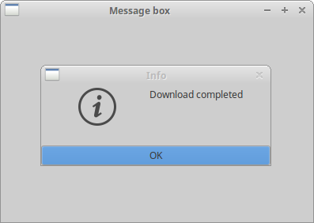
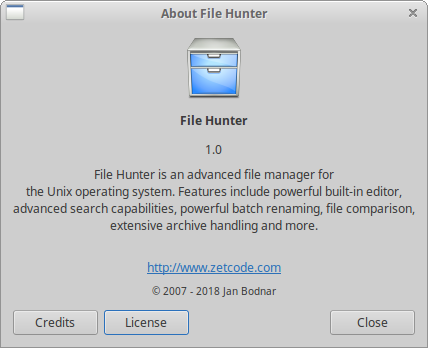
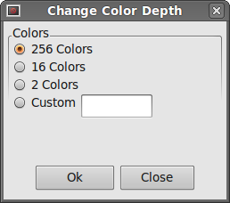

# wxPython dialogs

对话框窗口或对话框是大多数现代 GUI 应用程序不可缺少的部分。对话被定义为两个或更多人之间的对话。在计算机应用程序中，对话框是一个用于与应用程序“交谈”的窗口。 对话框用于输入数据，修改数据，更改应用程序设置等。对话是用户和计算机程序之间交流的重要手段。 

## A Simple message box

消息框 message box 向用户提供简短的信息。一个很好的例子是 CD 刻录应用程序。 当 CD 完成刻录时，会弹出一个消息框。 

**message_box.py**

```python
#!/usr/bin/env python3
# -*- coding: utf-8 -*-

"""
ZetCode wxPython tutorial

This example shows a simple
message box.

author: Jan Bodnar
website: www.zetcode.com
last modified: April 2018
"""

import wx


class Example(wx.Frame):

    def __init__(self, *args, **kwargs):
        super(Example, self).__init__(*args, **kwargs)

        self.InitUI()

    def InitUI(self):

        wx.CallLater(3000, self.ShowMessage)

        self.SetSize((300, 200))
        self.SetTitle('Message box')
        self.Centre()

    def ShowMessage(self):
        wx.MessageBox('Download completed', 'Info',
            wx.OK | wx.ICON_INFORMATION)


def main():

    app = wx.App()
    ex = Example(None)
    ex.Show()
    app.MainLoop()


if __name__ == '__main__':
    main()
```

此示例三秒钟后显示一个消息框。 

```python
wx.CallLater(3000, self.ShowMessage)
```

`wx.CallLater` 在三秒钟后调用一个方法。第一个参数是一个时间值，之后调用给定的方法。该参数以毫秒为单位。 第二个参数是一个要调用的方法。 

```python
def ShowMessage(self):
    wx.MessageBox('Download completed', 'Info', 
        wx.OK | wx.ICON_INFORMATION)
```

`wx.MessageBox` 显示一个小对话窗口。我们提供三个参数：文本消息 text message，标题消息 title message和标志 flags。标志用于显示不同的按钮和图标。在我们的例子中，我们显示一个确定按钮和信息图标。

 

## Predefined dialogs

wxPython 有几个预定义的对话框。这些是常见编程任务的对话框，例如文本、接收输入、加载和保存文件。 

## Message dialogs

Message dialogs are used to show messages to the user. They are more flexible than simple message boxes that we saw in the previous example. They are customisable. We can change icons and buttons that will be shown in a dialog.

消息对话框用于向用户显示消息，比前面例子中看到的简单消息框更加灵活。它们是可定制的。我们可以更改在对话框中的图标和按钮。 

| flag                | meaning                |
| ------------------- | ---------------------- |
| wx.OK               | 显示 OK 按钮           |
| wx.CANCEL           | 显示 Cancel 按钮       |
| wx.YES_NO           | 显示 Yes，没有按钮     |
| wx.YES_DEFAULT      | 让 Yes 按钮成为默认值  |
| wx.NO_DEFAULT       | 让 No 按钮成为默认值   |
| wx.ICON_EXCLAMATION | 显示警告 alert 图标    |
| wx.ICON_ERROR       | 显示错误 error 图标    |
| wx.ICON_HAND        | 同 wx.ICON_ERROR       |
| wx.ICON_INFORMATION | 显示信息 info 图标     |
| wx.ICON_QUESTION    | 显示疑问 question 图标 |

这些都是可以与 `wx.MessageDialog` 类一起使用的标志 flag。 

**message_dialogs.py**

```python
#!/usr/bin/env python3
# -*- coding: utf-8 -*-

"""
ZetCode wxPython tutorial

This example shows four types of
message dialogs.

author: Jan Bodnar
website: www.zetcode.com
last modified: April 2018
"""

import wx


class Example(wx.Frame):

    def __init__(self, *args, **kwargs):
        super(Example, self).__init__(*args, **kwargs)

        self.InitUI()

    def InitUI(self):

        panel = wx.Panel(self)

        hbox = wx.BoxSizer()
        sizer = wx.GridSizer(2, 2, 2, 2)

        btn1 = wx.Button(panel, label='Info')
        btn2 = wx.Button(panel, label='Error')
        btn3 = wx.Button(panel, label='Question')
        btn4 = wx.Button(panel, label='Alert')

        sizer.AddMany([btn1, btn2, btn3, btn4])

        hbox.Add(sizer, 0, wx.ALL, 15)
        panel.SetSizer(hbox)

        btn1.Bind(wx.EVT_BUTTON, self.ShowMessage1)
        btn2.Bind(wx.EVT_BUTTON, self.ShowMessage2)
        btn3.Bind(wx.EVT_BUTTON, self.ShowMessage3)
        btn4.Bind(wx.EVT_BUTTON, self.ShowMessage4)

        self.SetSize((300, 200))
        self.SetTitle('Messages')
        self.Centre()

    def ShowMessage1(self, event):
        dial = wx.MessageDialog(None, 'Download completed', 'Info', wx.OK)
        dial.ShowModal()

    def ShowMessage2(self, event):
        dial = wx.MessageDialog(None, 'Error loading file', 'Error',
            wx.OK | wx.ICON_ERROR)
        dial.ShowModal()

    def ShowMessage3(self, event):
        dial = wx.MessageDialog(None, 'Are you sure to quit?', 'Question',
            wx.YES_NO | wx.NO_DEFAULT | wx.ICON_QUESTION)
        dial.ShowModal()

    def ShowMessage4(self, event):
        dial = wx.MessageDialog(None, 'Unallowed operation', 'Exclamation',
            wx.OK | wx.ICON_EXCLAMATION)
        dial.ShowModal()


def main():

    app = wx.App()
    ex = Example(None)
    ex.Show()
    app.MainLoop()


if __name__ == '__main__':
    main()
```

在我们的例子中，我们创建了四个按钮并将它们放入网格 sizer 中。这些按钮将显示四个不同的对话窗口。我们通过指定不同的风格标志来创建它们

```python
def ShowMessage2(self, event):
    dial = wx.MessageDialog(None, 'Error loading file', 'Error', 
        wx.OK | wx.ICON_ERROR)
    dial.ShowModal()
```

消息对话框的创建很简单。 通过将 None 设置为父级parent，我们将对话框设置为顶级窗口。两个字符串提供消息文本和对话标题。 我们通过指定 `wx.OK` 和 `wx.ICON_ERROR` 标志来显示一个 OK 按钮和一个错误图标。为了在屏幕上显示对话框，我们调用 `ShowModal()` 方法。 

## About dialog box

几乎每个应用程序都有一个典型的对话框。它通常放置在帮助菜单中，此对话框的目的是为用户提供有关应用程序名称和版本的基本信息。过去这些对话框很简短，现在大多数的框还提供有关作者的更多信息。 他们为别的程序员或文档编写者提供信用。 他们还提供有关应用程序许可证的信息。 这些框可以显示公司的 logo 或应用程序 logo。 

为了创建关于对话框，我们必须创建两个对象。 `wx.adv.AboutDialogInfo` 和 `wx.adv.AboutBox`。 

wxPython 可以显示两种关于框。这取决于我们使用哪个平台以及我们调用哪些方法。它可以是原生对话框或wxPython 通用对话框。Windows 原生的关于对话框无法显示自定义图标，许可证文本或 URL。如果我们省略这三个字段，wxPython 将显示一个原生对话框。 否则，它将采用通用的。 如果我们想尽可能使用原生对话框，建议在一个单独的菜单项提供许可证信息。GTK+ 可以显示所有这些字段。 

**about_dialog.py**

```python
#!/usr/bin/env python3
# -*- coding: utf-8 -*-

'''
ZetCode wxPython tutorial

In this example, we create an
about dialog box.

author: Jan Bodnar
website: www.zetcode.com
last modified: April 2018
'''

import wx
import wx.adv


class Example(wx.Frame):

    def __init__(self, *args, **kwargs):
        super(Example, self).__init__(*args, **kwargs)

        self.InitUI()

    def InitUI(self):

        menubar = wx.MenuBar()
        help = wx.Menu()
        help.Append(wx.ID_ANY, '&About')
        help.Bind(wx.EVT_MENU, self.OnAboutBox)

        menubar.Append(help, '&Help')
        self.SetMenuBar(menubar)

        self.SetSize((350, 250))
        self.SetTitle('About dialog box')
        self.Centre()

    def OnAboutBox(self, e):

        description = """File Hunter is an advanced file manager for
the Unix operating system. Features include powerful built-in editor,
advanced search capabilities, powerful batch renaming, file comparison,
extensive archive handling and more.
"""

        licence = """File Hunter is free software; you can redistribute
it and/or modify it under the terms of the GNU General Public License as
published by the Free Software Foundation; either version 2 of the License,
or (at your option) any later version.

File Hunter is distributed in the hope that it will be useful,
but WITHOUT ANY WARRANTY; without even the implied warranty of
MERCHANTABILITY or FITNESS FOR A PARTICULAR PURPOSE.
See the GNU General Public License for more details. You should have
received a copy of the GNU General Public License along with File Hunter;
if not, write to the Free Software Foundation, Inc., 59 Temple Place,
Suite 330, Boston, MA  02111-1307  USA"""


        info = wx.adv.AboutDialogInfo()

        info.SetIcon(wx.Icon('hunter.png', wx.BITMAP_TYPE_PNG))
        info.SetName('File Hunter')
        info.SetVersion('1.0')
        info.SetDescription(description)
        info.SetCopyright('(C) 2007 - 2018 Jan Bodnar')
        info.SetWebSite('http://www.zetcode.com')
        info.SetLicence(licence)
        info.AddDeveloper('Jan Bodnar')
        info.AddDocWriter('Jan Bodnar')
        info.AddArtist('The Tango crew')
        info.AddTranslator('Jan Bodnar')

        wx.adv.AboutBox(info)


def main():

    app = wx.App()
    ex = Example(None)
    ex.Show()
    app.MainLoop()


if __name__ == '__main__':
    main()
```

The example has an about menu item. After selecting the item, the about box is displayed.

```python
        description = """File Hunter is an advanced file manager for 
the Unix operating system. Features include powerful built-in editor, 
advanced search capabilities, powerful batch renaming, file comparison, 
extensive archive handling and more.
"""
```

将太多文本放入应用程序的代码并不是最好的办法。我们不想让这个例子太复杂，所以我们把所有的文本放入代码中。 但是在现实世界的程序中，文本应该单独放置在一个文件中。它有助于我们应用程序的维护。 例如，如果我们想将我们的应用程序翻译成其他语言。 

```python
info = wx.adv.AboutDialogInfo()
```

第一件要做的事情是创建 `wx.AboutDialogInfo` 对象。构造函数是空的，它不带任何参数。

```python
info.SetIcon(wx.Icon('hunter.png', wx.BITMAP_TYPE_PNG))
info.SetName('File Hunter')
info.SetVersion('1.0')
info.SetDescription(description)
info.SetCopyright('(C) 2007 - 2014 Jan Bodnar')
info.SetWebSite('http://www.zetcode.com')
info.SetLicence(licence)
info.AddDeveloper('Jan Bodnar')
info.AddDocWriter('Jan Bodnar')
info.AddArtist('The Tango crew')
info.AddTranslator('Jan Bodnar')
```

The next thing to do is to call all necessary methods upon the created `wx.AboutDialogInfo` object.

接下来要做的事情是调用 `wx.AboutDialogInfo` 对象中所有必要的方法。

```python
wx.adv.AboutBox(info)
```

最后，我们创建一个 `wx.adv.AboutBox` 组件。 它唯一接收的参数是 `wx.adv.AboutDialogInfo` 对象。 

 

## A custom dialog

在下一个例子中，我们创建一个自定义对话框。图像编辑应用程序可以改变图片的颜色深度。为了提供这种功能，我们可以创建一个合适的对话框。 

**custom_dialog.py**

```python
#!/usr/bin/env python3
# -*- coding: utf-8 -*-

'''
ZetCode wxPython tutorial

In this code example, we create a
custom dialog.

author: Jan Bodnar
website: www.zetcode.com
last modified: April 2018
'''

import wx

class ChangeDepthDialog(wx.Dialog):

    def __init__(self, *args, **kw):
        super(ChangeDepthDialog, self).__init__(*args, **kw)

        self.InitUI()
        self.SetSize((250, 200))
        self.SetTitle("Change Color Depth")


    def InitUI(self):

        pnl = wx.Panel(self)
        vbox = wx.BoxSizer(wx.VERTICAL)

        sb = wx.StaticBox(pnl, label='Colors')
        sbs = wx.StaticBoxSizer(sb, orient=wx.VERTICAL)
        sbs.Add(wx.RadioButton(pnl, label='256 Colors',
            style=wx.RB_GROUP))
        sbs.Add(wx.RadioButton(pnl, label='16 Colors'))
        sbs.Add(wx.RadioButton(pnl, label='2 Colors'))

        hbox1 = wx.BoxSizer(wx.HORIZONTAL)
        hbox1.Add(wx.RadioButton(pnl, label='Custom'))
        hbox1.Add(wx.TextCtrl(pnl), flag=wx.LEFT, border=5)
        sbs.Add(hbox1)

        pnl.SetSizer(sbs)

        hbox2 = wx.BoxSizer(wx.HORIZONTAL)
        okButton = wx.Button(self, label='Ok')
        closeButton = wx.Button(self, label='Close')
        hbox2.Add(okButton)
        hbox2.Add(closeButton, flag=wx.LEFT, border=5)

        vbox.Add(pnl, proportion=1,
            flag=wx.ALL|wx.EXPAND, border=5)
        vbox.Add(hbox2, flag=wx.ALIGN_CENTER|wx.TOP|wx.BOTTOM, border=10)

        self.SetSizer(vbox)

        okButton.Bind(wx.EVT_BUTTON, self.OnClose)
        closeButton.Bind(wx.EVT_BUTTON, self.OnClose)


    def OnClose(self, e):

        self.Destroy()


class Example(wx.Frame):

    def __init__(self, *args, **kw):
        super(Example, self).__init__(*args, **kw)

        self.InitUI()


    def InitUI(self):

        tb = self.CreateToolBar()
        tb.AddTool(toolId=wx.ID_ANY, label='', bitmap=wx.Bitmap('color.png'))

        tb.Realize()

        tb.Bind(wx.EVT_TOOL, self.OnChangeDepth)

        self.SetSize((350, 250))
        self.SetTitle('Custom dialog')
        self.Centre()

    def OnChangeDepth(self, e):

        cdDialog = ChangeDepthDialog(None,
            title='Change Color Depth')
        cdDialog.ShowModal()
        cdDialog.Destroy()


def main():

    app = wx.App()
    ex = Example(None)
    ex.Show()
    app.MainLoop()


if __name__ == '__main__':
    main()
```

在上面的例子中，我们创建了一个自定义对话框。

```python
class ChangeDepthDialog(wx.Dialog):
    
    def __init__(self, *args, **kw):
        super(ChangeDepthDialog, self).__init__(*args, **kw) 
```

在我们的代码示例中，我们创建了一个自定义的 ChangeDepthDialog 对话框，从 `wx.Dialog` 小部件继承。

```python
def OnChangeDepth(self, e):

    cdDialog = ChangeDepthDialog(None,
        title='Change Color Depth')
    cdDialog.ShowModal()
    cdDialog.Destroy()
```

We instantiate a `ChangeDepthDialog class`. Then we call the `ShowModal()` method. Later, we must destroy our dialog with `Destroy()` Notice the visual difference between the dialog and the top level window. The dialog in the following figure has been activated. We cannot work with the toplevel window until the dialog is destroyed. There is a clear difference in the titlebar of the windows.

我们实例化了一个 `ChangeDepthDialog` 类，然后我们调用 `ShowModal()` 方法。之后，我们必须用 `Destroy()` 销毁我们的对话框。注意下对话框和顶层窗口 toplevel window 的区别，下图中的对话框已被激活，在对话框销毁之前，我们无法使用顶层窗口，同时它们的窗口标题栏有明显不同。 

 

在本章中，我们讨论了对话框。