# Widgets

在本节中，我们将介绍 wxPython 中基本的组件。 每个组件都有一个小代码示例。组件 Widgets 是应用程序的基本构建块。 wxPythont 有各种各样的组件，包括按钮，复选框，滑块和列表框。  

## wx.Button

`wx.Button` 是一个简单的组件。 它包含一个文本字符串，用于触发一个动作。 

**button_wid.py**

```python
#!/usr/bin/env python3
# -*- coding: utf-8 -*-

"""
ZetCode wxPython tutorial

In this code example, we create a
button widget.

author: Jan Bodnar
website: www.zetcode.com
last modified: April 2018
"""

import wx


class Example(wx.Frame):

    def __init__(self, *args, **kw):
        super(Example, self).__init__(*args, **kw)

        self.InitUI()

    def InitUI(self):

        pnl = wx.Panel(self)
        closeButton = wx.Button(pnl, label='Close', pos=(20, 20))

        closeButton.Bind(wx.EVT_BUTTON, self.OnClose)

        self.SetSize((350, 250))
        self.SetTitle('wx.Button')
        self.Centre()

    def OnClose(self, e):

        self.Close(True)


def main():

    app = wx.App()
    ex = Example(None)
    ex.Show()
    app.MainLoop()


if __name__ == '__main__':
    main()  
```

在代码例子中，我们创建一个关闭按钮，当按下时结束应用程序。

```python
cbtn = wx.Button(pnl, label='Close', pos=(20, 20))
```

一个 `wx.Button` 组件被创建。在组件的构造函数中，我们提供按钮的标签和按钮的在面板的位置。

```python
cbtn.Bind(wx.EVT_BUTTON, self.OnClose)
```

当我们点击按钮时触发 `wx.EVT_BUTTON` 事件，我们为事件处理器指定事件。

```python
def OnClose(self, e):
    
    self.Close(True)   
```

在 `OnClose()` 方法中，我们使用 `Close()` 方法终止应用程序。  

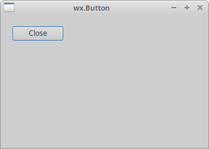 

## wx.ToggleButton

`wx.ToggleButton` 是一个具有两种状态的按钮：按下和未按下。 点击它可以在这两种状态之间切换。有些情况下这个功能很适用。

**toggle_buttons.py**

```python
#!/usr/bin/env python3
# -*- coding: utf-8 -*-

"""
ZetCode wxPython tutorial

In this code example, we create three
toggle button widgets.

author: Jan Bodnar
website: www.zetcode.com
last modified: April 2018
"""

import wx


class Example(wx.Frame):

    def __init__(self, *args, **kw):
        super(Example, self).__init__(*args, **kw)

        self.InitUI()

    def InitUI(self):

        pnl = wx.Panel(self)

        self.col = wx.Colour(0, 0, 0)

        rtb = wx.ToggleButton(pnl, label='red', pos=(20, 25))
        gtb = wx.ToggleButton(pnl, label='green', pos=(20, 60))
        btb = wx.ToggleButton(pnl, label='blue', pos=(20, 100))

        self.cpnl  = wx.Panel(pnl, pos=(150, 20), size=(110, 110))
        self.cpnl.SetBackgroundColour(self.col)

        rtb.Bind(wx.EVT_TOGGLEBUTTON, self.ToggleRed)
        gtb.Bind(wx.EVT_TOGGLEBUTTON, self.ToggleGreen)
        btb.Bind(wx.EVT_TOGGLEBUTTON, self.ToggleBlue)

        self.SetSize((350, 250))
        self.SetTitle('Toggle buttons')
        self.Centre()

    def ToggleRed(self, e):

        obj = e.GetEventObject()
        isPressed = obj.GetValue()

        green = self.col.Green()
        blue = self.col.Blue()

        if isPressed:
            self.col.Set(255, green, blue)
        else:
            self.col.Set(0, green, blue)

        self.cpnl.SetBackgroundColour(self.col)
        self.cpnl.Refresh()

    def ToggleGreen(self, e):

        obj = e.GetEventObject()
        isPressed = obj.GetValue()

        red = self.col.Red()
        blue = self.col.Blue()

        if isPressed:
            self.col.Set(red, 255, blue)
        else:
            self.col.Set(red, 0, blue)

        self.cpnl.SetBackgroundColour(self.col)
        self.cpnl.Refresh()

    def ToggleBlue(self, e):

        obj = e.GetEventObject()
        isPressed = obj.GetValue()

        red = self.col.Red()
        green = self.col.Green()

        if isPressed:
            self.col.Set(red, green, 255)
        else:
            self.col.Set(red, green, 0)

        self.cpnl.SetBackgroundColour(self.col)
        self.cpnl.Refresh()


def main():

    app = wx.App()
    ex = Example(None)
    ex.Show()
    app.MainLoop()


if __name__ == '__main__':
    main()
```

我们有红色，绿色和蓝色的切换按钮和一个面板。我们通过点击切换按钮来改变面板的颜色。

```python
rtb = wx.ToggleButton(pnl, label='red', pos=(20, 25)) 
```

`wx.ToggleButton` 组件被创建。

```python
self.cpnl  = wx.Panel(pnl, pos=(150, 20), size=(110, 110))
self.cpnl.SetBackgroundColour(self.col) 
```

这是一个面板，我们将使用切换按钮修改它的颜色。

```python
rtb.Bind(wx.EVT_TOGGLEBUTTON, self.ToggleRed) 
```

当我们点击 `rtb` 切换按钮时，会调用 `ToggleRed()` 事件处理器。

```python
def ToggleRed(self, e):
    
    obj = e.GetEventObject()
    isPressed = obj.GetValue()
    
    green = self.col.Green()
    blue = self.col.Blue()
    
    if isPressed:
        self.col.Set(255, green, blue)
    else:
        self.col.Set(0, green, blue)
        
    self.cpnl.SetBackgroundColour(self.col)
```

在 `ToggleRed()` 方法中，我们对 `rtb` 按钮被按下的事实做出了反应。我们计算颜色并更新颜色面板 colour panel 的颜色。  

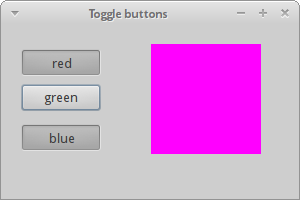 

## wx.StaticText

wx.StaticText 组件显示一行或多行只读文本。

**static_text.py**

```python
#!/usr/bin/python
# -*- coding: utf-8 -*-

"""
ZetCode wxPython tutorial

In this code example, we create a static text.

author: Jan Bodnar
website: www.zetcode.com
last modified: April 2018
"""

import wx


class Example(wx.Frame):

    def __init__(self, *args, **kw):
        super(Example, self).__init__(*args, **kw)

        self.InitUI()

    def InitUI(self):

        txt1 = '''I'm giving up the ghost of love
in the shadows cast on devotion
She is the one that I adore
creed of my silent suffocation
Break this bittersweet spell on me
lost in the arms of destiny'''

        txt2 = '''There is something in the way
You're always somewhere else
Feelings have deserted me
To a point of no return
I don't believe in God
But I pray for you'''

        pnl = wx.Panel(self)
        vbox = wx.BoxSizer(wx.VERTICAL)

        font = wx.Font(13, wx.DEFAULT, wx.NORMAL, wx.NORMAL, False, 'microsoft yahei ui')

        st1 = wx.StaticText(pnl, label=txt1, style=wx.ALIGN_LEFT)
        st2 = wx.StaticText(pnl, label=txt2, style=wx.ALIGN_LEFT)

        st1.SetFont(font)
        st2.SetFont(font)

        vbox.Add(st1, flag=wx.ALL, border=15)
        vbox.Add(st2, flag=wx.ALL, border=15)
        
        pnl.SetSizer(vbox)

        self.SetTitle('Bittersweet')
        self.Centre()


def main():

    app = wx.App()
    ex = Example(None)
    ex.Show()
    app.MainLoop()


if __name__ == '__main__':
    main()
```

在这个例子中，我们使用 `wx.StaticText` 组件展示了两篇 Bittersweet 的诗。

```python
font = wx.Font(13, wx.DEFAULT, wx.NORMAL, wx.DEFAULT)
```

我们为文本创建一个字体对象。

```python
        txt1 = '''I'm giving up the ghost of love
in the shadows cast on devotion
She is the one that I adore
creed of my silent suffocation
Break this bittersweet spell on me
lost in the arms of destiny'''
```

在 `wx.StaticText` 组件中会显示该字符串。

```python
st1 = wx.StaticText(pnl, label=txt1, style=wx.ALIGN_LEFT)
```

我们创建 `wx.StaticText` 组件。 文本将与左侧对齐。

```python
st1.SetFont(font)
st2.SetFont(font)
```

我们使用 `SetFont()` 为静态文本设置字体。  

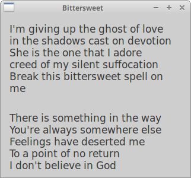 

## wx.StaticLine

这个组件在窗口上显示一个简单的线条。 它可以是水平的或垂直的。

**static_line.py**

```python
#!/usr/bin/env python3
# -*- coding: utf-8 -*-

"""
ZetCode wxPython tutorial

In this code example, we create a static line.

author: Jan Bodnar
website: www.zetcode.com
last modified: April 2018
"""


import wx


class Example(wx.Frame):

    def __init__(self, *args, **kw):
        super(Example, self).__init__(*args, **kw)

        self.InitUI()

    def InitUI(self):

        pnl = wx.Panel(self)

        font = wx.Font(10, wx.DEFAULT, wx.NORMAL, wx.BOLD)
        heading = wx.StaticText(self, label='The Central Europe',
                                pos=(25, 15), size=(200, -1))
        heading.SetFont(font)

        wx.StaticLine(self, pos=(25, 50), size=(300,1))

        wx.StaticText(self, label='Slovakia', pos=(25, 80))
        wx.StaticText(self, label='Hungary', pos=(25, 100))
        wx.StaticText(self, label='Poland', pos=(25, 120))
        wx.StaticText(self, label='Czech Republic', pos=(25, 140))
        wx.StaticText(self, label='Germany', pos=(25, 160))
        wx.StaticText(self, label='Slovenia', pos=(25, 180))
        wx.StaticText(self, label='Austria', pos=(25, 200))
        wx.StaticText(self, label='Switzerland', pos=(25, 220))

        wx.StaticText(self, label='5 445 000', pos=(250, 80))
        wx.StaticText(self, label='10 014 000', pos=(250, 100))
        wx.StaticText(self, label='38 186 000', pos=(250, 120))
        wx.StaticText(self, label='10 562 000', pos=(250, 140))
        wx.StaticText(self, label='81 799 000', pos=(250, 160))
        wx.StaticText(self, label='2 050 000', pos=(250, 180))
        wx.StaticText(self, label='8 414 000', pos=(250, 200))
        wx.StaticText(self, label='7 866 000', pos=(250, 220))

        wx.StaticLine(self, pos=(25, 260), size=(300,1))

        tsum = wx.StaticText(self, label='164 336 000', pos=(240, 280))
        sum_font = tsum.GetFont()
        sum_font.SetWeight(wx.BOLD)
        tsum.SetFont(sum_font)

        btn = wx.Button(self, label='Close', pos=(140, 310))

        btn.Bind(wx.EVT_BUTTON, self.OnClose)

        self.SetSize((360, 380))
        self.SetTitle('wx.StaticLine')
        self.Centre()

    def OnClose(self, e):

        self.Close(True)


def main():

    app = wx.App()
    ex = Example(None)
    ex.Show()
    app.MainLoop()


if __name__ == '__main__':
    main()
```

脚本显示中欧国家及其人口。 `wx.StatLine` 使它看起来更具视觉吸引力。

```python
wx.StaticLine(self, pos=(25, 50), size=(300,1))
```

这是 `wx.StaticLine` 的构造函数

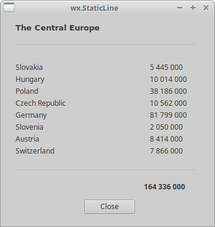 

## wx.StaticBox

这是一种装饰组件。 它用于对各种组件进行逻辑分组。 请注意，这个组件必须在其包含的组件之前创建，并且这些包含的组件应该是静态框的兄弟，而不是孩子。

```python
#!/usr/bin/python
# -*- coding: utf-8 -*-

import wx


class Example(wx.Frame):
           
    def __init__(self, *args, **kw):
        super(Example, self).__init__(*args, **kw) 
        
        self.InitUI()
        
    def InitUI(self):   

        pnl = wx.Panel(self)
        
        wx.StaticBox(pnl, label='Personal Info', pos=(5, 5), size=(240, 170))
        wx.CheckBox(pnl, label='Male', pos=(15, 30))
        wx.CheckBox(pnl, label='Married', pos=(15, 55))
        wx.StaticText(pnl, label='Age', pos=(15, 95))
        wx.SpinCtrl(pnl, value='1', pos=(55, 90), size=(60, -1), min=1, max=120)
        
        btn = wx.Button(pnl, label='Ok', pos=(90, 185), size=(60, -1))

        btn.Bind(wx.EVT_BUTTON, self.OnClose)

        self.SetSize((270, 250))
        self.SetTitle('Static box')
        self.Centre()
        self.Show(True)          
        
    def OnClose(self, e):
        
        self.Close(True)    
               
        
def main():
    
    ex = wx.App()
    Example(None)
    ex.MainLoop()    


if __name__ == '__main__':
    main()   
```

我们有一个 `wx.StaticBox` 来装饰其他四个组件。  

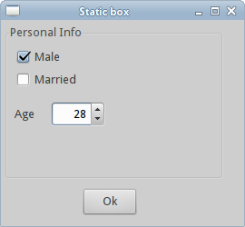 

## wx.ComboBox

`wx.ComboBox` 组合框，是单行文本字段、带有向下箭头图像的按钮和列表框 listbox 的组合。当你按下按钮时，出现一个列表框。 用户只能从提供的字符串列表中选择一个选项。

```python
#!/usr/bin/python
# -*- coding: utf-8 -*-

import wx


class Example(wx.Frame):
           
    def __init__(self, *args, **kw):
        super(Example, self).__init__(*args, **kw) 
        
        self.InitUI()
        
    def InitUI(self):   

        pnl = wx.Panel(self)
        
        distros = ['Ubuntu', 'Arch', 'Fedora', 'Debian', 'Mint']
        cb = wx.ComboBox(pnl, pos=(50, 30), choices=distros, 
            style=wx.CB_READONLY)

        self.st = wx.StaticText(pnl, label='', pos=(50, 140))
        cb.Bind(wx.EVT_COMBOBOX, self.OnSelect)
        
        self.SetSize((250, 230))
        self.SetTitle('wx.ComboBox')
        self.Centre()
        self.Show(True)          
        
    def OnSelect(self, e):
        
        i = e.GetString()
        self.st.SetLabel(i)
        
def main():
    
    ex = wx.App()
    Example(None)
    ex.MainLoop()    

if __name__ == '__main__':
    main()   
```

组合框 combo box 中选中的选项在下面标签中显示。

```python
distros = ['Ubuntu', 'Arch', 'Fedora', 'Debian', 'Mint']
```

组合框将包含这个字符串列表。

```python
cb = wx.ComboBox(pnl, pos=(50, 30), choices=distros, 
            style=wx.CB_READONLY)
```

一个 `wx.ComboBox` 组件被创建。选项参数是字符串列表，用于组合框的显示。 `wx.CB_READONLY` 样式使列表中的字符串为只读。

```python
cb.Bind(wx.EVT_COMBOBOX, self.OnSelect)
```

当我们从组合框中选择一个选项时，会触发 `wx.EVT_COMBOBOX` 事件。 我们将 `OnSelect()` 事件处理器插入此事件。

```python
def OnSelect(self, e):
    
    i = e.GetString()
    self.st.SetLabel(i)
```

我们从组合框中获取所选项目并将其设置到标签。  

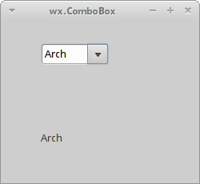 

## wx.CheckBox

`wx.CheckBox` 是一个具有两种状态的组件：on 和 off。 这是一个带有标签的盒子。 标签可以设置在框的右侧或左侧。 如果 `wx.CheckBox` 被选中，它将在框中用勾号表示。

**checkbox.py**

```python
#!/usr/bin/env python3
# -*- coding: utf-8 -*-

"""
ZetCode wxPython tutorial

In this example we create a checkbox widget.

author: Jan Bodnar
website: www.zetcode.com
last modified: April 2018
"""

import wx


class Example(wx.Frame):

    def __init__(self, *args, **kw):
        super(Example, self).__init__(*args, **kw)

        self.InitUI()

    def InitUI(self):

        pnl = wx.Panel(self)

        vbox = wx.BoxSizer(wx.HORIZONTAL)

        cb = wx.CheckBox(pnl, label='Show title')
        cb.SetValue(True)
        cb.Bind(wx.EVT_CHECKBOX, self.ShowOrHideTitle)

        vbox.Add(cb, flag=wx.TOP|wx.LEFT, border=30)

        pnl.SetSizer(vbox)

        self.SetTitle('wx.CheckBox')
        self.Centre()

    def ShowOrHideTitle(self, e):

        sender = e.GetEventObject()
        isChecked = sender.GetValue()

        if isChecked:
            self.SetTitle('wx.CheckBox')
        else:
            self.SetTitle('')


def main():

    app = wx.App()
    ex = Example(None)
    ex.Show()
    app.MainLoop()


if __name__ == '__main__':
    main()
```

在上面的例子中，我们使用 `wx.CheckBox` 组件显示或隐藏窗口标题。

```python
cb = wx.CheckBox(pnl, label='Show title')
```

这是 `wx.CheckBox` 组件的构造函数。

```python
cb.SetValue(True)
```

该框架的标题默认显示，我们使用 `SetValue()` 方法设置 `wx.CheckBox` 组件勾选状态。

```python
cb.Bind(wx.EVT_CHECKBOX, self.ShowOrHideTitle)
```

当我们点击 `wx.CheckBox` 组件时，会触发 `wx.EVT_CHECKBOX` 事件。 `ShowOrHideTitle()` 事件处理器在此事件中被调用。

```python
def ShowOrHideTitle(self, e):
    
    sender = e.GetEventObject()
    isChecked = sender.GetValue()
    
    if isChecked:
        self.SetTitle('wx.CheckBox')            
    else: 
        self.SetTitle('')   
```

在 `ShowOrHideTitle()` 方法中，我们根据 `wx.CheckBox` 小组件的状态显示或隐藏标题。  

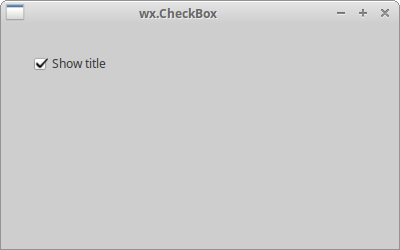 

## wx.StatusBar

`wx.StatusBar` 组件用于显示应用程序状态信息。它可以分为几个部分来显示信息。我们可以将其他组件插入到 `wx.StatusBar`。 它可以用作对话框的替代方案，因为对话框经常被滥用，大多数用户不喜欢。 我们可以通过两种方式创建一个 `wx.StatusBar` 。我们可以手动创建我们自己的 `wx.StatusBar` 并调用 `SetStatusBar()` 方法，或者我们可以简单地调用 `CreateStatusBar()` 方法。后一种方法为我们创建一个默认的 `wx.StatusBar` 。

```python
#!/usr/bin/python
# -*- coding: utf-8 -*-

import wx


class Example(wx.Frame):
           
    def __init__(self, *args, **kw):
        super(Example, self).__init__(*args, **kw) 
        
        self.InitUI()
        
    def InitUI(self):   

        pnl = wx.Panel(self)

        button = wx.Button(pnl, label='Button', pos=(20, 20))
        text = wx.CheckBox(pnl, label='CheckBox', pos=(20, 90))
        combo = wx.ComboBox(pnl, pos=(120, 22), choices=['Python', 'Ruby'])
        slider = wx.Slider(pnl, 5, 6, 1, 10, (120, 90), (110, -1))        

        pnl.Bind(wx.EVT_ENTER_WINDOW, self.OnWidgetEnter)
        button.Bind(wx.EVT_ENTER_WINDOW, self.OnWidgetEnter)
        text.Bind(wx.EVT_ENTER_WINDOW, self.OnWidgetEnter)
        combo.Bind(wx.EVT_ENTER_WINDOW, self.OnWidgetEnter)
        slider.Bind(wx.EVT_ENTER_WINDOW, self.OnWidgetEnter)

        self.sb = self.CreateStatusBar()

        self.SetSize((250, 230))
        self.SetTitle('wx.Statusbar')
        self.Centre()
        self.Show(True)     

    def OnWidgetEnter(self, e):
        
        name = e.GetEventObject().GetClassName()
        self.sb.SetStatusText(name + ' widget')
        e.Skip()               
        
def main():
    
    ex = wx.App()
    Example(None)
    ex.MainLoop()    

if __name__ == '__main__':
    main()   
```

在我们的例子中，我们有一个 `wx.Frame` 组件和其他五个组件。如果我们将鼠标指针悬停到组件上，它的名字将显示在 `wx.StatusBar`。

```python
pnl.Bind(wx.EVT_ENTER_WINDOW, self.OnWidgetEnter)
```

如果我们进入组件的区域，会生成 `EVT_ENTER_WINDOW` 事件。

```python
self.sb = self.CreateStatusBar()
```

使用 `CreateStatusBar()` 方法创建状态栏。

```python
def OnWidgetEnter(self, e):
    
    name = e.GetEventObject().GetClassName()
    self.sb.SetStatusText(name + ' widget')
    e.Skip()  
```

在 `OnWidgetEnter()` 方法内部，我们找出鼠标指针进入的组件的名称。我们使用 `SetStatusText()` 方法设置状态的文本。  

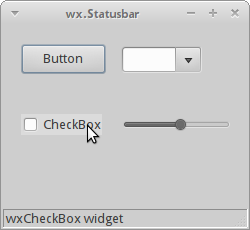 

## wx.RadioButton

`wx.RadioButton` 是一个允许用户从一组选项中选择单个相互排斥的选项的组件。一组单选按钮由该组中的第一个包含 `wx.RB_GROUP` 样式的单选按钮定义。所有其他的在第一个单选按钮之后的定义的单选按钮会被添加到第一个单选按钮的功能组中。用 `wx.RB_GROUP` 标志声明另一个单选按钮将创建一个新的单选按钮组。

```python
#!/usr/bin/python
# -*- coding: utf-8 -*-

import wx


class Example(wx.Frame):
           
    def __init__(self, *args, **kw):
        super(Example, self).__init__(*args, **kw) 
        
        self.InitUI()
        
    def InitUI(self):   
            
        pnl = wx.Panel(self)

        self.rb1 = wx.RadioButton(pnl, label='Value A', pos=(10, 10), 
            style=wx.RB_GROUP)
        self.rb2 = wx.RadioButton(pnl, label='Value B', pos=(10, 30))
        self.rb3 = wx.RadioButton(pnl, label='Value C', pos=(10, 50))
        
        self.rb1.Bind(wx.EVT_RADIOBUTTON, self.SetVal)
        self.rb2.Bind(wx.EVT_RADIOBUTTON, self.SetVal)
        self.rb3.Bind(wx.EVT_RADIOBUTTON, self.SetVal)

        self.sb = self.CreateStatusBar(3)
        
        self.sb.SetStatusText("True", 0)
        self.sb.SetStatusText("False", 1)
        self.sb.SetStatusText("False", 2)   

        self.SetSize((210, 210))
        self.SetTitle('wx.RadioButton')
        self.Centre()
        self.Show(True)     

    def SetVal(self, e):
        
        state1 = str(self.rb1.GetValue())
        state2 = str(self.rb2.GetValue())
        state3 = str(self.rb3.GetValue())

        self.sb.SetStatusText(state1, 0)
        self.sb.SetStatusText(state2, 1)
        self.sb.SetStatusText(state3, 2)            
        
def main():
    
    ex = wx.App()
    Example(None)
    ex.MainLoop()    

if __name__ == '__main__':
    main()   
```

我们有一个由三个单选按钮组成的组。 每一个单选按钮的状态会显示在状态栏中。

```python
self.rb1 = wx.RadioButton(pnl, label='Value A', pos=(10, 10), 
    style=wx.RB_GROUP)
self.rb2 = wx.RadioButton(pnl, label='Value B', pos=(10, 30))
self.rb3 = wx.RadioButton(pnl, label='Value C', pos=(10, 50))
```

我们创建三个单选按钮。 第一个单选按钮具有 `wx.RB_GROUP` 样式集。 它启动一个新的单选按钮组。

```python
self.rb1.Bind(wx.EVT_RADIOBUTTON, self.SetVal)
```

我们将 `wx.EVT_RADIOBUTTON` 事件绑定到 `SetVal()` 事件处理器。

```python
self.sb = self.CreateStatusBar(3)

self.sb.SetStatusText("True", 0)
self.sb.SetStatusText("False", 1)
self.sb.SetStatusText("False", 2) 
```

我们创建一个包含三个字段的状态栏 statusbar。我们使用单选按钮的状态初始化状态栏的文本设置。

```python
def SetVal(self, e):
    
    state1 = str(self.rb1.GetValue())
    state2 = str(self.rb2.GetValue())
    state3 = str(self.rb3.GetValue())

    self.sb.SetStatusText(state1, 0)
    self.sb.SetStatusText(state2, 1)
    self.sb.SetStatusText(state3, 2)  
```

在 `SetVal()` 方法内部，我们找出单选按钮的状态。我们将状态栏字段更新为当前单选按钮的值。  

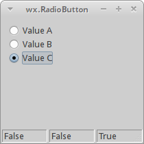 

## wx.Gauge

`wx.Gauge` 是我们处理冗长任务时使用的一个组件，它的指示，一直在显示任务的当前状态。

**gauge_wid.py**

```python
#!/usr/bin/env python3
# -*- coding: utf-8 -*-

"""
ZetCode wxPython tutorial

In this example we create gauge widget.

author: Jan Bodnar
website: www.zetcode.com
last modified: April 2018
"""

import wx

TASK_RANGE = 50

class Example(wx.Frame):

    def __init__(self, *args, **kw):
        super(Example, self).__init__(*args, **kw)

        self.InitUI()

    def InitUI(self):

        self.timer = wx.Timer(self, 1)
        self.count = 0

        self.Bind(wx.EVT_TIMER, self.OnTimer, self.timer)

        pnl = wx.Panel(self)
        vbox = wx.BoxSizer(wx.VERTICAL)
        hbox1 = wx.BoxSizer(wx.HORIZONTAL)
        hbox2 = wx.BoxSizer(wx.HORIZONTAL)
        hbox3 = wx.BoxSizer(wx.HORIZONTAL)

        self.gauge = wx.Gauge(pnl, range=TASK_RANGE, size=(250, -1))
        self.btn1 = wx.Button(pnl, wx.ID_OK)
        self.btn2 = wx.Button(pnl, wx.ID_STOP)
        self.text = wx.StaticText(pnl, label='Task to be done')

        self.Bind(wx.EVT_BUTTON, self.OnOk, self.btn1)
        self.Bind(wx.EVT_BUTTON, self.OnStop, self.btn2)

        hbox1.Add(self.gauge, proportion=1, flag=wx.ALIGN_CENTRE)
        hbox2.Add(self.btn1, proportion=1, flag=wx.RIGHT, border=10)
        hbox2.Add(self.btn2, proportion=1)
        hbox3.Add(self.text, proportion=1)

        vbox.Add((0, 30))

        vbox.Add(hbox1, flag=wx.ALIGN_CENTRE)

        vbox.Add((0, 20))

        vbox.Add(hbox2, proportion=1, flag=wx.ALIGN_CENTRE)
        vbox.Add(hbox3, proportion=1, flag=wx.ALIGN_CENTRE)

        pnl.SetSizer(vbox)

        self.SetTitle('wx.Gauge')
        self.Centre()

    def OnOk(self, e):

        if self.count >= TASK_RANGE:
            return

        self.timer.Start(100)
        self.text.SetLabel('Task in Progress')

    def OnStop(self, e):

        if self.count == 0 or self.count >= TASK_RANGE or not self.timer.IsRunning():
            return

        self.timer.Stop()
        self.text.SetLabel('Task Interrupted')

    def OnTimer(self, e):

        self.count = self.count + 1
        self.gauge.SetValue(self.count)

        if self.count == TASK_RANGE:

            self.timer.Stop()
            self.text.SetLabel('Task Completed')


def main():

    app = wx.App()
    ex = Example(None)
    ex.Show()
    app.MainLoop()


if __name__ == '__main__':
    main()                
```

我们有一个测量仪 gauge 和两个按钮。一个按钮启动仪表，另一个按钮停止仪表。

```python
self.timer = wx.Timer(self, 1)
self.count = 0
```

我们使用 `wx.Timer` 以特定的时间间隔执行代码。我们将在那些时刻更新仪表。count 变量用于确定任务已完成的部分。

```python
self.gauge = wx.Gauge(pnl, range=TASK_RANGE, size=(250, -1))
```

这是 `wx.Gauge` 组件的构造函数。range 参数设置组件的最大整数值。

```
def OnOk(self, e):
    
    if self.count >= TASK_RANGE:
        return

    self.timer.Start(100)
    self.text.SetLabel('Task in Progress')
```

当我们点击 OK 按钮时， `OnOk()` 方法被调用。我们首先检查 count 变量是否在任务的范围内。如果不是，我们从方法返回。如果任务未完成，我们启动计时器并更新静态文本。

```python
def OnStop(self, e):
    
    if self.count == 0 or self.count >= TASK_RANGE or not self.timer.IsRunning():
        return

    self.timer.Stop()
    self.text.SetLabel('Task Interrupted')
```

当我们点击停止按钮时， `OnStop()` 方法被调用。 我们检查停止任务的条件。如果条件满足，我们停止计时器并更新静态文本。

```python
def OnTimer(self, e):
    
    self.count = self.count + 1
    self.gauge.SetValue(self.count)
    
    if self.count == TASK_RANGE:

        self.timer.Stop()
        self.text.SetLabel('Task Completed')
```

`OnTimer()` 方法在启动定时器后周期性地调用。在该方法中，我们更新了 count 变量和 gauge 组件。如果 count 变量等于 `TASK_RANGE` ，我们停止定时器并更新静态文本。  

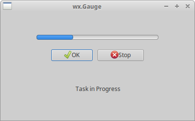 

## wx.Slider

`wx.Slider` 是一个具有简单滑柄的组件。 这个滑柄可以来回拉动。这样我们可以选择一个特定的任务。 

**slider_wid.py**

```python
#!/usr/bin/env python3
# -*- coding: utf-8 -*-

"""
ZetCode wxPython tutorial

In this example we create slider control.

author: Jan Bodnar
website: www.zetcode.com
last modified: April 2018
"""

import wx


class Example(wx.Frame):

    def __init__(self, *args, **kw):
        super(Example, self).__init__(*args, **kw)

        self.InitUI()

    def InitUI(self):

        pnl = wx.Panel(self)

        sizer = wx.GridBagSizer(5, 5)

        sld = wx.Slider(pnl, value=200, minValue=150, maxValue=500,
                        style=wx.SL_HORIZONTAL)

        sld.Bind(wx.EVT_SCROLL, self.OnSliderScroll)
        sizer.Add(sld, pos=(0, 0), flag=wx.ALL|wx.EXPAND, border=25)

        self.txt = wx.StaticText(pnl, label='200')
        sizer.Add(self.txt, pos=(0, 1), flag=wx.TOP|wx.RIGHT, border=25)

        sizer.AddGrowableCol(0)
        pnl.SetSizer(sizer)

        self.SetTitle('wx.Slider')
        self.Centre()

    def OnSliderScroll(self, e):

        obj = e.GetEventObject()
        val = obj.GetValue()

        self.txt.SetLabel(str(val))


def main():

    app = wx.App()
    ex = Example(None)
    ex.Show()
    app.MainLoop()


if __name__ == '__main__':
    main()  
```

在滑块中选择的值显示在静态文本中。

```python
sld = wx.Slider(pnl, value=200, minValue=150, maxValue=500,
                style=wx.SL_HORIZONTAL)
```

一个 `wx.Slider` 被创建。我们使用 `minValue` 和 `maxValue` 参数为滑块的初始位置提供最小值和最大滑块位置。 `wx.SL_HORIZONTAL` 使滑块水平。

```python
sld.Bind(wx.EVT_SCROLL, self.OnSliderScroll)
```

遇到 `wx.EVT_SCROLL` 事件时，`OnSliderScroll()` 方法会调用。

```python
self.txt = wx.StaticText(pnl, label='200')
```

当前选定的滑块的值显示在放置于滑块下方的静态文本中。

```python
def OnSliderScroll(self, e):
    
    obj = e.GetEventObject()
    val = obj.GetValue()
    
    self.txt.SetLabel(str(val)) 
```

在 `OnSliderScroll()` 方法中，我们获取事件的 sender 。 我们得到滑块的当前值，并将其设置到静态文本。  

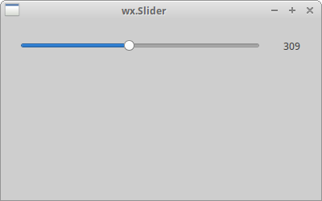 

## wx.SpinCtrl

`wx.SpinCtrl` 组件可以让我们增加和减少值。

**spin_ctrl.py**

```python
#!/usr/bin/env python3
# -*- coding: utf-8 -*-

"""
ZetCode wxPython tutorial

In this example we create spin control.

author: Jan Bodnar
website: www.zetcode.com
last modified: April 2018
"""

import wx


class Example(wx.Frame):

    def __init__(self, *args, **kw):
        super(Example, self).__init__(*args, **kw)

        self.InitUI()

    def InitUI(self):

        pnl = wx.Panel(self)

        sizer = wx.GridBagSizer(5, 5)

        st1 = wx.StaticText(pnl, label='Convert Fahrenheit temperature to Celsius')
        sizer.Add(st1, pos=(0, 0), span=(1, 2), flag=wx.ALL, border=15)

        st2 = wx.StaticText(pnl, label='Fahrenheit:')
        sizer.Add(st2, pos=(1, 0), flag=wx.ALL | wx.ALIGN_CENTER, border=15)
        
        self.sc = wx.SpinCtrl(pnl, value='0')
        self.sc.SetRange(-459, 1000)

        sizer.Add(self.sc, pos=(1, 1), flag=wx.ALIGN_CENTER)

        st3 = wx.StaticText(pnl, label='Celsius:')
        sizer.Add(st3, pos=(2, 0), flag=wx.ALL|wx.ALIGN_RIGHT, border=15)

        self.celsius = wx.StaticText(pnl, label='')
        sizer.Add(self.celsius, pos=(2, 1), flag=wx.ALL, border=15)

        computeButton = wx.Button(pnl, label='Compute')
        computeButton.SetFocus()
        sizer.Add(computeButton, pos=(3, 0), flag=wx.ALIGN_RIGHT|wx.TOP, border=30)

        closeButton = wx.Button(pnl, label='Close')
        sizer.Add(closeButton, pos=(3, 1), flag=wx.ALIGN_LEFT|wx.TOP, border=30)

        computeButton.Bind(wx.EVT_BUTTON, self.OnCompute)
        closeButton.Bind(wx.EVT_BUTTON, self.OnClose)

        pnl.SetSizer(sizer)

        self.SetTitle('wx.SpinCtrl')
        self.Centre()

    def OnClose(self, e):

        self.Close(True)

    def OnCompute(self, e):

        fahr = self.sc.GetValue()
        cels = round((fahr - 32) * 5 / 9.0, 2)
        self.celsius.SetLabel(str(cels))


def main():

    app = wx.App()
    ex = Example(None)
    ex.Show()
    app.MainLoop()


if __name__ == '__main__':
    main()       
```

该脚本将华氏温度转换为摄氏温度。我们使用 `wx.SpinCtrl` 组件为华氏温度选择一个值。

```python
self.sc = wx.SpinCtrl(pnl, value='0')
self.sc.SetRange(-459, 1000)
```

我们创建一个初始值为 0 的 `wx.SpinCtrl` 组件，`SetRange()` 为组件设置值的范围。

```python
def OnCompute(self, e):
    
    fahr = self.sc.GetValue()
    cels = round((fahr - 32) * 5 / 9.0, 2)
    self.celsius.SetLabel(str(cels)) 
```

当我们点击计算按钮时，`OnCompute()` 方法被调用。在该方法的主体中，我们从 spin 控件中获得当前值。我们计算摄氏温度并将静态文本组件设置为计算后的温度。  

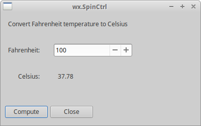 

wxPython教程的这一部分专注于 wxPython 的核心组件。  